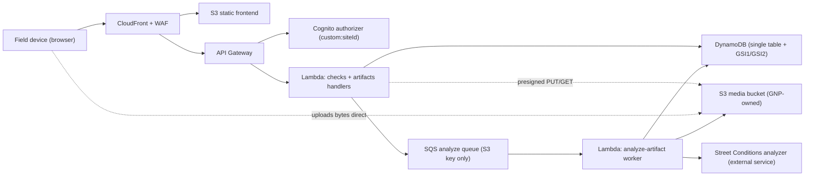
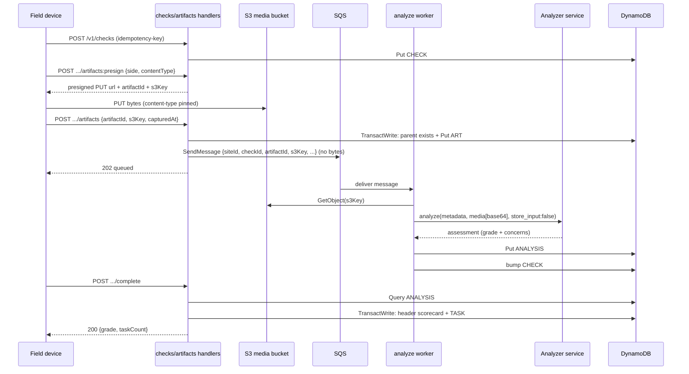

# Architecture

## Container view



The media bytes reach the analyzer only from the worker (base64, `store_input:false`);
they never travel through the SQS queue and are never logged. The perimeter-check
handlers never see the bytes either — the device PUTs straight to S3 against a
presigned URL, and the handler stores only the S3 key.

## Async analyze flow



A retryable analyzer error re-throws so SQS redelivers (then dead-letters); a
permanent failure is recorded as an `ANALYSIS#` marker with `status:"failed"`
(no concerns), which `completeCheck` excludes from synthesis but `getCheck`
still surfaces.

## Single-table data model

```mermaid
erDiagram
  CHECK ||--o{ ARTIFACT : has
  ARTIFACT ||--o| ANALYSIS : "analyzed into"
  CHECK ||--o{ TASK : "routes to"

  CHECK {
    string pk "SITE#<siteId>"
    string sk "CHECK#<checkId>"
    string status "in_progress|completed"
    string grade "at complete"
    number issueCount
    number maxSeverity
    string gsi1pk "SITE#<siteId> (timeline)"
    string gsi1sk "startedAt ISO"
  }
  ARTIFACT {
    string pk "SITE#<siteId>"
    string sk "CHECK#<checkId>#ART#<side>#<artifactId>"
    string s3Key
    string side
    string capturedAt "per-photo"
  }
  ANALYSIS {
    string pk "SITE#<siteId>"
    string sk "CHECK#<checkId>#ANALYSIS#<artifactId>"
    string status "analyzed|failed"
    string grade
    string rubricVersion
  }
  TASK {
    string pk "SITE#<siteId>"
    string sk "TASK#<taskId>"
    string type "onsite|city_escalation"
    number severity
    string gsi2pk "SITE#<siteId>#TASK#<status> (worklist)"
    string gsi2sk "severity#createdAt"
  }
```

See [dynamodb-data-model.md](./dynamodb-data-model.md) for the authoritative item
shapes and access patterns, and [analysis-backend-lambdas-plan.md](./inprogress/analysis-backend-lambdas-plan.md)
for the analyze-path build steps.

## Security boundaries

- Browser users authenticate through Cognito; API Gateway validates tokens before invoking Lambda.
- `siteId` is derived server-side from the JWT `custom:siteId` claim — never read from the request body — so a tenant can only ever address its own partition.
- The analyzer API key is a server-side credential (Secrets Manager), never sent to the device and never logged. Every analyze call sets `store_input:false`, so the analyzer retains none of our media.
- Media bytes travel only device→S3 (presigned PUT) and S3→worker→analyzer. They never pass through the SQS queue (key only) or appear in API Gateway / Lambda / worker logs.
- Lambda roles are scoped per function and avoid wildcard resource access; the media bucket blocks public access, is SSE-KMS + TLS-only, and has a short retention lifecycle.
- Public endpoints are protected by CloudFront security headers, TLS policy, CAA DNS records, WAF managed rules, and rate limits.

## Offline capture and sync

Perimeter checks are idempotent by design: the client mints the `checkId` (a ULID) and
sends it as the `idempotency-key`, and artifact/analysis writes are conditional, so a
replayed request can never create a duplicate. For the MVP there is **no active service
worker** — full offline queue-and-replay is deferred (see [MVP-TODO.md](./inprogress/MVP-TODO.md)) —
but the idempotency contract is already in place for when it lands.
