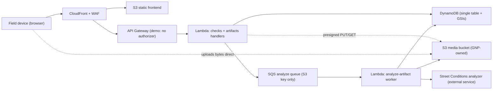
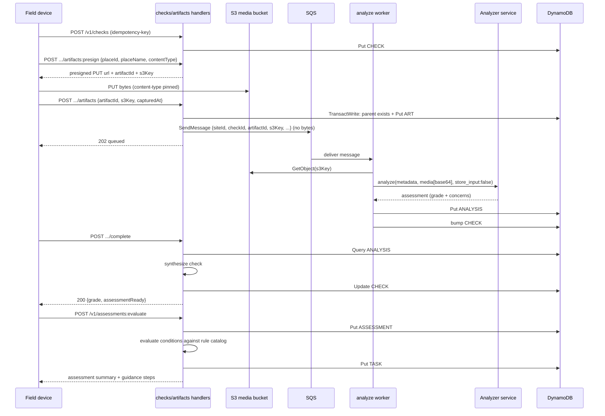

# Architecture

## Container view

The media bytes reach the analyzer only from the worker (base64, `store_input:false`);
they never travel through the SQS queue and are never logged. The perimeter-check
handlers never see the bytes either — the device PUTs straight to S3 against a
presigned URL, and the handler stores only the S3 key.

## Async analyze flow

A retryable analyzer error re-throws so SQS redelivers (then dead-letters); a
permanent failure is recorded as an `ANALYSIS#` marker with `status:"failed"`
(no concerns), which `completeCheck` excludes from synthesis but `getCheck`
still surfaces.

## Guidance workflow (rule-driven tasks)

`completeCheck` no longer routes tasks from a category→severity placeholder. It synthesizes
the check scorecard and returns `assessmentReady`; the client then calls
`POST /v1/assessments:evaluate` as a separate idempotent step. That endpoint persists an
`ASSESSMENT#` report plus one `COND#` item per condition of concern, evaluates each against
a versioned rule catalog (normalized from the product's `actions-escalations-rules` CSV),
and immediately creates `TASK#` items for rules that resolve from category + severity alone.
Conditions needing user answers return question steps; answer submission re-evaluates the
condition and creates its task then.

Key properties, all built (`backend/src/analysis/guidance/` + `handlers/guidance.js`):

- **Deterministic, point-in-time, auditable:** each task keeps its `ruleId` +
  `policyVersion` forever; rulebase updates ship as new catalog versions (`actions-escalations-v2.js`),
  validated in CI (`npm run policy:validate`), diffed semantically with fixture impact
  reports (`npm run policy:diff`). The changelog is
  [guidance-policy-changelog.md](./guidance-policy-changelog.md).
- **Category resolution:** analyzer category labels → canonical rule categories via aliases;
  unresolved categories become `manual_review`, never a guess (safety-critical rules).
- **Safety ordering:** emergency outcomes (911) always precede routine guidance; the backend
  returns metadata only — it never places calls or files tickets itself.
- **Task compatibility:** tasks keep `type: "onsite" | "city_escalation"` alongside the
  richer `kind`/`escalationChannel`/`appActions[]` fields.
- Endpoints: `POST /v1/assessments:evaluate`, `GET /v1/assessments/{id}/guidance`,
  `POST /v1/assessments/{id}/conditions/{id}/answers`, `POST /v1/tasks/{id}/complete`,
  `POST /v1/tasks/{id}/cannot-do`. A dev-only harness (`/dev/guidance-harness`, dev builds
  only) exercises the flow with fixtures.

## Single-table data model

All tenant data lives in one DynamoDB table keyed on `pk = SITE#<siteId>`, so a check's header,
artifacts, and analyses share one partition and come back in a single query.

See [dynamodb-data-model.md](./dynamodb-data-model.md) for the authoritative item shapes, keys,
GSIs, and access patterns.

## Security boundaries

**Demo posture note:** the deployed MVP API runs **no authorizer** — requests resolve to a
single `DEMO_SITE_ID` (see `api.tf`; test data is disposable). The boundaries below describe
the target design, enforced with the Phase 6 tenant-isolation work (issue tracker) before
any real data; details in [security-review.md](./security-review.md).

- Browser users authenticate through Cognito; API Gateway validates tokens before invoking Lambda.
- `siteId` is derived server-side from the JWT `custom:siteId` claim — never read from the request body — so a tenant can only ever address its own partition (IAM `LeadingKeys` scoping).
- The analyzer API key is a server-side credential (Secrets Manager), never sent to the device and never logged. Every analyze call sets `store_input:false`, so the analyzer retains none of our media.
- Media bytes travel only device→S3 (presigned PUT) and S3→worker→analyzer. They never pass through the SQS queue (key only) or appear in API Gateway / Lambda / worker logs.
- Lambda roles are scoped per function and avoid wildcard resource access; the media bucket blocks public access, is SSE-KMS + TLS-only. (A ~7-day media-expiration lifecycle rule is designed but not yet enforced — a pre-launch TODO; see [security-review.md](./security-review.md).)
- Public endpoints are protected by CloudFront security headers, TLS policy, CAA DNS records, WAF managed rules, and rate limits.

## Offline capture and sync

Perimeter checks are idempotent by design: the client mints the `checkId` (a ULID) and
sends it as the `idempotency-key`, and artifact/analysis writes are conditional, so a
replayed request can never create a duplicate. For the MVP there is **no active service
worker** — full offline queue-and-replay is deferred (tracked on the issue
tracker) —
but the idempotency contract is already in place for when it lands.
