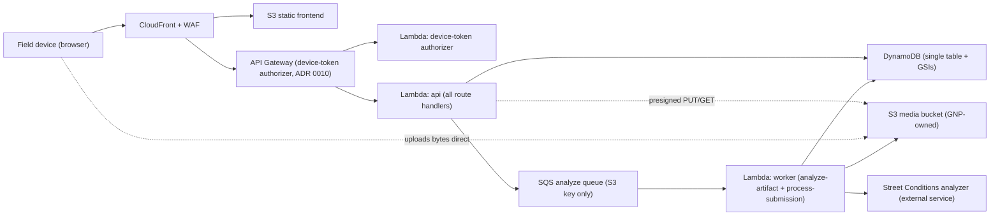
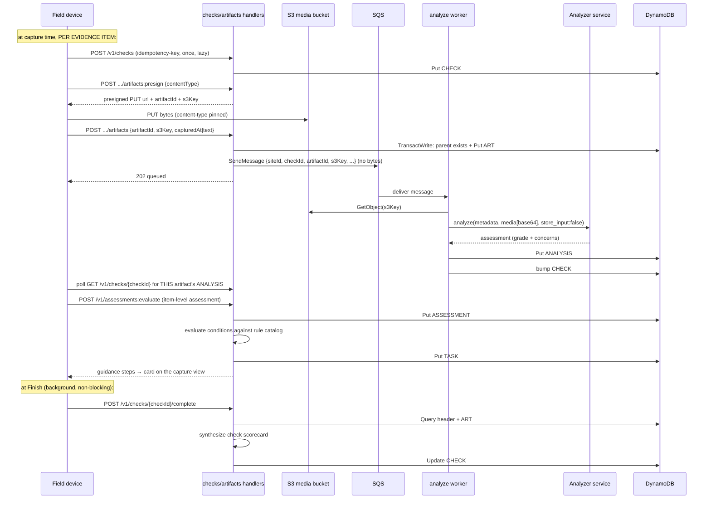

# Architecture

## Container view

The media bytes reach the analyzer only from the worker (base64, `store_input:false`);
they never travel through the SQS queue and are never logged. The perimeter-check
handlers never see the bytes either — the device PUTs straight to S3 against a
presigned URL, and the handler stores only the S3 key.

## Compute topology (Lambdas)

Three functions (`infra/modules/app/lambda.tf`), split by invocation style; bundles
are esbuild ESM outputs of `backend/scripts/build-lambdas.mjs`:

| Function | Trigger | Memory | Timeout | Role |
|---|---|---|---|---|
| `-api` | API Gateway, sync | 512 MB | 29 s | Every route handler behind one dispatch; reserved concurrency 10 |
| `-authorizer` | API Gateway REQUEST authorizer | 256 MB | 5 s | Verifies the HS256 device token, pins `siteId`; verdicts cached 60 s by the gateway; reserved concurrency 200 (20× the api cap — every gated request passes through it) |
| `-worker` | SQS, async | 1024 MB | 300 s | Both async jobs in one function: `process-submission` (demo flow) and `analyze-artifact` (per-photo), picked per message by shape (`backend/src/lambda/worker.js`); one queue, partial-batch failure reporting |

Worker tuning, all sized in `lambda.tf` comments: batch size 10 with a
**0-second batching window** (photos register staggered as each S3 PUT lands, so a
window would quantize them into waves) and `scaling_config.maximum_concurrency = 20`
— worst-case peak 10 × 20 = **200 concurrent analyzer (Bedrock Sonnet 4) calls**,
which is the quota-sizing number. The analyzer leg's per-call budget: the worker
reads the photo from S3, **downscales it (sharp: EXIF-orient, fit 1568 px long
edge, JPEG q80)** — bounding the base64 payload so the analyzer never sees raw
camera-resolution bytes (full-size input was rejected 413 `input_too_large` before
the downscale existed) — then calls the analyzer and writes the `ANALYSIS#` item.
sharp is esbuild-`external` and copied from node_modules into the worker bundle
only (api/authorizer never import it).

## Async analyze flow

The **evidence item is the unit of analysis**. A check is a capture container — one
flat photo roll for the whole perimeter, with a single typed description as the
alternative to photos; there is no per-site list of places to walk
([ADR 0014](./adr/0014-remove-places-photo-roll.md)). Each photo (or the description) is
uploaded, registered, analyzed, and evaluated independently as soon as it's captured —
results appear on the capture screen as they land, without waiting for the walk to
finish. Finish unlocks at three photos or one description; the rule is client-side
(`frontend/src/domain/check-completion.js`) and the backend only records the counts.
A check-level synthesis still exists, but only as the deferred, idempotent
**completion** step the client runs in the background after `Finish` (so the saved
scorecard exists for analytics/review); it never blocks or gates capture-time
guidance.

Typed descriptions register as text artifacts through the same
`.../artifacts` path (`registerArtifact` with `text`, no bytes) and flow through
the identical analyze→evaluate pipeline; the worker sends the fixed literal
`"perimeter"` as the analyzer's `position_descriptor` (there is no per-photo
position, and nothing downstream decides on it). Duplicate or overlapping tasks are
acceptable — two photos of the same issue may each produce tasks; deciding what
to keep belongs to the user.

A retryable analyzer error re-throws so SQS redelivers (then dead-letters); a
permanent failure is recorded as an `ANALYSIS#` marker with `status:"failed"`
(no concerns), which check synthesis excludes from scoring but `getCheck`
still surfaces. The client's per-item poll (`photo-analysis.js`) bounds a stuck
analyzer with a timeout; the check-level `complete` runs a **coverage gate**
(every registered artifact must have an ANALYSIS# item, analyzed or failed
marker) before synthesizing, and is idempotent-once so re-completion is a no-op.

## Guidance workflow (rule-driven tasks)

Guidance is evaluated **per evidence item** at capture time: `POST /v1/assessments:evaluate`
is called by the client once that item's analysis lands, with an item-level assessment built
from the single analysis. The endpoint persists an `ASSESSMENT#` report plus one `COND#`
item per condition of concern, evaluates each against a versioned rule catalog (normalized
from the product's `actions-escalations-rules` CSV), and immediately creates `TASK#` items
for rules that resolve from category + severity alone. Conditions needing user answers
return question steps; answer submission re-evaluates the condition and creates its task
then. Because each photo is its own analysis unit, two photos of the same issue can
legitimately produce two tasks — deduplication is a user curation decision, not a
system one.

Key properties, all built (`backend/src/analysis/guidance/` + `handlers/guidance.js`):

- **Deterministic, point-in-time, auditable:** each task keeps its `ruleId` +
  `policyVersion` forever; rulebase updates ship as new catalog versions (`actions-escalations-v3.js`),
  validated in CI (`npm run policy:validate`), diffed semantically with fixture impact
  reports (`npm run policy:diff`). The changelog is
  [guidance-policy-changelog.md](./guidance-policy-changelog.md).
- **Category resolution:** analyzer category labels → canonical rule categories via aliases;
  unresolved categories become `manual_review`, never a guess (safety-critical rules).
- **Ticket location resolution:** capture requests a fresh device location for each photo or
  text report and carries it through the condition/task; 311 filing uses that location first,
  then the site's geocoded default location from `SITE#<siteId> / #META`. With neither it fails
  the app action with a retryable `missing_location` result rather than guessing.
- **Safety ordering:** emergency outcomes (911) always precede routine guidance; the analyzer
  returns metadata only — it never places calls or files tickets itself. 311 tickets are filed
  and closed by the app-action layer (not the analyzer): informational tickets filed under the
  app's own agency id 76 are closed via `UpdateSR` when the task is completed through the done
  path; tickets filed for city-handled work stay under the city's management. HUB closure is
  non-idempotent, so each successful close is checkpointed onto the task (merged into
  `appActionResults`, conditioned on the completion lease) before the next HUB call; lease
  recovery then carries the durable `closed` record forward instead of re-closing the SR.
- **Task compatibility:** tasks keep `type: "onsite" | "city_escalation"` alongside the
  richer `kind`/`escalationChannel`/`appActions[]` fields.
- Endpoints: `POST /v1/assessments:evaluate`, `GET /v1/assessments/{id}/guidance`,
  `POST /v1/assessments/{id}/conditions/{id}/answers`, `POST /v1/tasks/{id}/complete`,
  `POST /v1/tasks/{id}/cannot-do`, `POST /v1/311-requests:batch`, and
  `GET /v1/tasks/{taskId}/311-requests/{srNum}`. The 311 routes verify that each site-scoped task
  owns its service-request number and return only the normalized summary and timeline fields used
  by the client. Card hydration batches visible requests so one handler invocation loads the
  agency-76 feed once; concurrent detail loads in the same Lambda environment also share an
  in-flight feed request. The raw HUB response and customer fields are never returned. A dev-only
  harness (`/dev/guidance-harness`, dev builds only) exercises the flow with fixtures.

## Single-table data model

All tenant data lives in one DynamoDB table keyed on `pk = SITE#<siteId>`, so a check's header,
artifacts, and analyses share one partition and come back in a single query.

See [dynamodb-data-model.md](./dynamodb-data-model.md) for the authoritative item shapes, keys,
GSIs, and access patterns.

## Security boundaries

**Auth posture (ADR 0010):** device bootstrap (`POST /site-code` + device
registration) is open; every other route sits behind a **REQUEST-type Lambda
authorizer** that verifies the HS256 device-token Bearer credential. The
authorizer pins `siteId` server-side — requests resolve to the token's site
partition, never a body-supplied one. (Demo/test data remains disposable; see
[security-review.md](./security-review.md) for the posture details.)

- The device (not a user) authenticates: registration mints an HS256 device token
  (ADR 0010) whose site claim scopes every later request to one partition. (The
  Cognito user pool in `main.tf` serves the separate central admin console, not
  the field device.)
- `siteId` is derived server-side from the verified token/claim — never read from the request body — so a tenant can only ever address its own partition **at the application layer** (every handler resolves the partition via `deriveSiteId`).
  The **platform-layer backstop** — an IAM `dynamodb:LeadingKeys` condition on the
  Lambda role pinning key prefixes to `SITE#<siteId>` — is the **target design, not
  the current deployment**: the deployed role carries table-wide DynamoDB actions
  with no such condition (see [dynamodb-data-model.md](./dynamodb-data-model.md)
  "Identity model"). Hardening it is the pre-real-data work tracked on the issue
  tracker.
- The analyzer API key is a server-side credential (Secrets Manager), never sent to the device and never logged. Every analyze call sets `store_input:false`, so the analyzer retains none of our media.
- Media bytes travel only device→S3 (presigned PUT) and S3→worker→analyzer. They never pass through the SQS queue (key only) or appear in API Gateway / Lambda / worker logs.
- Lambda roles are scoped per function and avoid wildcard resource access; the media bucket blocks public access, is SSE-KMS + TLS-only. (A ~7-day media-expiration lifecycle rule is designed but not yet enforced — a pre-launch TODO; see [security-review.md](./security-review.md).)
- Public endpoints are protected by CloudFront security headers, TLS policy, CAA DNS records, WAF managed rules, and rate limits.

## Edge routing contract (SPA fallback vs API routes)

The provider frontend's CloudFront distribution has **no error-page mapping**. SPA deep links
(`/check`, `/today`, …) resolve via a viewer-request function (`aws_cloudfront_function.frontend_spa_rewrite`,
`infra/modules/app/cloudfront.tf`) that rewrites dot-less, non-API URIs to `/index.html`
*before* the S3 origin — so missing assets return real 404s and, critically, the API
origins' own 403/404 JSON responses reach the viewer untouched.

**Never re-add distribution-wide `custom_error_response` blocks** on the frontend (or admin)
distribution: they apply to *every* origin, so an API 403/404 would be rewritten into
`index.html` with status 200 — the 2026-09-14 dev incident (device-token authorizer denial
→ 200/HTML → the client treated the SPA as a successful API response). The client guards
against this class of failure (non-JSON API body → `ApiError(non_json_response)` in
`services/api.js`; `services/backend-health.js` probes `/health` and surfaces
OUTAGE/AUTH states), and CI's deploy smoke check fails if an API error response arrives
as anything but JSON.

## Offline capture and sync

Perimeter checks are idempotent by design: the client mints the `checkId` (a ULID) and
sends it as the `idempotency-key`, and artifact/analysis writes are conditional, so a
replayed request can never create a duplicate. For the MVP there is **no active service
worker** — full offline queue-and-replay is deferred (tracked on the issue
tracker) —
but the idempotency contract is already in place for when it lands.
