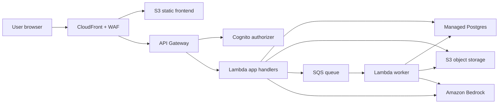

# Architecture

## Security Boundaries

- Browser users authenticate through Cognito.
- API Gateway validates tokens before invoking Lambda.
- Lambda roles are scoped per function and avoid wildcard resource access.
- Database credentials are read from Secrets Manager.
- S3 buckets block public access unless explicitly used for CloudFront origin access.
- Public endpoints are protected by CloudFront security headers, TLS policy, CAA DNS records, WAF managed rules, and rate limits.

## Offline Capture and Sync

The frontend uses a Workbox service worker. Offline submissions are queued client-side and replayed to API Gateway when connectivity returns. The backend must treat replayed submissions as idempotent by requiring client-generated request IDs.
