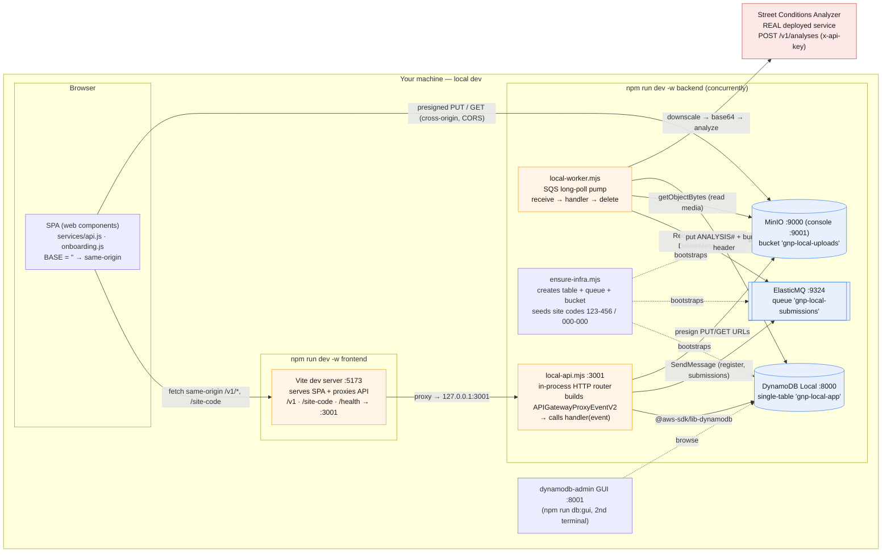
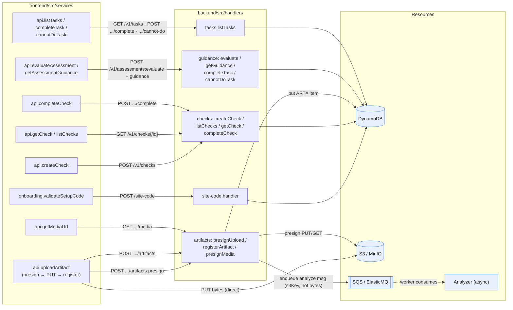
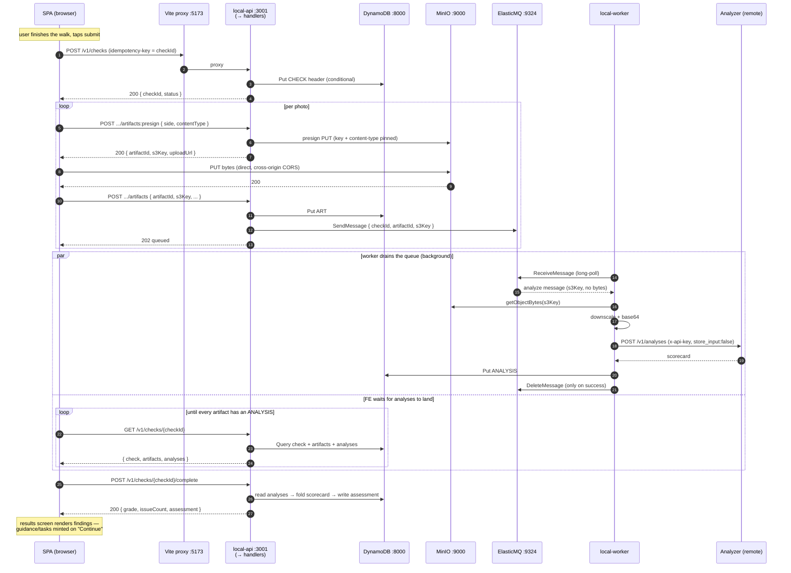

# Development environment architecture

How the app runs **locally** (`npm run dev`), and how each local piece maps to the
AWS resource it stands in for. The guiding principle (see
[ADR 0006](adr/0006-docker-free-local-dev-harness.md)) is that the local harness runs the
**exact handler + worker code we deploy to Lambda**, against Docker-free emulators reached
through the same AWS SDK clients via endpoint env vars. Terraform stays the source of truth
for real wiring; the harness only answers *"does my handler work."*

---

## 1. Infrastructure & process topology

What actually runs on your machine, on which ports, and its production equivalent.

### Local ↔ production mapping

| Local (dev) | Stands in for (prod) | Notes |
|---|---|---|
| Vite dev server `:5173` + proxy | S3 + CloudFront (SPA hosting) | Prod SPA & API share **one** CloudFront distro, so `BASE=""` and paths stay relative in both. |
| `local-api.mjs` in-process router `:3001` | API Gateway (HTTP API v2) + **one** API Lambda | Router table mirrors `src/lambda/api.js` route keys and the Terraform routes — keep all three in step. |
| `local-worker.mjs` poll pump | SQS **event-source mapping** → worker Lambda | Picks handler by message shape; deletes only on success (throw ⇒ redelivery), like real SQS. |
| DynamoDB Local `:8000` | DynamoDB single table | `ensure-infra.mjs` table schema kept in lockstep with the Terraform `aws_dynamodb_table`. |
| ElasticMQ `:9324` | SQS | Both `/submissions` demo flow and analyze flow share the one queue. |
| MinIO `:9000` | S3 (uploads bucket) | Enables the presigned-PUT leg + worker read-back with no real AWS; path-style addressing. |
| `X-Debug-Sub` header / `DEBUG_SUB` | Cognito JWT authorizer (`sub`) | Auth is **stubbed** locally; the router injects a fake principal. |
| **(none — real service)** | Street Conditions Analyzer | The analyze worker calls the **actual deployed** analyzer in dev too; needs a real `ANALYZER_API_KEY`. |
| Bedrock stub (`BEDROCK_*`) | Amazon Bedrock | Mocked locally; real model calls happen inside the analyzer service / cloud dev env only. |

The SDK clients (`db.js`, `s3.js`, `artifacts.js`'s SQS client) need **no code change** to hit
emulators — `AWS_ENDPOINT_URL_DYNAMODB` / `_SQS` / `_S3` in `.env.local` redirect them.

---

## 2. Request routing map — frontend call → handler → resources

Every route the SPA hits, the handler behind it, and the backing resources it touches. One
Lambda backs every route in prod (`src/lambda/api.js`); locally the router dispatches to the
same exported handlers.

Key invariants visible above:

- **`siteId` is never sent by the client** — it's derived server-side from the principal (the
  stubbed `sub` locally) and enforced as the DynamoDB partition key.
- **Media bytes never transit the API.** The device PUTs straight to S3/MinIO via a presigned
  URL; `registerArtifact` enqueues only the **S3 key**, and the worker fetches the bytes.
- The client mints `checkId` and sends it as the `idempotency-key`, so every write is replayable.

---

## 3. The full media loop (submit a perimeter check)

The end-to-end async path — the one flow that exercises every resource. This is
`services/submit-check.js` orchestrating `services/api.js`, then the worker running in the
background.

### Why it's shaped this way

- **Presign → direct PUT → register** keeps large image bytes off the API Lambda entirely (cost,
  payload limits, and the analyzer never retains media — GNP owns retention in its own bucket).
- **Async via SQS** decouples the slow part (downscale + remote LLM, ~seconds per photo) from the
  request path. The worker fans out a batch concurrently, so wall-clock ≈ the slowest photo.
- **Idempotency everywhere** (conditional writes on `checkId`, `artifactId`, `ANALYSIS#` sort key)
  means a lost 202, a redelivered SQS message, or a resumed submit can't double-count or corrupt
  the folded scorecard.
- The client `waitForAnalyses` poll **throws** on timeout rather than completing on partial
  coverage, because `complete` freezes the scorecard idempotently — a silent partial would be
  permanent.

---

*Sources: `frontend/vite.config.js`, `frontend/src/services/{api,onboarding,submit-check}.js`,
`backend/src/lambda/{api,worker}.js`, `backend/src/handlers/*`, `backend/src/workers/analyze-artifact.js`,
`backend/scripts/{local-api,local-worker,local-minio}.mjs`, `backend/scripts/lib/ensure-infra.mjs`,
`.env.example`, `docs/dev-commands.md`, `docs/adr/0006-docker-free-local-dev-harness.md`.*
