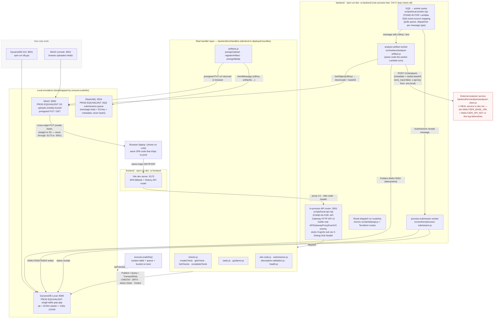

# Development environment architecture

Dev-focused view of the system: what the frontend calls, which code handles it
(the **same exported Lambda handlers we deploy**), and what each handler talks
to. Design rationale for the harness: [ADR 0006](./adr/0006-docker-free-local-dev-harness.md).
Prod architecture lives in [architecture.md](./architecture.md).

## Dev → prod mapping

| Dev node | How it runs here | Prod equivalent (Terraform, `infra/modules/app`) |
|---|---|---|
| Vite dev server `:5173` | `npm run dev -w frontend`; proxies `/v1`, `/site-code`, `/health` to `:3001` | CloudFront + WAF; static SPA from private S3 (OAC), API paths routed to API Gateway (cache behaviors `/v1/*`, `/site-code`, `/submissions`, `/health`) |
| In-process API router `:3001` | `backend/scripts/local-api.mjs` calls the **exported handlers directly**, fakes `Cognito sub` (`X-Debug-Sub`) | API Gateway HTTP API v2 → single proxy integration → `gnp-api` Lambda (`src/lambda/api.js` dispatches on `event.routeKey`) |
| Handler layer | `backend/src/handlers/*.js`, run in-process, unmodified | Bundled by esbuild into `backend/dist/api/index.mjs` (nodejs22.x, 512 MB, 29 s, reserved concurrency 10) |
| DynamoDB Local `:8000` | Java jar, self-bootstrapped table | `aws_dynamodb_table.app` — single table, `pk`/`sk`, GSIs 1/2/4/5, PITR, KMS, stream |
| ElasticMQ `:9324` | Java jar, queue created by bootstrap | `aws_sqs_queue.submissions` + DLQ (maxReceiveCount 5, KMS) |
| Worker pump | `backend/scripts/local-worker.mjs` polls and dispatches | `aws_lambda_event_source_mapping` → `gnp-worker` Lambda (batch 10, window 0, max concurrency 20, ReportBatchItemFailures) |
| MinIO `:9000` | Binary in `backend/.local/`, CORS set globally by launcher | `aws_s3_bucket.uploads` — private, SSE-KMS, CORS for presigned browser PUTs |
| Analyzer call | **Real remote service**, key from `.env.local` (`ANALYZER_API_KEY`) or Secrets Manager when `ANALYZER_API_KEY_SECRET_ARN` is set | Secrets Manager secret `gnp-*-analyzer-api-key` fetched by the worker; `ANALYZER_BASE_URL` from TF var |
| `description-validation` handler | Needs Bedrock config; **not available locally** — handler reports "missing Bedrock configuration" | `aws_lambda_function.api` env `BEDROCK_MODEL_ID` → Bedrock runtime client |
| Cognito | Not exercised — `X-Debug-Sub` stub instead | `aws_cognito_user_pool.users` + web client (`siteId` custom attr pre-declared for the future JWT authorizer) |

## Notes

- The only two things local dev cannot stand in for are **Bedrock** (description
  validation leg) and **Cognito** (tenant identity). Everything else — routes,
  handlers, table shapes, queue semantics, presigned S3 round trip — is the
  deployed code and topology.
- Media bytes flow browser → MinIO directly via presigned PUT (CORS handled by
  the MinIO launcher), then worker → analyzer. The queue carries only the S3
  key — same invariant as prod.
- `POST /v1/checks` uses the client-minted ULID as `idempotency-key`; replaying
  it flips the item to `duplicate_replay` locally just as prod's conditional
  writes would.