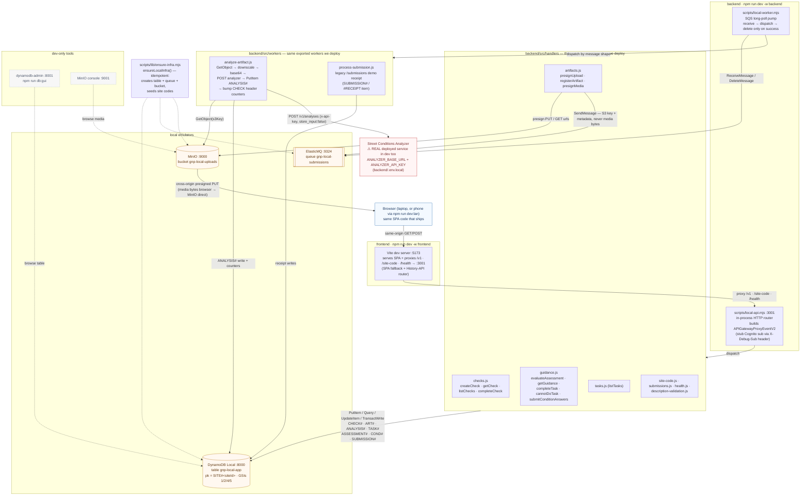
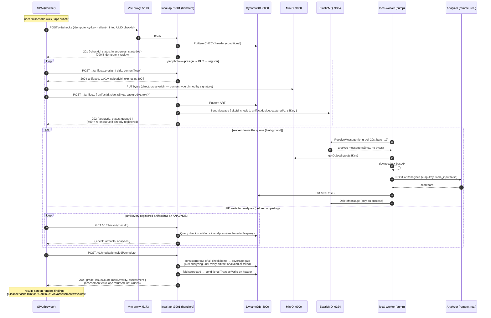

# Development environment architecture (local only)

How the app runs **locally** — what processes start, which ports they take, what each local
piece is a stand-in for, and every request path end to end. Scope is deliberately the local
harness only: for production wiring, see [architecture.md](./architecture.md) and
[ADR 0007](./adr/0007-deploy-promotion-model.md). Design rationale for the harness:
[ADR 0006](./adr/0006-docker-free-local-dev-harness.md). Command reference:
[dev-commands.md](./dev-commands.md).

The guiding principle (ADR 0006): the harness runs the **exact handler + worker code we deploy**
against Docker-free emulators, reached through the same AWS SDK clients via endpoint env vars.
Terraform stays the source of truth for real wiring; the harness only answers *"does my handler
work."*

Sources for everything claimed here: `frontend/vite.config.js`,
`frontend/src/services/{api,onboarding,submit-check,artifact-uploader}.js`,
`backend/scripts/*` + `backend/scripts/lib/*`, `backend/src/lambda/{api,worker}.js`,
`backend/src/handlers/*`, `backend/src/workers/*`, `backend/src/analysis/*`,
`backend/src/lib/principal.js`, `backend/src/{config,db,s3}.js`, `.env.example`,
`backend/elasticmq.conf`, and `docs/dev-commands.md`.

---

## 1. What runs when you type `npm run dev`

Two commands from the repo root:

| Command | Process tree |
|---|---|
| `npm run dev -w frontend` | Vite dev server on **:5173** |
| `npm run dev -w backend` | `concurrently -k` runs three named processes; Ctrl-C tears down all |

The backend tree:

- **`svc`** — `npm run local:services` = `concurrently` (ddb + mq + minio):
  - `local:ddb` → **DynamoDB Local** :8000 (Java jar via the `dynamodb-local` npm package,
    launched with `-sharedDb` so the bootstrap and the handlers see the same database;
    JRE 17+ required)
  - `local:mq` → **ElasticMQ** :9324 (Java fat-jar downloaded on first run into
    `backend/.local/`; bound to `127.0.0.1`; `sqs-limits = strict` so it rejects payloads like
    real SQS)
  - `local:minio` → **MinIO** :9000 API / :9001 console (single binary downloaded into
    `backend/.local/` or a `minio` already on PATH; bound to `127.0.0.1`)
- **`api`** — `scripts/local-api.mjs` on **:3001** (`LOCAL_API_PORT`; deliberately not 3000, a
  common Docker port)
- **`worker`** — `scripts/local-worker.mjs` (SQS long-poll pump)

Related scripts:

- `npm run db:gui` (second terminal) → **dynamodb-admin** GUI on **:8001**
- `npm run local:bootstrap` → run `ensureLocalInfra()` once, then exit (the api and worker each
  call it at startup anyway, so a fresh `npm run dev` self-bootstraps)
- `npm run analyze:smoke` → exercise the analyzer client against a single image (reads
  `backend/.env`, not `.env.local`)

Shared env is loaded by every `local:*` script via Node's native
`--env-file=../.env.local` (copy `.env.example` → `.env.local`). Frontend, tests, lint, and
typecheck do **not** need Java.

### Ports at a glance

| Port | Thing |
|---|---|
| 5173 | Vite dev server (SPA + API proxy) |
| 3001 | local-api.mjs (`LOCAL_API_PORT`) |
| 8000 | DynamoDB Local |
| 8001 | dynamodb-admin GUI |
| 9324 | ElasticMQ |
| 9000 / 9001 | MinIO API / console |

### Local resource names

| Resource (env var) | Local name |
|---|---|
| DynamoDB table (`DYNAMO_TABLE`) | `gnp-local-app` |
| SQS queue (`SQS_QUEUE_URL`) | `http://localhost:9324/000000000000/gnp-local-submissions` (name `gnp-local-submissions`) |
| S3 bucket (`S3_UPLOAD_BUCKET`) | `gnp-local-uploads` |

### Emulator redirection — env vars only, no code changes

AWS SDK v3 endpoint env vars redirect every client at the emulators; service-specific vars take
precedence over the global `AWS_ENDPOINT_URL`, which leaves Bedrock pointing at real AWS
(unused locally — see §6):

| Env var (`​.env.local`) | Effect |
|---|---|
| `AWS_ENDPOINT_URL_DYNAMODB=http://localhost:8000` | DynamoDB clients → DynamoDB Local |
| `AWS_ENDPOINT_URL_SQS=http://localhost:9324` | SQS clients → ElasticMQ |
| `AWS_ENDPOINT_URL_S3=http://localhost:9000` | S3 clients → MinIO; also flips `backend/src/s3.js` to path-style addressing and makes `ensureLocalInfra()` create the bucket |
| `AWS_REGION` / `AWS_ACCESS_KEY_ID` / `AWS_SECRET_ACCESS_KEY` | Dummy values (`localdev`/`localdevsecret`); they double as MinIO root credentials, so user ≥ 3 chars, password ≥ 8 chars |

---

## 2. Topology

### The one piece that is not local

**The Street Conditions Analyzer is real in dev too.** The analyze worker calls the deployed
service (`POST /v1/analyses`, `x-api-key` from `.env.local`, `store_input:false` — the analyzer
never retains our media). Without `ANALYZER_API_KEY` the analyze worker throws, the message
redelivers, and the check hangs at "pending" — but the upload/presign legs still work
(`.env.example:9-17,55-61`). Everything else on this page is local-only.

---

## 3. Auth stub & tenant derivation

The local router (`scripts/lib/proxy-event.mjs`) builds a faithful `APIGatewayProxyEventV2` —
including `routeKey`, path parameters, flattened query-string parameters, raw query string, and a
JWT-authorizer-shaped `requestContext` — and stubs Cognito with a **fake `sub`**: the
`X-Debug-Sub` header if present, else `DEBUG_SUB` (default `local-dev-user`).

The important consequence: handlers derive the tenant with `deriveSiteId()`
(`backend/src/lib/principal.js`), which reads **only** the `custom:siteId` JWT claim and falls
back to `DEMO_SITE_ID || "demo-site"`. The stub injects just `sub` — never a `custom:siteId`
claim — so:

- **`X-Debug-Sub` does NOT change the tenant partition.** It identifies requests in your code
  and logs only.
- **Every local write lands in the `SITE#demo-site` partition** (the code fallback), because no
  claim is present.
- When a real JWT authorizer (with the `custom:siteId` claim) arrives, the same deployed handler
  code will derive real tenants; nothing in the harness changes.

### Seeded site codes

`ensureLocalInfra()` seeds two `SITE_CODE#` items (`scripts/lib/ensure-infra.mjs:232-276`) so the
setup screen works out of the box:

| Code | State | Behavior |
|---|---|---|
| `123456` | active | `POST /site-code` → 200, binds `site-health-center-mission` |
| `000000` | **inactive** | `POST /site-code` → 401 invalid code |

The frontend's `formatSiteCode()` uppercases, strips non-alphanumerics, and caps at 6 chars, so
users may type `123-456` or `123456` — both hit the backend as `123456`.

---

## 4. Request routing map — SPA call → handler → resources

All 17 routes in one table; the same set is registered in **three** places that must stay in
step (`scripts/local-api.mjs:80-114`, `src/lambda/api.js:36-60`, and the deployed API Gateway
route table in `infra/modules/app/api.tf:8-26`):

| # | Route (method + pattern) | Handler | Frontend caller | Resources touched |
|---|---|---|---|---|
| 1 | `POST /site-code` | `site-code.js` | `onboarding.validateSetupCode` | DynamoDB `Get` on `SITE_CODE#<code>#META` |
| 2 | `POST /v1/checks` | `checks.createCheck` | `api.createCheck` (submit-check) | DDB `PutItem` CHECK header (cond. `attribute_not_exists(sk)`) |
| 3 | `GET /v1/checks` | `checks.listChecks` | `api.listChecks` | DDB `Query` GSI1 (`gsi1pk = SITE#<siteId>`) |
| 4 | `GET /v1/checks/{checkId}` | `checks.getCheck` | `api.getCheck` / `waitForAnalyses` | DDB base-table `Query` `begins_with(sk, CHECK#<id>)` |
| 5 | `POST /v1/checks/{checkId}/complete` | `checks.completeCheck` | `api.completeCheck` | DDB consistent `Query` + cond. `TransactWrite` header |
| 6 | `POST /v1/checks/{checkId}/artifacts:presign` | `artifacts.presignUpload` | `api.presignArtifact` | S3 presign (no DB write) |
| 7 | `POST /v1/checks/{checkId}/artifacts` | `artifacts.registerArtifact` | `api.registerArtifact` / `uploadArtifact` / `registerTextArtifact` | DDB `PutItem` ART# (cond.) + SQS enqueue (see below) |
| 8 | `GET /v1/checks/{checkId}/artifacts/{artifactId}/media` | `artifacts.presignMedia` | `api.getMediaUrl` (staff review) | DDB `Query` ART# items + S3 presign GET |
| 9 | `POST /v1/checks/{checkId}/sides/{side}/description:validate` | `description-validation.js` | `api.validateSideDescription` | none (in-process heuristic; Bedrock is prod-only — see §6) |
| 10 | `GET /v1/tasks` | `tasks.listTasks` | `api.listTasks` | DDB `Query` GSI2 worklist |
| 11 | `POST /v1/tasks/{taskId}/complete` | `guidance.completeTask` | `api.completeTask` | DDB writes (task + audit) |
| 12 | `POST /v1/tasks/{taskId}/cannot-do` | `guidance.cannotDoTask` | `api.cannotDoTask` | DDB writes (task + audit) |
| 13 | `POST /v1/assessments:evaluate` | `guidance.evaluateAssessment` | `api.evaluateAssessment` | DDB writes ASSESSMENT# + COND# + TASK# |
| 14 | `GET /v1/assessments/{assessmentId}/guidance` | `guidance.getGuidance` | `api.getAssessmentGuidance` | DDB reads ASSESSMENT# + COND# + TASK# |
| 15 | `POST /v1/assessments/{assessmentId}/conditions/{conditionId}/answers` | `guidance.submitConditionAnswers` | `api.submitConditionAnswers` (guidance-harness) | DDB writes COND# + TASK# |
| 16 | `POST /submissions` | `submissions.js` | legacy demo flow | DDB + SQS |
| 17 | `GET /health` | `health.js` | (probe) | none |

Route 7 in full: `registerArtifact` does a conditional `PutItem` of the ART# item (no-graft
check: the client-supplied `s3Key` must start with `checks/<siteId>/<checkId>/`), then always
enqueues to SQS — on both the fresh-202 and already-registered-409 paths — so an artifact can
never be persisted but never queued. The message body is
`{ siteId, checkId, artifactId, side, capturedAt, s3Key?, text? }` (photo artifacts carry the
key, text-only artifacts carry `text`; either way, **never media bytes**).

Key invariants across all routes:

- **`siteId` is never sent by the client** — it's derived server-side (§3).
- **Media bytes never transit the API** — the browser PUTs straight to MinIO via a presigned URL
  (`api.putMedia`); the API handler only mints and registers.
- **The client mints `checkId`** (a ULID) and sends it as the `idempotency-key` header; every
  write is conditional, so replays are idempotent (a replayed create returns 200 instead of 201;
  a replayed register returns 409 but still re-enqueues).

---

## 5. The full media loop (submit a perimeter check)

The one flow that exercises every resource — `services/submit-check.js` orchestrating
`services/api.js`, with the worker running in the background:

### Why it's shaped this way

- **Presign → direct PUT → register** keeps image bytes off the API (payload limits, cost), and
  `store_input:false` means the analyzer never retains media — GNP owns retention in its own
  bucket.
- **Async via SQS** decouples the slow part (downscale + remote LLM) from the request path. The
  worker fans the batch out concurrently, so wall-clock ≈ the slowest photo, not the sum.
- **Idempotency everywhere** — conditional writes on CHECK header `sk`, ART# `sk`, and ANALYSIS#
  `sk` mean a lost 202, a redelivered SQS message, or a resumed submit can't double-count or
  corrupt the folded scorecard.
- The client's `waitForAnalyses` poll **throws** on deadline rather than completing on partial
  coverage (error body code `analyses_pending`) — `completeCheck`'s coverage gate (409
  `analyzing`) would refuse a premature fold anyway, and its header write is idempotent-once, so
  a silent partial would be permanent. Failed analyses write a `status: "failed"` ANALYSIS#
  marker, which counts toward coverage but is excluded from synthesis.

---

## 6. What the local harness can and cannot stand in for

| Capability | Locally | Notes |
|---|---|---|
| All 17 API routes | ✅ real handlers, in-process | identical code to the deployed bundle |
| Check/artifact read-write paths | ✅ real handlers + DynamoDB Local | same table shape (pk/sk + GSIs 1/2/4/5) |
| Presigned S3 round trip | ✅ real handlers + MinIO | path-style, CORS via launcher env |
| Async analyze + queue semantics | ⚠️ real worker code, ElasticMQ queue | the analyzer leg goes to the **real remote service** |
| Description validation (`:validate` route) | ✅ works locally | keyword heuristic (`BEDROCK_ALLOW_LOCAL_STUB=true` + `BEDROCK_MODEL_ID=local-stub-model` → `heuristicValidate`); escape hatch `DESCRIPTION_VALIDATION_DISABLED=true` skips the check entirely. No Bedrock call is made locally. |
| Legacy `/submissions` demo flow | ✅ real worker code | receipt + `duplicate_replay` idempotency |
| Tenant identity | ⚠️ stubbed | `X-Debug-Sub`/`DEBUG_SUB` = fake `sub` only; no `custom:siteId` claim, so everything writes to `SITE#demo-site` |
| Amazon Bedrock (real model call) | ❌ | only the description-validation heuristic runs locally; real model calls happen in the deployed analyzer service / cloud env, not in this backend |
| Cognito | ❌ | site-code flow mints no JWT today; the stub replaces it |

---

*End of document — sources listed in the header.*