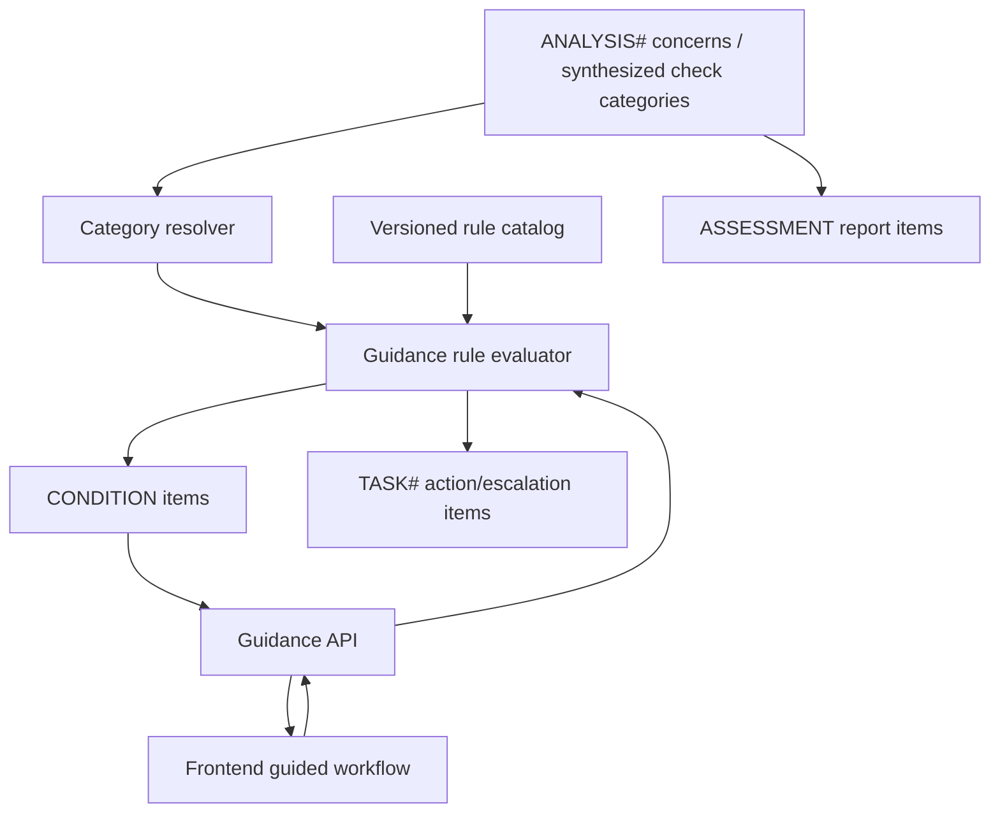
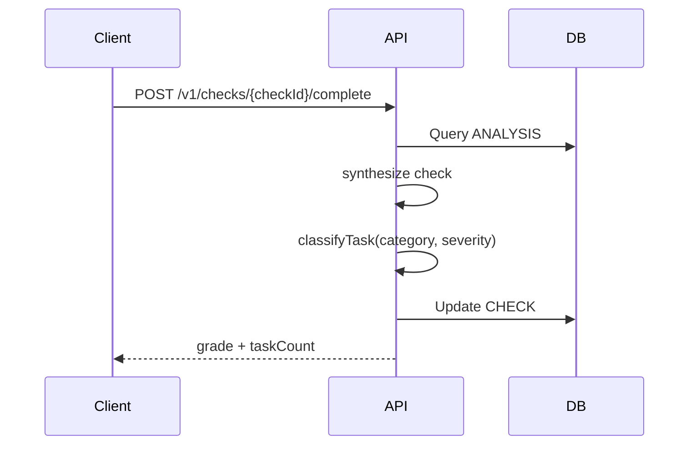
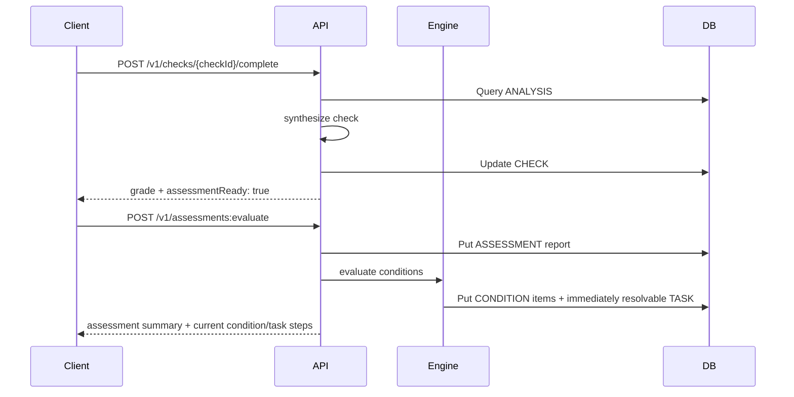

# Plan: Guidance Workflow Backend

*Backend design plan · [index](./README.md) · builds on
[analysis-backend-lambdas-plan.md](./analysis-backend-lambdas-plan.md) and
[dynamodb-data-model.md](./dynamodb-data-model.md)*

**Status:** Design draft  
**Date:** 2026-08-17  
**Scope:** Design only. No implementation in this plan.

## Purpose

The Good Neighbor app needs a backend component that takes an analyzer assessment and returns the
right user guidance, in the right sequence, for every condition found around a site. The assessment
comes from the Street Conditions analysis service and may include one or more identified conditions
of concern. Each condition has a category, severity from 0-5, qualitative assessment text, evidence
references, and location/timestamp metadata.

The guidance backend applies the action/escalation rule table to those conditions. The current
canonical source asset is `actions-escalations-rules.csv`, which supersedes the earlier GNP-4 file
name. Some rules can resolve immediately. Others need one or more user answers before the backend
can determine the right action or escalation. The backend therefore needs to behave like a small,
auditable workflow engine, not just a stateless classifier.

The output should let the frontend step a user through the process:

- ask any required follow-up questions;
- show the selected action or escalation;
- expose the right button labels and automated app actions;
- provide helper guidance;
- capture why the user cannot complete an action or escalation;
- persist enough state to resume, audit, and avoid duplicate tickets/tasks.

## Existing Context

The current analyze path already has the right upstream seam:

1. A check is created.
2. Artifacts are uploaded to GNP-owned S3.
3. The async analyzer worker calls the Street Conditions analysis service.
4. The worker persists `ANALYSIS#` items with adapted `concerns[]`.
5. `completeCheck` synthesizes a check-level scorecard.
6. Current placeholder task routing creates `TASK#` items.

This plan replaces the placeholder "category + severity -> task type" routing with a rule-driven
guidance workflow. It should live at the boundary between check synthesis and task creation.

Relevant existing backend modules:

- `backend/src/analysis/adapt-scorecard.js` adapts the analyzer assessment into GNP's persisted
  analysis shape.
- `backend/src/analysis/synthesize-check.js` rolls analyzed artifacts into a check-level scorecard.
- `backend/src/analysis/task-routing.js` is the current placeholder routing module and should be
  replaced by the rule workflow engine.
- `backend/src/handlers/checks.js` currently completes a check and creates tasks atomically.
- `backend/src/handlers/tasks.js` lists open `TASK#` items.

## Non-Goals

- Do not change the Street Conditions analyzer contract.
- Do not implement live email, phone, or external escalation integrations in this plan.
- Do not build a rules admin UI yet.
- Do not reclassify already-created tasks when rules change.
- Do not parse arbitrary spreadsheet formulas at runtime.
- Do not vendor analyzer rubric weighting data unless the rule table explicitly requires it.

## Source Inputs

### Assessment Input

The Street Conditions analysis response contains:

```js
{
  assessment: {
    metadata: {
      reported_at,
      latitude,
      longitude,
      position_descriptor,
      notes
    },
    general_conditions: {
      label,
      description
    },
    identified_conditions_of_concern: [
      {
        category,
        definition,
        severity,
        severity_label,
        description,
        evidence_indices,
        confidence
      }
    ]
  }
}
```

The existing app projection stores each concern roughly as:

```js
{
  category,
  rating,
  ratingLabel,
  explanation,
  evidenceIndices
}
```

For guidance evaluation, the backend needs:

- canonical category;
- original analyzer category;
- severity/rating;
- description/explanation;
- source artifact IDs;
- check ID;
- site ID;
- side or position descriptor when available;
- captured/reported timestamp;
- latitude/longitude when available.

### Rule Table Input

The current `actions-escalations-rules.csv` file has these meaningful fields:

- `Category`
- `Weighting`
- `Rule ID`
- `Evaluation order`
- `Condition: severity`
- `Ask user`
- `Condition: user response`
- `THEN (Action or Escalation)`
- `Action / escalation text`
- `User-facing button label(s)`
- `App action`
- `311 category`
- `Human-readable guidance`
- `"Can't do this" reasons`
- `Source`

The PDF examples from the earlier GNP-4 packet show the intended product behavior: the app receives
an assessment, the backend selects or asks for additional information, the app shows the selected
action/escalation, and the user can complete it or say why they cannot.

## Design Principle

The rule backend should be deterministic, point-in-time, and resumable.

For the same assessment, same policy version, and same user answers, it must always select the same
rule. Once it selects a rule and creates a task, that task keeps the selected `ruleId` and
`policyVersion` forever, even if future policy changes would route the same category differently.

## High-Level Architecture



### Components

1. **Rule catalog**
   A normalized, versioned representation of the CSV rule table.

2. **Category resolver**
   Maps analyzer category labels to rule-table canonical categories.

3. **Rule evaluator**
   A pure module that decides whether a condition needs an answer, resolves to an outcome, or needs
   manual review.

4. **Assessment/report store**
   Persists the incoming assessment/report and source metadata so later screens, audits, retries,
   and task records can reference the original analyzer output.

5. **Guidance API**
   Lets the frontend ingest or start evaluation for an assessment, fetch current condition/task
   steps, submit answers, and mark task completion or "can't do this" reasons.

6. **Task creator**
   Creates durable `TASK#` items as soon as each condition can be resolved into an action or
   escalation.

## Rule Catalog Design

The CSV should be converted into structured JSON as a build/admin operation, then loaded by the
backend. Runtime request handling should never evaluate raw spreadsheet prose or raw expressions.

Example normalized rule:

```js
{
  policyVersion: "actions-escalations-2026-08-17",
  ruleId: "GRAFFITI-2",
  category: "Graffiti",
  weighting: "Low",
  evaluationOrder: 2,
  severity: {
    min: 1,
    max: 5
  },
  requiredQuestions: [
    {
      key: "active_now",
      prompt: "Is this happening right now?",
      type: "boolean",
      options: [
        { label: "Yes", value: true },
        { label: "No", value: false }
      ]
    },
    {
      key: "onsite",
      prompt: "Is this on site property?",
      type: "boolean",
      options: [
        { label: "Yes", value: true },
        { label: "No", value: false }
      ]
    }
  ],
  predicate: {
    all: [
      { fact: "active_now", op: "eq", value: false },
      { fact: "onsite", op: "eq", value: true }
    ]
  },
  outcome: {
    kind: "action",
    label: "Clean it off within 3 days.",
    buttons: [],
    appActions: [],
    category311: null,
    guidance:
      "If the graffiti is on your own building, remove it yourself within 3 days.",
    cannotDoReasons: [
      "It doesn't feel safe",
      "It's too much for us to clean"
    ],
    source: "Policy line 115"
  }
}
```

### Catalog Validation

Before a catalog version can be used, validate:

- every `ruleId` is unique within `policyVersion`;
- every rule has a known category;
- every severity range is within 0-5;
- every predicate references declared question keys or known assessment facts;
- every question key has one consistent type across the policy version;
- every outcome kind is `action`, `escalation`, or `manual_review`;
- every app action maps to a known backend action code;
- every escalation with user-facing buttons has normalized button/action metadata;
- every rule has deterministic ordering: category, evaluation order, rule ID.

### Runtime Representation

The backend should load the active catalog once per Lambda container and cache it in memory. The
catalog is small enough that no database lookup is needed per rule. Later, if rule editing becomes a
product feature, the catalog can move to S3 or DynamoDB with an environment-pinned active version.

### Rulebase Update Process

The rules asset is expected to change over time. The backend must accommodate a changed rulebase
without changing historical decisions.

Recommended process:

1. Product updates `actions-escalations-rules.csv`.
2. A maintainer runs a catalog conversion script that normalizes the CSV into JSON.
3. The converter emits:
   - normalized catalog JSON;
   - validation report;
   - source CSV checksum;
   - derived `policyVersion`, such as `actions-escalations-2026-08-17` or a SemVer-style
     `actions-escalations-v2`;
   - semantic rulebase diff compared with the previous catalog;
   - changelog summary derived from that diff.
4. CI validates the catalog before merge.
5. Deploy config selects one active policy version per environment.
6. New assessment evaluations use the active version.
7. Existing assessment reports, conditions, and tasks continue using the `policyVersion` they were
   created with.

Policy data should therefore be append/version based. Do not overwrite the meaning of an existing
`policyVersion`. If a rule changes, publish a new version.

### Rulebase Diff

Rulebase updates need an analytical diff, not just a line-oriented file diff. The converter should
compare the previous normalized catalog to the proposed catalog and report behavior-level changes:

- added, removed, and renamed categories;
- added, removed, and changed rule IDs;
- changed evaluation order within a category;
- changed severity ranges;
- changed required question keys, question types, option values, or prompts;
- changed predicates/user-response conditions;
- changed outcome kind (`action` vs `escalation`);
- changed action/escalation labels, helper guidance, button labels, app actions, 311 categories,
  and cannot-do reasons;
- changed category aliases that could affect analyzer-category resolution;
- newly unresolved or newly resolved analyzer category mappings.

The diff should also run fixture-based impact analysis. Given a small library of representative
assessment/answer fixtures, evaluate both the old and new catalog and report:

- conditions whose selected `ruleId` changes;
- conditions that switch between action and escalation;
- conditions that newly require a user question;
- conditions that no longer require a user question;
- conditions that become manual review;
- app actions that change, especially 911, 311, phone, email, or form actions.

This output should be reviewed before the new `policyVersion` is activated. The goal is to answer
"what behavior changes for users and staff?" rather than only "what cells changed?" Formal rulebase
approval ownership is intentionally deferred; for now, the diff and impact report are advisory
release artifacts.

## Category Resolution

The analyzer category string is not guaranteed to match the policy CSV forever. Add a small resolver:

```js
{
  policyVersion: "actions-escalations-2026-08-17",
  rubricId: "good-neighbor-app",
  rubricVersion: "1.0.0",
  aliases: [
    {
      analyzerCategory: "Litter",
      canonicalCategory: "Litter"
    },
    {
      analyzerCategory: "Waste & Small Debris",
      canonicalCategory: "Litter"
    }
  ]
}
```

Resolution order:

1. exact match to canonical category;
2. exact alias match for the analyzer rubric version;
3. normalized text match only if explicitly allowed;
4. unresolved -> manual review guidance.

Do not silently guess for health/safety categories. If the category cannot be resolved, preserve the
original analyzer category and return a `manual_review` outcome.

## Rule Evaluation Model

The evaluator should be a pure function:

```js
evaluateCondition({
  condition,
  rules,
  answers,
  policyVersion
})
```

It returns one of:

```js
{ kind: "needs_answer", question }
{ kind: "outcome", rule, outcome }
{ kind: "manual_review", reason }
{ kind: "no_guidance", reason }
```

### Evaluation Algorithm

For one condition:

1. Ignore severity 0 unless policy explicitly defines a severity 0 rule.
2. Resolve the condition category.
3. Select all rules for the canonical category.
4. Sort by `evaluationOrder`, then `ruleId`.
5. Filter to rules whose severity range includes the condition severity.
6. Evaluate rules one order group at a time:
   - If a matching rule's predicate requires missing answers, return the next required question.
   - If all required answers exist and the predicate matches, return the rule outcome.
   - If all required answers exist and the predicate fails, continue.
7. If no rule matches, return manual review.

### Evaluation Order Semantics

Within a category, `Evaluation order = 1` means evaluate immediately. `Evaluation order = 2` means
evaluate only after order 1 fails or does not produce an outcome.

When multiple rules have the same evaluation order and share the same question, the engine should ask
that question once, then use the answer to choose the rule. Example: bulky items has two order-1
rules distinguished by `provider_generated == true/false`.

### Question Semantics

The CSV stores question prose, but the backend needs stable answer keys. Normalize repeated question
patterns into known keys:

| User question pattern | Stable key | Type |
|---|---|---|
| "Are these items from your program?" | `provider_generated` | boolean |
| "Is this happening right now?" | `active_now` | boolean |
| "Is this on site property?" | `onsite` | boolean |
| "Is this blockage due to your clients or residents?" | `affiliated` | boolean |
| "Is this person/are these people your client or resident?" | `affiliated` | boolean |
| "Is this animal owned by a client or resident?" | `affiliated` | boolean |

Question text can vary by category, but answer keys should remain stable where semantics match.

## Sequencing Across Multiple Conditions

An assessment can include multiple conditions. The backend should return a prioritized queue of next
steps, not leave sequencing to the frontend.

Confirmed ordering:

1. Emergency escalations that resolve without questions.
2. Conditions with questions that can reveal an emergency.
3. High weighting, severity descending.
4. Moderate weighting, severity descending.
5. Low weighting, severity descending.
6. Assessment source order.
7. Canonical category name.

Emergency app actions include:

- `open_phone` with `phoneNumber: "911"`;
- urgent non-emergency phone calls;
- immediate safety instructions such as move away, do not confront, do not touch.

This ensures the user sees "Call 911" before routine cleanup work.

Multiple emergency outcomes should remain separate guidance outcomes and separate tasks. Those task
records carry the audit trail through `ruleId`, `policyVersion`, source condition data, user
answers, timestamps, and completion/cannot-do state. Any collapsing or bundling of emergency UI can
be handled on the frontend later.

## Assessment, Condition, And Task State

Do not add a separate guidance-session state machine. The durable state should be represented by:

- the stored assessment/report;
- one condition item per evaluated condition;
- zero or more task items created from resolved conditions.

This keeps the backend simpler and makes the records match the domain. A condition's status tells
the app whether more user input is needed, whether it has fully resolved into tasks, or whether it
requires manual review.

### Assessment Report

When an assessment/report is passed to the main evaluation endpoint, store it in DynamoDB before or in
the same transaction as condition creation. The stored report is the durable source of truth for
later screens, task audit, re-reads, and troubleshooting. Do not rely on the client or analyzer to
resend the original payload.

```js
{
  pk: "SITE#<siteId>",
  sk: "ASSESSMENT#<assessmentId>",
  entityType: "ASSESSMENT",
  assessmentId,
  checkId,
  status: "evaluating",
  policyVersion: "actions-escalations-2026-08-17",
  rubricVersion,
  grade,
  reportedAt,
  location: {
    latitude,
    longitude,
    positionDescriptor
  },
  sourceArtifactIds: ["<artifactId>"],
  rawAssessment: {
    // adapted analyzer assessment/report payload, excluding media bytes
  },
  summary: {
    totalConditions,
    conditionsNeedAnswer,
    conditionsResolvedToTasks,
    openTaskCount,
    actionCount,
    escalationCount,
    emergencyCount,
    manualReviewCount
  },
  gsi1pk: "SITE#<siteId>#ASSESSMENT",
  gsi1sk: "<reportedAt>#<assessmentId>",
  createdAt,
  updatedAt
}
```

Assessment statuses:

- `evaluating`
- `needs_answers`
- `tasks_created`
- `completed`
- `manual_review`

### Condition

```js
{
  pk: "SITE#<siteId>",
  sk: "ASSESSMENT#<assessmentId>#COND#<conditionId>",
  entityType: "CONDITION",
  conditionId,
  assessmentId,
  checkId,
  source: {
    artifactIds: ["<artifactId>"],
    side,
    evidenceIndices: [0],
    reportedAt,
    latitude,
    longitude,
    positionDescriptor
  },
  analyzerCategory: "Waste & Small Debris",
  canonicalCategory: "Litter",
  severity: 3,
  severityLabel,
  description,
  answers: {},
  status: "ready",
  selectedRuleId: null,
  outcome: null,
  taskIds: [],
  resolvedToTasks: false,
  needsAnswer: null,
  cannotDo: null,
  gsi4pk: "SITE#<siteId>#CONDITION#SEV#3",
  gsi4sk: "<reportedAt>#<assessmentId>#<conditionId>",
  gsi5pk: "SITE#<siteId>#CONDITION#UNRESOLVED",
  gsi5sk: "<reportedAt>#SEV#3#<assessmentId>#<conditionId>",
  createdAt,
  updatedAt
}
```

Valid condition statuses:

- `needs_answer`
- `ready`
- `resolved`
- `tasks_created`
- `completed`
- `cannot_do`
- `manual_review`
- `skipped`

`resolvedToTasks` is the explicit flag for "this condition has been fully translated into tasks."
It is `false` while a condition needs an answer, is waiting for evaluation, or has gone to manual
review. It becomes `true` once all task records implied by the selected rule have been created.
Conditions that require no task should set `status: "completed"` and `resolvedToTasks: true` with an
empty `taskIds` array, but the current rulebase is expected to create at least one task for each
action/escalation outcome.

## Task Shape

When a condition resolves to an action or escalation, create or update a `TASK#` item immediately.
If the condition can be resolved from category and severity alone, create the task during assessment
evaluation. If the condition needs a user answer, create the task as soon as the required answer is
stored and the rule outcome is known.

```js
{
  pk: "SITE#<siteId>",
  sk: "TASK#<taskId>",
  entityType: "TASK",
  taskId,
  assessmentId,
  checkId,
  conditionId: "<conditionId>",
  policyVersion: "actions-escalations-2026-08-17",
  ruleId: "LITTER-2",
  kind: "escalation",
  type: "city_escalation",
  status: "open",
  category: "Litter",
  analyzerCategory: "Litter",
  severity: 3,
  label: "Ask the City to clean the street.",
  guidance:
    "If there is too much trash for you to clean up, you can use the app to file a 311 ticket and ask the City for help.",
  buttons: [
    {
      label: "File 311 ticket",
      actionCode: "create_311_ticket"
    }
  ],
  appActions: [
    {
      code: "create_311_ticket",
      payload: {
        category311: "Street/sidewalk cleaning"
      }
    }
  ],
  appActionStatus: "pending",
  appActionResults: [],
  cannotDoReasons: ["We already filed a ticket"],
  sourceArtifactIds: ["<artifactId>"],
  gsi2pk: "SITE#<siteId>#TASK#open",
  gsi2sk: "<createdAt>#<kind>#<severity>#<taskId>",
  createdAt,
  updatedAt
}
```

### Compatibility With Existing `type`

The current app uses `type: "onsite" | "city_escalation"`. The CSV's primary distinction is
`Action` vs `Escalation`, while escalation channels include 311, 911, SFACC, email, and forms.

Recommended forward-compatible fields:

- `kind: "action" | "escalation"`;
- `type: "onsite" | "city_escalation"` for existing worklist compatibility;
- `escalationChannel: "311" | "911" | "phone" | "email" | "form" | null`;
- `appActions[]` for executable backend/frontend behavior.

Mapping:

- CSV `Action` -> `kind: "action"`, `type: "onsite"`;
- CSV `Escalation` with 311/form/email -> `kind: "escalation"`, `type: "city_escalation"`;
- CSV `Escalation` with 911/phone -> `kind: "escalation"`, `type: "city_escalation"` for now, with
  channel-specific app action.

## API Design

All routes remain site-scoped. `siteId` is derived server-side from the principal.

### Evaluate Assessment

```http
POST /v1/assessments:evaluate
```

Stores the assessment/report, creates condition records, evaluates every condition against the
active rulebase, and creates any tasks that can be created immediately. Idempotent on
`assessmentId` or `checkId + source analysis IDs + policyVersion`.

This endpoint is the main boundary for external or synthesized assessments. It must persist the
assessment/report payload in DynamoDB before returning so later task lists, condition views, audits,
and retries can reference the same source data.

Response:

```js
{
  assessment: {
    assessmentId,
    checkId,
    status,
    policyVersion,
    summary
  },
  steps: []
}
```

### Get Current Guidance

```http
GET /v1/assessments/{assessmentId}/guidance
```

Returns the stored assessment summary plus ordered condition/task steps. Steps are derived from
condition and task statuses; there is no separate guidance session state.

Question step:

```js
{
  stepId: "COND#01#Q#active_now",
  conditionId: "01",
  kind: "question",
  category: "Graffiti",
  severity: 3,
  prompt: "Is this happening right now?",
  answerKey: "active_now",
  options: [
    { label: "Yes", value: true },
    { label: "No", value: false }
  ],
  source: {
    checkId,
    artifactIds: ["art_1"],
    positionDescriptor: "front entrance",
    reportedAt
  }
}
```

Task/outcome step:

```js
{
  stepId: "TASK#task_01J...",
  taskId: "task_01J...",
  conditionId: "01",
  kind: "task",
  ruleId: "GRAFFITI-3",
  outcomeKind: "escalation",
  status: "open",
  category: "Graffiti",
  severity: 3,
  label: "Ask the City to clean the graffiti.",
  guidance:
    "If the graffiti is not on your property, report it to the City instead of cleaning it yourself.",
  buttons: [
    {
      label: "File 311 ticket",
      actionCode: "create_311_ticket"
    }
  ],
  cannotDoReasons: ["We already filed a ticket"]
}
```

### Submit Answers

```http
POST /v1/assessments/{assessmentId}/conditions/{conditionId}/answers
```

Request:

```js
{
  answers: {
    active_now: false,
    onsite: false
  }
}
```

The backend validates answer keys against the active question set, stores the answer, re-evaluates
the condition, creates any now-resolved task immediately, marks the condition `tasks_created`, and
returns updated steps.

### Complete Task

```http
POST /v1/tasks/{taskId}/complete
```

Marks the task completed. If app integrations exist, this endpoint records the result:

```js
{
  completedBy: "device",
  completionMethod: "user_confirmed",
  appActionResults: [
    {
      code: "create_311_ticket",
      status: "skipped",
      reason: "feature_disabled"
    }
  ]
}
```

### Cannot Do

```http
POST /v1/tasks/{taskId}/cannot-do
```

Request:

```js
{
  reason: "There's too much trash for me to collect",
  note: "Optional short note"
}
```

The reason must be one of the allowed reasons on the selected rule unless the frontend exposes an
admin-only free-text path. "Can't do this" is always audit-only for this workflow: the backend stores
the reason, keeps it attached to the task and condition, and does not use it to trigger
alternate routing.

## App Action Normalization

CSV `App action` text should be normalized into executable action codes.

| CSV intent | Action code | Payload |
|---|---|---|
| Create and file 311 ticket | `create_311_ticket` | `{ category311 }` |
| Route to phone app | `open_phone` | `{ phoneNumber }` |
| Email zerograffiti@sfdpw.org | `compose_email` | `{ to, subjectTemplate, bodyTemplate }` |
| Complete fire protection form | `create_fire_hazard_report` | `{ formType }` |
| No automatic action | `none` | `{}` |

Button labels should point to action codes, not prose:

```js
{
  label: "Call 911",
  actionCode: "open_phone",
  payload: {
    phoneNumber: "911"
  }
}
```

Integration execution can be phased:

1. MVP: return action metadata; frontend opens phone links where applicable; task completion records
   app-action audit results.
2. Next: backend creates 311 tickets. The current backend has a feature-flagged stub behind
   `GNP_311_SUBMISSION_ENABLED=true` using the rulebase's existing `category311` payload.
3. Later: email/form integrations with audit records.

## Idempotency

Guidance operations must be replay-safe:

- `assessments:evaluate` conditionally creates one assessment report per
  `assessmentId + policyVersion`.
- condition IDs are deterministic from check ID, canonical category, source artifact IDs, and source
  order.
- answer submission overwrites only the same answer keys for the same condition.
- task creation creates at most one task per condition/rule.
- completing or marking cannot-do is idempotent if repeated with the same payload.

Recommended idempotency keys:

- assessment: `ASSESSMENT#<assessmentId>#<policyVersion>`;
- condition: `ASSESSMENT#<assessmentId>#COND#<conditionId>`;
- task: deterministic UUIDv5/ULID derived from `assessmentId + conditionId + selectedRuleId`, or store
  `createdTaskId` on the condition item before/inside the task transaction.

## DynamoDB Access Patterns

The rule backend should bake the expected reads into the single-table design. Do not rely on scans
for assessment, condition, or task workflow screens.

### Item Keys

| Entity | Base table key |
|---|---|
| Assessment report | `pk = SITE#<siteId>`, `sk = ASSESSMENT#<assessmentId>` |
| Condition | `pk = SITE#<siteId>`, `sk = ASSESSMENT#<assessmentId>#COND#<conditionId>` |
| Task | `pk = SITE#<siteId>`, `sk = TASK#<taskId>` |

### Indexes

| Index | Partition | Sort | Sparse on | Serves |
|---|---|---|---|---|
| GSI1 assessment timeline | `SITE#<siteId>#ASSESSMENT` | `<reportedAt>#<assessmentId>` | assessment reports | list assessments by site/date |
| GSI2 task worklist | `SITE#<siteId>#TASK#<status>` | `<createdAt>#<kind>#<severity>#<taskId>` | tasks | list tasks by site/status/date |
| GSI4 condition timeline | `SITE#<siteId>#CONDITION#SEV#<severity>` | `<reportedAt>#<assessmentId>#<conditionId>` | conditions | list conditions by site/date/severity |
| GSI5 unresolved conditions | `SITE#<siteId>#CONDITION#UNRESOLVED` | `<reportedAt>#SEV#<severity>#<assessmentId>#<conditionId>` | unresolved conditions only | list conditions not fully translated into tasks |

GSI3 remains deferred for the post-MVP cross-site city escalation queue. MVP uses per-site GSI2
only. City escalations are still created as `TASK#` items, but they are listed within the
originating site's worklist. A cross-site city escalation queue and its sparse GSI3 should be added
only when there is an actual city/admin view that needs it.

### Query Inventory

| Query | Operation |
|---|---|
| Get one assessment/report | `GetItem SITE#<siteId> / ASSESSMENT#<assessmentId>` |
| List assessments by site/date | `Query GSI1 gsi1pk = SITE#<siteId>#ASSESSMENT AND gsi1sk BETWEEN <start> AND <end>` |
| List conditions for one assessment | `Query base pk = SITE#<siteId> AND begins_with(sk, ASSESSMENT#<assessmentId>#COND#)` |
| List conditions by site/date/severity | `Query GSI4 gsi4pk = SITE#<siteId>#CONDITION#SEV#<severity> AND gsi4sk BETWEEN <start> AND <end>` |
| List unresolved conditions | `Query GSI5 gsi5pk = SITE#<siteId>#CONDITION#UNRESOLVED` with optional date range |
| Get one task | `GetItem SITE#<siteId> / TASK#<taskId>` |
| List tasks by site/status/date | `Query GSI2 gsi2pk = SITE#<siteId>#TASK#<status> AND gsi2sk BETWEEN <start> AND <end>` |
| List action or escalation tasks | Query GSI2 by site/status/date, then filter `kind` in memory for the bounded result set; add a kind-specific index only if this becomes large |
| List tasks for one assessment | Query GSI2 by date/status when status is known, or query base assessment conditions and batch-get `taskIds` |
| List tasks for one condition | `GetItem` condition, then batch-get `taskIds` |

### Index Tradeoffs

GSI2's sort key is date-first so date-range task lists are efficient. This gives up the existing
severity-first worklist ordering (`severity#createdAt`). The API can sort a bounded date result by
severity in memory. If the product later needs both "all open tasks by severity" and "tasks by date
range" as first-class unbounded queries, add a second task index instead of overloading one sort key.

GSI4 supports condition history by site/date/severity. To list all severities for a date range,
query the six severity partitions (`0` through `5`) in parallel and merge the bounded results. GSI5
is sparse: a condition appears there only while `resolvedToTasks` is false. When answers arrive and
tasks are created, remove the GSI5 keys in the same transaction that writes the task IDs back to the
condition.

## Complete Check Flow

Current behavior:



Recommended behavior:



Decision: keep **Option B's separation**. `completeCheck` completes analysis synthesis and marks the
assessment as ready to evaluate. The frontend or backend caller then invokes the assessment
evaluation endpoint as a separate, idempotent step. This keeps check completion and rule evaluation
separate, makes retries easier to reason about, and lets a future admin/debug tool evaluate or
re-evaluate assessment reports intentionally.

## Handling Immediate Outcomes

Many current rules do not ask the user anything. These can resolve immediately when the assessment
is evaluated.

Examples:

- Feces and urine severity 1-5 -> file 311 ticket.
- Needles severity 1-5 -> file 311 ticket.
- Medical emergency severity 2-5 -> call 911.
- Litter severity 1-2 -> pick up trash.
- Litter severity 3-5 -> file 311 ticket.

Decision: create tasks as soon as practicable. If a condition can be resolved from category and
severity, create the durable `TASK#` item during assessment evaluation. If a condition requires a
user answer, store `status: "needs_answer"` on the condition and create the task immediately after
the answer makes the rule outcome known.

## Handling Question-Driven Outcomes

Question-driven categories include:

- Bulky items: asks whether the items are from the program.
- Graffiti: asks whether it is happening now and whether it is on site property.
- Blocked doorway/sidewalk: asks whether affiliated clients/residents caused the blockage.
- Public drug use: asks whether the person/people are clients/residents.
- Someone in distress: asks whether the person/people are clients/residents.
- Aggressive animals: asks whether the animal is owned by a client/resident.

The backend should ask the minimum next question needed. It should not ask every possible question at
once if an earlier answer resolves the rule.

Example: graffiti

1. Ask `active_now`.
2. If true, return "Do not confront them. Call 911."
3. If false, ask `onsite`.
4. If provider-controlled property, return "Clean it off within 3 days."
5. Otherwise, return "Ask the City to clean the graffiti."

## Safety Rules

The rule table contains safety-critical outcomes. Add guardrails:

- Never suppress a 911 outcome behind lower-priority routine guidance.
- Never ask the user to touch needles, feces/urine, fire hazards, threats, or violence.
- Phone-call app actions must require explicit user initiation from the device; the backend returns
  metadata but does not place calls.
- 311 submissions should include evidence and metadata, but never expose another tenant's data.
- Store all user answers and selected rules for audit.
- If a rule is malformed or category resolution fails, return manual review rather than guessing.

## Response Ordering

The backend should return a small number of current steps, ordered by priority. For mobile UX, one
primary step at a time is ideal, but the response may include a queue preview.

Response shape:

```js
{
  assessment: {
    assessmentId: "asm_01J...",
    checkId: "01J...",
    status: "needs_answers",
    policyVersion: "actions-escalations-2026-08-17",
    summary: {
      unresolvedConditions: 3,
      conditionsResolvedToTasks: 2,
      actionCount: 1,
      escalationCount: 2,
      emergencyCount: 1
    }
  },
  currentStep: {},
  queue: []
}
```

The frontend can render `currentStep` as the active card and use `queue` for progress context.

## Error Handling

| Case | Behavior |
|---|---|
| Check not found | 404 |
| Check not completed/analyzed | 409 with `analysis_not_ready` |
| No concerns | assessment status `completed`, no condition/task steps |
| Rule catalog unavailable | 503 |
| Category unresolved | manual review step |
| Malformed rule | log error, manual review step |
| Invalid answer key | 400 |
| Answer conflicts with prior answer | 409 unless overwrite is explicitly allowed |
| Duplicate assessment evaluation | return existing assessment, conditions, and tasks |
| Duplicate task creation | return existing task |
| App action integration failure | keep task open and store action failure |

## Observability

Log structured events without media bytes:

- `guidance.assessment_evaluated`
- `guidance.assessment_stored`
- `guidance.condition_resolved`
- `guidance.question_returned`
- `guidance.answer_submitted`
- `guidance.task_created`
- `guidance.task_completed`
- `guidance.cannot_do_recorded`
- `guidance.manual_review_required`
- `guidance.rule_error`
- `guidance.rulebase_diff_generated`

Metrics:

- assessments evaluated;
- conditions not resolved to tasks older than N hours;
- manual review count by category;
- cannot-do count by reason;
- 911 guidance count;
- 311 escalation count;
- rule catalog validation failures;
- rulebase diff behavior-change count;
- category resolution failures.

## Testing Strategy

### Unit Tests

- CSV-to-catalog normalization.
- Rulebase semantic diff and fixture-based impact analysis.
- Severity range parsing.
- Question key normalization.
- Predicate evaluation.
- Evaluation order behavior.
- Shared-question behavior within one order group.
- Category alias resolution.
- App action normalization.
- Cannot-do reason parsing.

### Golden Rule Tests

Create one fixture per category covering all branches:

- Litter severity 1, 2, 3, 5.
- Bulky provider-generated true/false.
- Graffiti active now true, active now false + site property, active now false + not site property.
- Fire hazard severity 1-3 and 4-5.
- Blockage low severity affiliated true/false and high severity.
- Public drug use low severity affiliated true/false and high severity.
- Distress low severity affiliated true/false and high severity.
- Animal low severity affiliated true/false and high severity.
- Medical severity 1 and 2-5.
- Threats any severity.

### Handler Tests

- Evaluating an assessment stores the report and deterministic condition items.
- Re-evaluating the same assessment is idempotent.
- Submitting answers updates the condition and creates any now-resolved task.
- Immediately resolvable outcomes create tasks during assessment evaluation.
- Duplicate task creation returns the existing task.
- Cannot-do validates allowed reasons.
- Site isolation derives `siteId` from the principal.

### Integration Tests

Use local DynamoDB:

1. Create check.
2. Insert analysis fixtures.
3. Complete check.
4. Evaluate assessment.
5. Submit answer.
6. Verify task.
7. Complete/cannot-do task.

### Frontend Test Harness

Add a simple dev-only UI so product and engineering can paste or load an assessment JSON fixture and
see exactly what the backend returns. This should be a thin harness over the real local API, not a
mocked reimplementation of the rule engine.

Core capabilities:

- paste raw assessment/report JSON into a textarea;
- load a few checked-in example fixtures from a dropdown;
- optionally set `assessmentId`, `checkId`, `reportedAt`, and site/dev principal context;
- call `POST /v1/assessments:evaluate`;
- show the stored assessment summary, generated conditions, created tasks, and remaining questions;
- let the tester answer required condition questions and call the answer endpoint;
- refresh `GET /v1/assessments/{assessmentId}/guidance`;
- show raw request/response JSON alongside the human-readable cards;
- show task and condition status changes, including `resolvedToTasks`;
- show rule provenance: `policyVersion`, `ruleId`, category mapping, and selected app actions.

Keep it clearly marked as a development/test harness. It should run against the local API harness and
local DynamoDB by default, and it should not be exposed in production builds unless explicitly gated.

## Phased Build Plan

### Phase 0 - Product Cleanup

Done for the current source asset. The renamed `actions-escalations-rules.csv` has the canonical
category labels and the known GNP-4 cleanup corrections. Future changes should follow the rulebase
update process above and produce a new `policyVersion`.

### Phase 1 - Catalog And Evaluator (DONE 2026-08-18)

- Added the normalized v2 rule catalog from `actions-escalations-rules-v2.csv`.
- Added catalog validation.
- Added category resolver with analyzer-category aliases.
- Added pure condition evaluator.
- Added unit/golden tests covering all 26 v2 rule rows.

### Phase 2 - Assessment And Condition Persistence (DONE 2026-08-18)

- Added DynamoDB key helpers for assessment, condition, unresolved condition, and date-first task
  query shapes.
- Added assessment/report persistence from condition inputs.
- Added condition creation from stored assessment reports.
- Added idempotent transaction writes for assessment, condition, and immediately resolvable task
  records.
- Added GSI1/GSI2/GSI4/GSI5 key writes needed by the query inventory.
- Added Terraform and local DynamoDB bootstrap definitions for GSI4/GSI5.

### Phase 3 - Assessment Guidance API (DONE 2026-08-18)

- Added `POST /v1/assessments:evaluate`.
- Added `GET /v1/assessments/{assessmentId}/guidance`.
- Added answer submission at
  `POST /v1/assessments/{assessmentId}/conditions/{conditionId}/answers`.
- Added immediate task creation for conditions resolved after answer submission.
- Added cannot-do capture at `POST /v1/tasks/{taskId}/cannot-do`.
- Added local API routes for all Phase 3 handlers.

### Phase 4 - Complete Check Integration (DONE 2026-08-18)

- Updated `completeCheck` to return `assessmentReady: true` plus an assessment envelope after
  synthesis.
- Added the separate assessment evaluation call in the frontend submit flow.
- Stopped creating placeholder routed tasks directly from `classifyTask` during check completion.
- Preserved frontend compatibility by evaluating the returned assessment before fetching open
  `TASK#` items.
- Kept city escalations on per-site GSI2 for MVP; GSI3/cross-site queue remains deferred.

### Phase 5 - App Action Integrations (DONE 2026-08-18)

- Added app action status/results fields to created `TASK#` items.
- Added deterministic app action result handling for task completion.
- Kept phone actions as explicit user-action metadata; the backend never places calls.
- Added 311 ticket submission as a feature-flagged stub behind `GNP_311_SUBMISSION_ENABLED=true`.
- Left email/form integrations as `not_configured` audit results until product confirms workflows
  and credentials.
- Added `POST /v1/tasks/{taskId}/complete` and local API routing.
- Added frontend API wrappers for task completion and cannot-do capture.

Decision: use the existing 311 payload fields represented in the current rulebase for now. The final
311 payload contract can be updated in a later rulebase version.

### Phase 6 - Admin/Policy Operations (DONE 2026-08-18)

- Added policy version metadata to the active v2 catalog.
- Added `npm run policy:validate --workspace backend` for catalog validation.
- Added catalog validation to CI.
- Added `npm run policy:diff --workspace backend -- --before <old-catalog.js> --after
  <new-catalog.js>` for semantic rulebase diffs and fixture-based impact reports.
- Added representative policy impact fixtures.
- Added `docs/guidance-policy-changelog.md`.
- Deferred an admin dry-run endpoint until there is an authenticated admin surface for draft
  policies.

Decision: historical in-progress assessment evaluations always finish on their original
`policyVersion`. Do not automatically supersede an in-progress evaluation onto a newer rulebase.

### Phase 7 - Frontend Test Harness

- Add a dev-only route or standalone page, for example `/dev/guidance-harness`.
- Provide a JSON editor/textarea with validation errors.
- Provide fixture loading for representative assessments.
- Call the real local `POST /v1/assessments:evaluate` endpoint.
- Render returned assessment summary, conditions, questions, tasks, app actions, and raw JSON.
- Support submitting answers for question-driven conditions.
- Support refresh/reload by `assessmentId`.
- Gate the harness out of production builds or behind a local/dev feature flag.

## Settled Decisions

- Use the existing 311 payload fields from the current rulebase for now; update the final 311
  payload contract through a later rulebase version.
- Defer formal rulebase approval ownership. The semantic diff and fixture-based impact report are
  advisory release artifacts for now.
- Historical in-progress assessment evaluations always finish on their original `policyVersion`.

## Recommendation

Build the rule evaluator, assessment store, and condition records as first-class backend modules.
Treat the CSV as versioned policy data, not application code. Persist the selected rule, policy
version, user answers, and source condition for every outcome. Keep final `TASK#` items as the
durable worklist surface, but create them from resolved conditions as soon as the rule outcome is
known.

This gives the frontend a clean step-by-step API, keeps safety-critical routing on the server, and
preserves an audit trail for every action and escalation.
