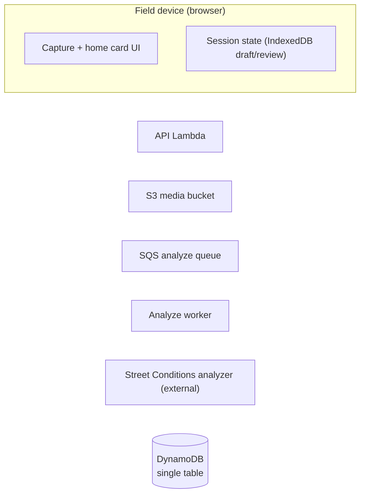
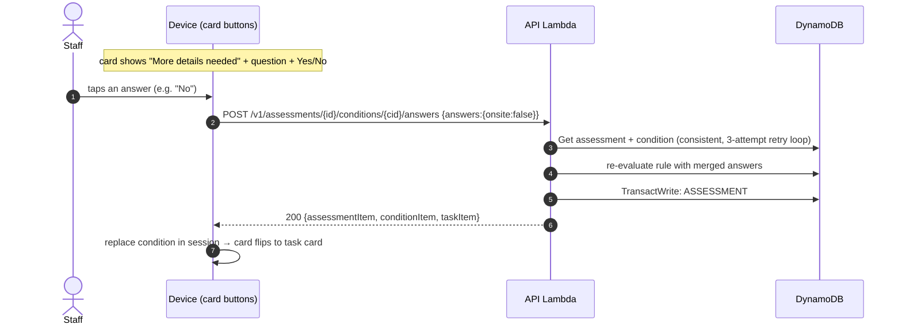
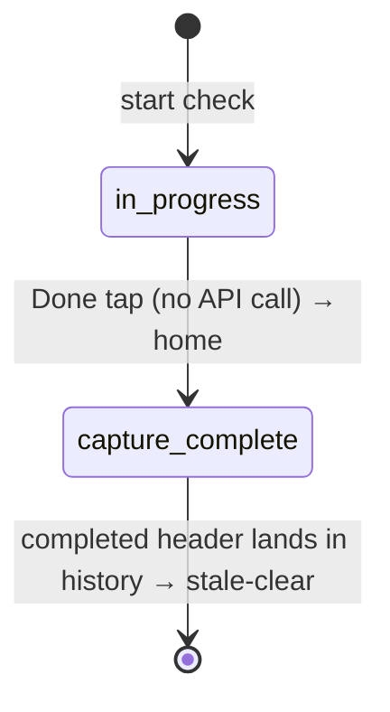
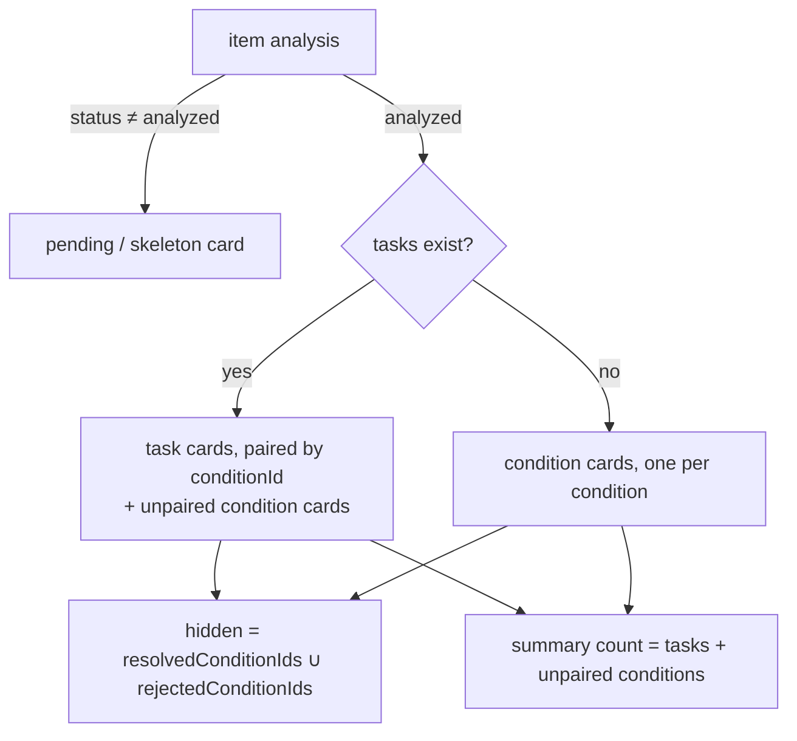
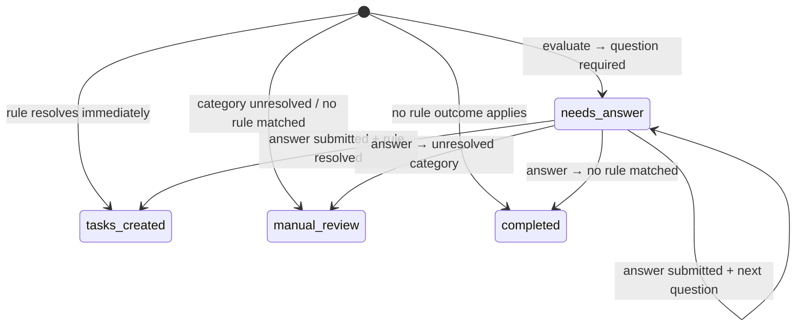

# Perimeter Check Data Flow — from tap to task

*Core reference · [index](./README.md) · item shapes: [dynamodb-data-model.md](./dynamodb-data-model.md)*

**Status:** Live flow — this is what happens today
**Date:** 2026-09-11 · re-traced file-by-file against the code after the #192 home-screen
rebuild and the #202 task short-ID change (anchors throughout)

> **Flow correction (2026-09-11):** an earlier version of this doc narrated the
> pre-#192 batch pipeline (capture → `/review` → batch `submitCheck()` → home
> "Review assessment" tile → `/results` → Continue mints tasks). That pipeline **still
> ships but is unreachable from the UI** — the dead-code verdicts are tabulated in
> [legacy-submit-path-retirement-plan.md](./legacy-submit-path-retirement-plan.md), which
> also schedules its deletion. The live flow is one continuous **per-item** pipeline:
> each photo/typed description uploads, analyzes, and evaluates into guidance **at
> capture time**, Done only finalizes the run scorecard in the background and returns
> the user to home, and the results-screen dispute branch is unreachable. This doc now
> describes only the live flow.

This doc walks one typical perimeter check end-to-end: what the user does, what the app
sends to the Street Conditions analyzer and what comes back, what lands in DynamoDB at
each moment, and how the analysis data becomes the cards the user sees and resolves.
The analyzer itself is a black box here — see the [architecture doc](./architecture.md)
for its container context and [security-review.md](./security-review.md) for the media
boundaries. All sample data is realistic; every record below was traced to the code that
writes it.

**Audience:** new engineers and technical product folks. Start high-level, then zoom.

---

## 1. Orientation — the shape of the whole thing

One continuous per-item pipeline, with a background scorecard fold at the end:

1. **Capture & analyze & guide — per item.** The staff member walks the perimeter taking
   photos and typing descriptions, one "place" at a time. Each piece of evidence is its
   own analysis unit: the moment it's captured it uploads to S3, registers, and the
   analyzer grades it asynchronously while the walk is still happening. As soon as the
   artifact's analysis lands, the client builds a per-item assessment from it and sends
   it to the guidance evaluator — **tasks mint at capture time**, one assessment per
   evidence item, not one per check.
2. **Done finalizes the scorecard only.** Tapping Done ends capture, returns the user to
   the home screen, and starts a **background scorecard fold**: wait for every artifact's
   analysis, then fold them into one grade/summary/category rollup on the check header.
   No assessment envelope is minted for a review step; there is no review screen in the
   live flow.
3. **Work the cards on home.** From the moment an item's tasks exist they render as
   cards — live in the capture region during the walk, then in the home results tray and
   task buckets afterward. The user answers clarifying questions, edits/deletes findings
   (amendments), and completes tasks until done.

Who's who:

- **Staff (device)** — performs the check; authenticated by a device/site JWT
  (`siteId` is derived server-side, never from the body).
- **API Lambda** — one Lambda behind all `/v1/*` routes (backend/src/lambda/api.js).
- **Analyze worker** — SQS-triggered Lambda that fetches media from S3 and calls the
  analyzer (backend/src/workers/analyze-artifact.js).
- **Street Conditions analyzer** — external service. In: metadata + downscaled image bytes
  (`store_input:false`). Out: one assessment per photo — a `grade`, a one-line
  `general_conditions` description, and `identified_conditions_of_concern[]`
  (category/severity/explanation/evidence indices).
- **DynamoDB** — single table, partition `SITE#<siteId>` (backend/src/handlers/keys.js).

### Mermaid key for the diagrams



---

## 2. Sequence — the happy path, with the user in it

```mermaid
sequenceDiagram
  autonumber
  actor Staff
  participant UI as Device (capture + home)
  participant API as API Lambda
  participant S3 as S3 media
  participant Q as SQS
  participant W as Analyze worker
  participant AZ as Analyzer (external)
  participant DB as DynamoDB

  Note over Staff,UI: /check — capture screen
  Staff->>UI: taps Add photo at "Loading Dock"
  Note over UI: item added to session → its own pipeline starts immediately
  UI->>API: POST /v1/checks (checkId as idempotency-key)<br/>once per run, lazily on the first item
  API->>DB: Put CHECK# header {status:"in_progress"}
  UI->>API: POST .../artifacts:presign {placeId, contentType}
  API-->>UI: artifactId + presigned PUT
  UI->>S3: PUT photo bytes
  UI->>API: POST .../artifacts {artifactId, s3Key, capturedAt}
  API->>DB: Put ART# (conditional)
  API->>Q: SendMessage {s3Key…} (never bytes)
  Q->>W: deliver
  W->>S3: GetObject
  W->>AZ: analyze(metadata, media, store_input:false)
  AZ-->>W: assessment {grade, concerns[]}
  W->>DB: Put ANALYSIS# (conditional, idempotent)
  W->>DB: bump CHECK# counters (best-effort)
  UI->>API: GET /v1/checks/{id} — poll for THIS artifact's ANALYSIS#<br/>(2s cadence, 180s cap)
  Note over UI: card flips from "Analyzing…" skeleton to result cards
  UI->>API: POST /v1/assessments:evaluate<br/>(per-item envelope built from the analysis)
  API->>DB: TransactWrite ASSESSMENT# + COND# ×n + TASK# ×m<br/>(shortIds allocated from the site counter)
  API->>DB: task_created app actions (informational 311, best-effort)
  Note over UI: task / condition / question cards render on the item at once
  Staff->>UI: answers "More details needed", or Edit / Delete on a card
  Staff->>UI: taps Done
  Note over UI: navigate home on the tap — no API call;<br/>session flips to capture-complete + background fold starts
  UI->>API: POST /v1/checks/{id}/complete (background, after coverage poll)
  API->>DB: Query header + ART# + ANALYSIS# (consistent)<br/>409 analyzing until every artifact has an ANALYSIS#
  API->>DB: Update CHECK# header (scorecard, status="completed", once-only)
  Note over UI: home re-renders from listTasks → task buckets;<br/>session cards hand off to backend cards as they arrive
  Staff->>UI: works task cards (Done / File 311 / Can't / answers)
  UI->>API: POST /v1/tasks/{id}/complete · /cannot-do · .../answers
  API->>DB: guarded task/condition writes
```

Reading notes:

- Steps 3–15 repeat **per evidence item**. The check header is created once (step 3),
  lazily inside the first item's analysis run; every item then runs its own
  upload→analyze→evaluate loop concurrently.
- The worker→analyzer call is the only place media leaves our stack, and it's
  one-arrow-in/one-out on purpose — that's the whole external boundary.
- **Guidance is per-item and capture-time.** There is no Continue step: an item's
  `assessments:evaluate` fires as soon as its analysis lands. An item whose analysis
  finds no concerns (`rating 0`) never creates an assessment at all.
- Steps 18–20 are **client-driven and background**: the backend never calls the client,
  and the scorecard fold neither mints tasks nor blocks the user — the user is already
  working task cards on home while it runs.

### The branch: a condition needs a user answer

Some rule rows can't resolve from category+severity alone — they ask a question first
("Is this on site property?"). The condition is parked as `needs_answer`, the card renders
with Yes/No buttons, and the answer round-trip re-enters the flow:



The condition guards are the idempotency story here: a double-tap or retry that loses the
race gets a 409 — and if the stored answers already match what was submitted, the backend
**recovers** by returning the stored result (a 200) instead of erroring
(backend/src/handlers/guidance.js `recoverAnsweredCondition`; the store itself retries
the transaction up to 3× before surfacing the conflict).

---

## 3. Worked example — "Graffiti at the Loading Dock"

Follow one realistic run through every write. Site **Civic Center Annex** (`siteId:
site-civic-01`, short codes `providerShortCode:"MOI"` / `siteShortCode:"CCA"`), places
**Lobby** (typed description, no issues) and **Loading Dock** (one photo). ULID checkId
minted client-side: `01JABCDEF…`; the photo's artifact uuid below is abbreviated
`<uuid>`. Analyzer returns, for the Loading Dock photo: `{grade:"Poor", concerns:[{category:"Graffiti", severity:2, description:"Spray paint on the roll-up door", …}]}`.

### Per-item capture & analyze (all during the walk)

**User taps Add photo.** The photo is added to the local session and its pipeline starts
*immediately* (frontend/src/components/perimeter-check.js `_addPhoto` →
frontend/src/services/photo-analysis.js `analyzeEvidenceItem` → `run`). No DB write yet —
the first `createCheck` happens lazily inside the item's own analysis run
(photo-analysis.js `ensureRemoteCheck`).

| API call | DB write | Record (abbreviated) |
|---|---|---|
| `POST /v1/checks` (once; idempotency-key = ULID) | Put CHECK# | `pk SITE#site-civic-01` · `sk CHECK#01JABC…` · `{status:"in_progress", startedAt, places:[…], issueCount:0, maxSeverity:0}` |
| `POST .../artifacts:presign` | — (no write; mints artifactId + S3 key `checks/site-civic-01/01JABC…/loading-dock/<uuid>`) | — |
| (device PUTs bytes straight to S3) | — | — |
| `POST .../artifacts` (register) | Put ART# (conditional) | `sk CHECK#01JABC…#ART#loading-dock#<uuid>` · `{placeId, placeName:"Loading Dock", s3Key, capturedAt, contentType}` → then SQS send `{siteId, checkId, artifactId, s3Key…}` (never bytes) |
| *(SQS → worker → analyzer)* | Put ANALYSIS# (conditional) | `sk CHECK#01JABC…#ANALYSIS#<uuid>` · `{status:"analyzed", grade:"Poor", gradeDescription:"…", concerns:[{category:"Graffiti", rating:2, explanation:"Spray paint…", evidenceIndices:[0]}], issueCount:1, maxSeverity:2, analysisId, rubricVersion, model}` + best-effort header counter bump |
| *(typed Lobby description)* `POST .../artifacts` (text: no s3Key, carries `text`) | Put ART# + ANALYSIS# | text artifacts take the same path minus S3; the analyzer's grade for it was "Good" with no concerns |

While that runs the user sees a live "Analyzing photo…" skeleton on the card
(analysis-results.templates.js `pendingCard`), flipping into result cards when
`GET /v1/checks/{id}` returns the ANALYSIS# item (photo-analysis.js
`waitForArtifactAnalysis`).

**Guidance mints immediately for that item.** The client builds a per-item assessment
from the analysis (photo-analysis.js `assessmentFromAnalysis` — note the ids are now
*per artifact*, not per check: `assessmentId = checkId-artifactId`,
`conditionId = artifactId-001-graffiti`) and calls `assessments:evaluate` with it
(photo-analysis.js `guidanceFromAnalysis` → `evaluateAssessment`):

| API call | DB write | Record (abbreviated) |
|---|---|---|
| `POST /v1/assessments:evaluate` | TransactWrite | see below |
| ↳ assessment | Put ASSESSMENT# (conditional) | `sk ASSESSMENT#01JABC…-<uuid>` · `{status:"tasks_created", policyVersion:"actions-escalations-v2", grade:"Poor", summary:{totalConditions:1, conditionsResolvedToTasks:1, openTaskCount:1, escalationCount:1, …}}` |
| ↳ condition | Put COND# (conditional) | `sk ASSESSMENT#01JABC…-<uuid>#COND#<uuid>-001-graffiti` · `{status:"tasks_created", analyzerCategory:"Graffiti", canonicalCategory:"Graffiti", severity:2, answers:{}, taskIds:[<taskId>], resolvedToTasks:true, selectedRuleId:"GRAFFITI-2", needsAnswer:null}` (+ GSI4/GSI5 stamps) |
| ↳ task | Put TASK# (conditional) | `sk TASK#<uuid>` · `{shortId:"MOI-CCA-001", status:"open", kind:"escalation", type:"city_escalation", ruleId:"GRAFFITI-2", policyVersion, category:"Graffiti", severity:2, label:"Ask the City to clean the graffiti.", guidance:"If the graffiti is not on your property…", appActions:[create_311_ticket…], conditionId, assessmentId, checkId}` (+ GSI2 worklist stamp) |

The task's **shortId** is minted just before the transaction: the store reads the site's
short codes off `#META`, then atomically bumps the site's
`COUNTER#task-display-id` counter (`nextTaskDisplayNumber`) and formats
`<providerShortCode>-<siteShortCode>-<nnn>` (guidance-store.js
`allocateTaskShortIds`). `taskId` stays the canonical identifier; the shortId is the
human-facing reference the cards display (today-view.js `displayTaskId`).

Rule GRAFFITI-2: the rule catalog (actions-escalations-v2) resolves "Graffiti" exactly,
matches severity 1–3 at evaluation order 1, and its predicate `location !=
provider_controlled_property` matched the default (nothing on-site flagged) — so it
escalates to the City rather than becoming a staff task. A sister rule GRAFFITI-1 with the
inverse predicate would have minted an `onsite` "Clean off the graffiti" action instead.

**task_created app actions run right after the transaction commits**
(guidance-store.js `executeTaskCreatedAppActions`): actions whose rule payload is flagged
`executionTrigger:"task_created"` execute at mint time, not at completion time. A rule
with an informational 311 action files the ticket immediately (agency 76) and the result
is folded into `appActionResults` with a `#status = :open` guard; a failure there never
blocks task creation. User-confirmed actions (the 311 *filing* the Done button triggers,
closures) wait for the user.

The Lobby's "Good, no concerns" analysis **stops at ANALYSIS#** —
`guidanceFromAnalysis` only calls evaluate when the analysis has concerns, so a
no-issue item writes no ASSESSMENT#/COND#/TASK# records.

### Done — background scorecard fold

**User taps Done.** No API call on the tap: capture ends, the session flips to
`capture-complete` (check-session.js `markCaptureComplete`, draft cleared) and
`finalizeCaptureScorecardInBackground` (submit-check.js) starts; the user lands on home
right away (perimeter-check.js `_finishCheck` → `navigate("/today")`).

| API call | DB write | Record (abbreviated) |
|---|---|---|
| `POST /v1/checks/{id}/complete` | Update CHECK# (guarded: `#status <> "completed"`) | `{status:"completed", grade:"Poor", summary:"<analyzer's own line for the worst place>", categories:[{category:"Graffiti", maxRating:2, sourceArtifactIds:[<uuid>]}], rubricVersion, issueCount:1, maxSeverity:2, synthesizedAt, completedAt}` — the Lobby's "Good" lost to the Dock's "Poor" (worst-of synthesis, backend/src/analysis/synthesize-check.js) |

The endpoint is coverage-gated: it re-reads the header + all children consistently and
returns `409 analyzing` until **every registered artifact has an ANALYSIS# item**
(failed markers count toward coverage but carry no concerns). The completion write is
conditional on the header not already being `completed`, so a replay is an idempotent
200 (backend/src/handlers/checks.js `completeCheck`). If the app is closed before the
fold finishes, the next home load re-kicks it from the persisted `capture-complete`
session (today-view.js; re-finalizing is idempotent), and the session is cleared once a
completed header with the same id shows up in history
(`isStalePendingSession`).

The 200 response still carries a whole-check guidance assessment envelope
(checks.js `buildGuidanceAssessment`), but the live flow **discards it** — its only
consumers were the legacy batch pipeline. The header's `grade`/`summary`/`categories`
rollup stays (cheap, compliance-valuable) but is a **write-only follow-on** today: its
only reader is the unreachable results screen — see
[legacy-submit-path-retirement-plan.md](./legacy-submit-path-retirement-plan.md) § 2.
Home's "last log" line reads only `completedAt`/`startedAt` from the header.

### While on home — cards, answers, amendments

Home renders three sources in lockstep: backend task cards (`GET /v1/tasks?status=…`,
GSI2, handlers/tasks.js), the session's live analysis cards until backend cards exist for
the same problem (`sessionProblemItemHasBackendCards` dedup), and a "That's a wrap"
summary when a recent run resolved without new issues (today-view.js `_homeResults`).

- **Question cards.** A condition with `needsAnswer` renders as **"More details needed"**
  with the prompt and Yes/No buttons
  (analysis-results.templates.js `conditionEvidenceCard`/`clarifyingQuestion`). Say the
  Dock photo had found **"Aggressive animals"** severity 2 instead (rules ANIMAL-1/2
  require *"Is this animal owned by a site client or resident?"* before they resolve):

| API call | DB write | Record (abbreviated) |
|---|---|---|
| `assessments:evaluate` (at capture) | Put COND# | `sk ASSESSMENT#…#COND#<uuid>-001-aggressive-animals` · `{status:"needs_answer", needsAnswer:{key:"affiliated", prompt:"Is this animal owned by a site client or resident?", options:[{label:"Yes", value:true},{label:"No", value:false}]}, answers:{}, taskIds:[]}` (+ GSI5 unresolved stamp) |
| `POST /v1/assessments/{id}/conditions/{cid}/answers {answers:{affiliated:false}}` **(user taps "No" on the card)** | TransactWrite | same COND# now `{status:"tasks_created", answers:{affiliated:false}, taskIds:[<newTaskId>], resolvedToTasks:true, needsAnswer:null, selectedRuleId:"ANIMAL-2", outcome:{kind:"non_actionable_escalation", …}}` — GSI5 stamp removed; new TASK# `{shortId:"MOI-CCA-002", kind:"non_actionable_escalation", ruleId:"ANIMAL-2", …}` minted; assessment summary deltas applied (conditionsNeedAnswer −1, openTaskCount +1) in the same transaction, guarded by `assessmentRevision` |

  Card dismissal is data-driven: the answer response replaces the condition item in the
  client session (photo-analysis.js `answerAnalysisQuestion`), `needsAnswer` is now null,
  so the card re-renders as the task card for the same conditionId. Nothing was
  "dismissed" — it *resolved*.

- **Edit / Delete on a card** are the amendments endpoints
  (backend/src/handlers/analysis-amendments.js): Edit re-runs the analyzer on an amended
  description and **supersedes any open tasks for that condition**
  (`status:"superseded"` + `supersededAt`, siblings untouched), then the refreshed
  analysis re-evaluates and can mint new tasks (`refreshEvidenceAnalysis`); Delete
  (reason `not_a_problem`) is the same supersession without a re-analysis. Task status
  `superseded` removes the task from the open worklist — it is not a user-visible
  resolution.

### Dismissal & completion — task cards on home

Home task cards come straight from `TASK#` items (today-view.js `homeTaskStatus`):
status `open` → needs-action card; `completing` → in-progress; a `completed` task whose
completion was `311_filed` stays **in-progress** (the City is now working it);
`completed`/`cannot_do` → resolved bucket (then archived after a 72h age window). Tasks
created within the last 3h also surface as "new" cards. **User taps "Done"** on the
graffiti card (311 path here):

| API call | DB write | Record (abbreviated) |
|---|---|---|
| `POST /v1/tasks/{taskId}/complete` (escalation → `311_filed`) | TransactWrite on TASK# | `{status:"completed", completionMethod:"311_filed", appActionStatus:"submitted", appActionResults:[{code:"create_311_ticket", status:"submitted", payload:{tickets:[{srNum, responsibleAgency:"76"}]}}], completionLeaseExpiresAt:null}` |
| *(onsite action instead)* `completionMethod:"manual"` | same shape | `{status:"completed", completionMethod:"manual"}` — and any informational tickets we filed at task creation (agency 76) are closed via `close_311_ticket` in the same completion |

Both paths take the completion lease first: `open → completing` (claimed with a
5-minute lease, `appActionStatus:"executing`), app actions execute, then the final write
is conditioned on the exact lease so a reclaimed executor can't double-complete
(guidance-store.js `completeTaskWithAppActions`). A failed 311 filing leaves the task
`open` (with the failure in `appActionResults`) so the user can retry — completion
resolves as a 200 with the failure recorded, and the client surfaces the reason on the
card instead of silently doing nothing.

### Final database state (the whole run)

| pk | sk | Key attributes (end state) |
|---|---|---|
| `SITE#site-civic-01` | `#META` | site config incl. `providerShortCode:"MOI"`, `siteShortCode:"CCA"` |
| `SITE#site-civic-01` | `COUNTER#task-display-id` | `nextTaskDisplayNumber:2` (one number allocated per minted task; gaps allowed) |
| `SITE#site-civic-01` | `CHECK#01JABC…` | status `completed`, grade `Poor`, summary + categories rollup, issueCount 1, maxSeverity 2 |
| `SITE#site-civic-01` | `CHECK#01JABC…#ART#loading-dock#<uuid>` | placeName, s3Key, capturedAt (photo metadata; bytes in S3) |
| `SITE#site-civic-01` | `CHECK#01JABC…#ART#lobby#<uuid>` | text description (no s3Key) |
| `SITE#site-civic-01` | `CHECK#01JABC…#ANALYSIS#<uuid>` ×2 | raw adapted analyzer output: grade + concerns[] per artifact |
| `SITE#site-civic-01` | `ASSESSMENT#01JABC…-<uuid>` | status `tasks_created`, summary counts, rawAssessment (per analyzed artifact that had concerns) |
| `SITE#site-civic-01` | `ASSESSMENT#01JABC…-<uuid>#COND#<uuid>-001-graffiti` | status `tasks_created`, taskIds, selectedRuleId `GRAFFITI-2`, answers {} |
| `SITE#site-civic-01` | `TASK#<uuid>` | status `completed`, `shortId:"MOI-CCA-001"`, kind `escalation`, ruleId `GRAFFITI-2`, appActionResults |

Every check-scoped item shares one `pk`, so the check-detail read (AP7) is a single
`begins_with(sk, "CHECK#01JABC…")` query — the reason the single-table design exists.
Guidance items (ASSESSMENT#/COND#/TASK#) key off the per-artifact assessment id, so an
amendment can supersede exactly one condition's tasks without touching siblings.

---

## 4. The gates — how data decides what the user sees

Nothing in the UI is toggled by side-flags; cards render from stored/derived state. The
gates, in order:

**a. Session stage machine (during/after capture).** The local session carries a status
that the home view keys off (check-session.js `markCaptureComplete`):



- `in-progress` → capture region open on home. `capture-complete` → home shows the
  captured items' analysis cards; the background scorecard fold runs from here (and is
  re-kicked on every home load until the completed header appears).
- The session module also carries legacy stages (`uploading`, `analyzing`,
  `submitted`, `analysis_failed`) plus the home error/progress tiles that key off them —
  **reachable only from the retired batch pipeline**, never set by the live flow
  (retirement plan § 2). Treat them as dead while they wait for deletion.

**b. Card selection per evidence item** (analysis-results.templates.js
`visibleProblemSelection`):



- A condition is **hidden** when its conditionId is in `resolvedConditionIds` or
  `rejectedConditionIds` (local session bookkeeping written by resolve/reject actions).
- A task card's title is `category → analyzerCategory → canonicalCategory` fallback.
- The "N problems found" label counts **tasks + unpaired conditions** — the same units the
  tray renders, so the count never disagrees with the cards.
- Once backend task cards for the same problem exist (matched by
  taskId/conditionId/assessmentId), the session card yields so the two sources never
  duplicate (`sessionProblemItemHasBackendCards`).

**c. Question cards.** A condition with `needsAnswer` renders as "More details needed" +
prompt + Yes/No buttons. Answering replaces the condition item in the session (and in
DynamoDB, § 3), so the question card disappears because the *data changed*, not because a
dismissal flag was set. Double-tap protection: per-condition in-flight set + button
disabling client-side; `status = needs_answer` condition guard server-side.

**d. Home worklist buckets** (today-view.js `homeTaskStatus`): straight from `TASK#`
status — `open` → needs-action; `completing` → in-progress; `completed` with
`completionMethod:"311_filed"` → **stays in-progress** (the City owns the work now);
`completed`/`cannot_do` → resolved, then archived after a 72h age window; tasks created
within a 3h window also surface as "new" cards. Task overrides are client-side only
(read-model smoothing), never a second source of truth.

**e. Condition status state machine** (what gates a condition between card types):



Task status (`open → completing → completed | cannot_do | superseded`) is guarded by
conditional writes end-to-end — a replay can never double-complete or double-mint.

---

## 5. Where things live in code

| Step | Write site | Read/render site |
|---|---|---|
| Create check (lazy, per run) | backend/src/handlers/checks.js `createCheck` | frontend/src/services/photo-analysis.js `ensureRemoteCheck` |
| Presign / register artifact | backend/src/handlers/artifacts.js `presignUpload`, `registerArtifact` | frontend/src/services/api.js `uploadArtifact`, `registerTextArtifact` (photo-analysis.js `run`) |
| Per-item analysis | backend/src/workers/analyze-artifact.js | frontend/src/services/photo-analysis.js `analyzeEvidenceItem` → `waitForArtifactAnalysis` |
| Per-item guidance evaluate → tasks | backend/src/handlers/guidance.js `evaluateAssessment` → analysis/guidance/guidance-store.js `storeEvaluatedAssessment` (+ `allocateTaskShortIds`) | frontend/src/services/photo-analysis.js `guidanceFromAnalysis` |
| Card rendering | — | frontend/src/components/analysis-results.templates.js (tray on home/capture), today-view.js |
| Question round-trip | backend/src/handlers/guidance.js `submitConditionAnswers` + guidance-store.js `answerCondition` (+ `recoverAnsweredCondition`) | frontend/src/services/photo-analysis.js `answerAnalysisQuestion`, components/analysis-answer-controls.js, today-view.js `_answerAnalysisQuestion` |
| Edit / reject condition (amendments) | backend/src/handlers/analysis-amendments.js → guidance-store.js `supersedeOpenTasksForCondition` | today-view.js `_saveProblemEdit` / `_confirmDeleteProblem`, photo-analysis.js `refreshEvidenceAnalysis` |
| Complete / synthesize scorecard | backend/src/handlers/checks.js `completeCheck` + backend/src/analysis/synthesize-check.js | frontend/src/services/submit-check.js `finalizeCaptureScorecardInBackground` |
| Home worklist | backend/src/handlers/tasks.js `listTasks` | frontend/src/components/today-view.js (`homeTaskStatus`, evidence hydration) |
| Task completion / 311 | guidance-store.js `completeTaskWithAppActions`, `executeTaskCreatedAppActions` | frontend/src/components/today-view.js `_onAction`, `_resolveAnalysisProblem` |
| Task short IDs | guidance-store.js `allocateTaskShortIds` (counter `COUNTER#task-display-id`) | today-view.js `displayTaskId` |

---

## 6. Notes & pointers

- **Single-problem flow** (`/problem`) uses the identical per-item pipeline — each item
  uploads/analyzes/evaluates at capture (photo-analysis.js `analyzeEvidenceItem`); Done
  finalizes the scorecard the same way. Everything downstream is the same shape.
- **The `/results` dispute screen is unreachable legacy.** `check-results.js`
  ("Something not right?" → not_present/better/worse/other dispositions on Continue) and
  the backend dispute machinery behind it still ship but nothing in the live UI can
  reach them; reviewer corrections are served by the amendments endpoints instead. The
  full dead-code verdict table and deletion schedule live in
  [legacy-submit-path-retirement-plan.md](./legacy-submit-path-retirement-plan.md).
- **Task `shortId`** (`<providerShortCode>-<siteShortCode>-<nnn>`) is display-only;
  `taskId` remains the API/key identifier. Counter gaps are allowed if a task
  transaction fails after allocation — see
  [dynamodb-data-model.md](./dynamodb-data-model.md).
- **311 lifecycle:** informational tickets filed at `task_created` (agency 76) are
  closed via `close_311_ticket` on work-done completions; user-confirmed filings
  (`311_filed`) are the City's to manage. See the data model doc for the full 311
  attribute story.
- **Offline/resume, analytics/CQRS** are deliberately out of scope here: see
  [dynamodb-data-model.md](./dynamodb-data-model.md) (311 attributes, GSIs, identity
  model) and [architecture.md](./architecture.md) (security boundaries),
  [guidance-policy-changelog.md](./guidance-policy-changelog.md) (rule versioning).
- The analyzer contract is documented by its consumer adapters:
  backend/src/analysis/contract.js (wire shape) and adapt-scorecard.js (what we keep).