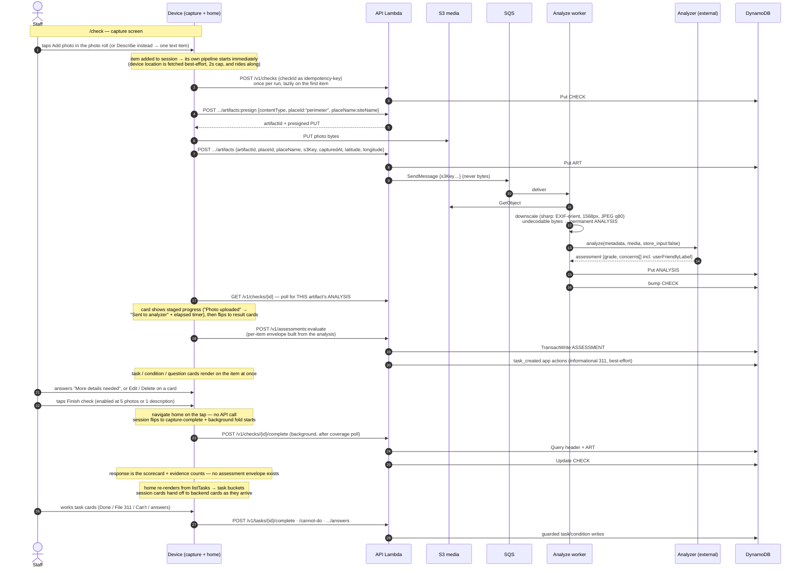
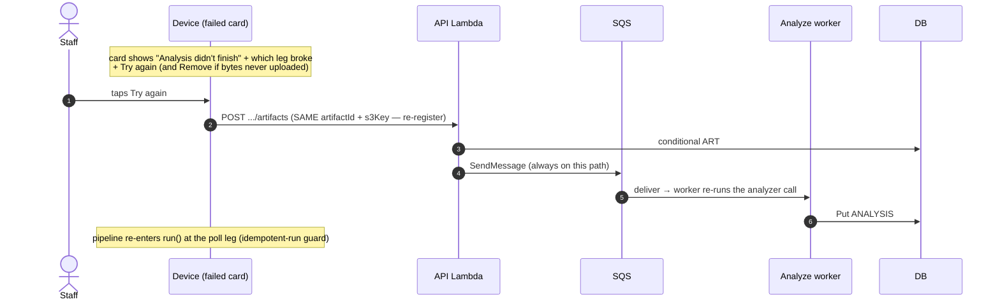
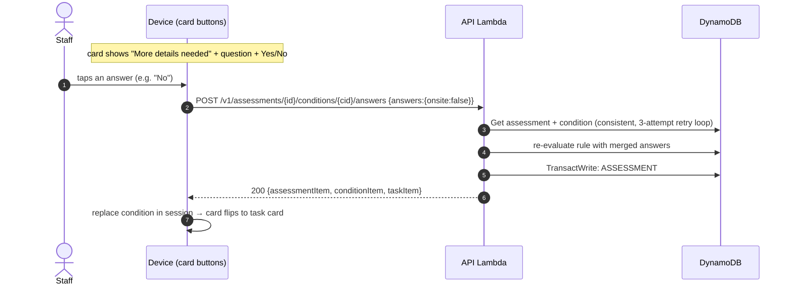
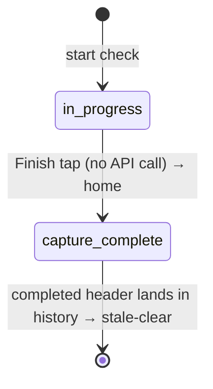
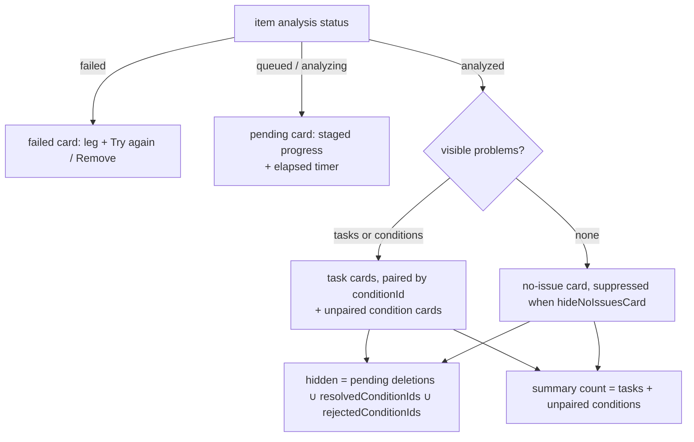
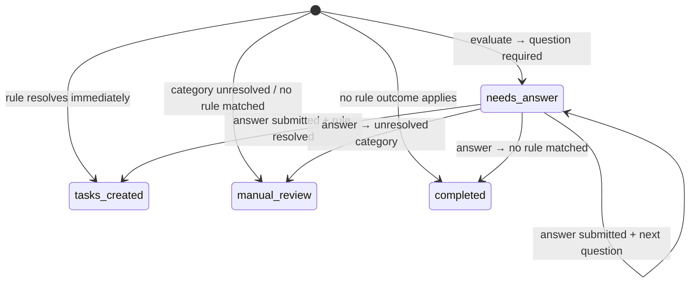

# Perimeter Check Data Flow — from tap to task

*Core reference · [index](./README.md) · item shapes: [dynamodb-data-model.md](./dynamodb-data-model.md)*

**Last reviewed:** 2026-09-21 against dev

This doc walks one typical perimeter check end-to-end: what the user does, what the app
sends to the Street Conditions analyzer and what comes back, what lands in DynamoDB at
each moment, and how the analysis data becomes the cards the user sees and resolves.
The analyzer itself is a black box here — see the [architecture doc](./architecture.md)
for its container context and [security-review.md](./security-review.md) for the media
boundaries. All sample data is realistic; every record below was traced to the code that
writes it.

---

## 1. Orientation — the shape of the whole thing

One continuous per-item pipeline, with a background scorecard fold at the end:

1. **Capture & analyze & guide — per item.** The staff member walks the perimeter adding
   photos to one flat photo roll — or, when taking photos outside isn't practical or safe,
   types one description of the whole area instead. There is no list of places to walk
   ([ADR 0014](./adr/0014-remove-places-photo-roll.md)); Finish unlocks at **five photos
   or one saved description** (frontend/src/domain/check-completion.js), a client-side
   rule the backend records but never enforces. Each piece of evidence is its
   own analysis unit: the moment it's captured it uploads to S3, registers, and the
   analyzer grades it asynchronously while the walk is still happening. As soon as the
   artifact's analysis lands, the client builds a per-item assessment from it and sends
   it to the guidance evaluator which translates issues discovered by the AI into a list 
   of tasks to be performed either by the site staff or the city.
2. **Finish just ends the walk.** It flips the session to `capture-complete` and kicks off
   the background scorecard fold — a check-level grade/summary rollup written to the
   check header for analytics and compliance. No UI reads it today; the task cards keep
   working the same way on home as they did in capture.

Who's who:

- **Staff (device)** — performs the check; authenticated by an HS256 device-token JWT
  whose `siteId` claim is derived server-side, never from the body. An authorizer that
  runs but yields no claim fails closed (`MissingSiteClaimError`), never a silent
  fallback to another tenant's partition (backend/src/lib/principal.js).
- **API Lambda** — one Lambda behind all `/v1/*` routes (backend/src/lambda/api.js).
- **Analyze worker** — SQS-triggered Lambda that fetches media from S3, downscales it
  (sharp: EXIF-orient, fit 1568 px long edge, JPEG q80 — ADR 0012), and calls the
  analyzer (backend/src/workers/analyze-artifact.js).
- **Street Conditions analyzer** — external service. In: metadata (`position_descriptor`
  = the site name, capture time, per-photo GPS) + downscaled image bytes (`store_input:false`). Out: one
  assessment per photo — a `grade`, a one-line `general_conditions` description, and
  `identified_conditions_of_concern[]` (category/severity/explanation/evidence indices,
  plus a `user_friendly_label` per concern the cards prefer as their title).
- **DynamoDB** — single table, partition `SITE#<siteId>` (backend/src/handlers/keys.js).

---

## 2. Sequence — the happy path

Reading notes:

- Steps 3–15 repeat **per evidence item**. The check header is created once (step 3),
  lazily inside the first item's analysis run; every item then runs its own
  upload→analyze→evaluate loop concurrently.
- `placeId` / `placeName` on presign and register are optional. The client sends the
  synthetic id `"perimeter"` plus the site name (check-session.js `perimeterPlace`); the
  backend defaults a missing `placeId` to the same constant (artifacts.js
  `DEFAULT_PLACE_ID`), and the worker's `position_descriptor` falls back to the literal
  `"perimeter"` when `placeName` is absent.
- The worker→analyzer call is the only place media leaves our stack.
- Steps 18–20 are **client-driven and background**: the backend never calls the client,
  and the scorecard fold neither mints tasks nor blocks the user — the user is working
  task cards on home while it runs.

### The branch: a failed pipeline leg

The client stamps `uploaded` on the card when the S3 PUT lands and `sent` when the
artifact is registered, with a live elapsed timer after `sent`. A failure is reduced to
a leg (`start`/`upload`/`analyze`/`evaluate`), what had already succeeded, and how long
we waited (photo-analysis.js `describeFailure`, `withLeg`). The failed card offers
**Try again** (plus **Remove** for never-uploaded photos), and retry is leg-aware
(photo-analysis.js `retryEvidenceItem`):

- a failed **analyze** leg: re-`registerArtifact` with the **same artifactId + s3Key** —
  the backend always enqueues on that path, so the worker makes a fresh analyzer call;
- a failed **upload** leg: replay the pipeline from presign;
- an interrupted run (upload done, analysis never started): adopt the persisted
  `upload.artifactId`/`s3Key` and go straight to polling.

### The branch: a condition needs a user answer

Some rule rows can't resolve from category+severity alone — they ask a question first
("Is this on site property?"). The condition is parked as `needs_answer`, the card renders
with Yes/No buttons, and the answer round-trip re-enters the flow:

Double-taps and retries are safe: a lost race returns 409, and if the stored answers
already match what was submitted the backend returns the stored result (200) instead of
erroring (guidance.js `recoverAnsweredCondition`). If the assessment was replaced
meanwhile (`supersededByAssessmentId`), the write fails with 409
`AssessmentRevisionConflict` and the client re-reads the latest published guidance
before proceeding.

---

## 3. Worked example — "Graffiti on the roll-up door"

Follow one realistic run through every write. Site **Civic Center Annex** (`siteId:
site-civic-01`, short codes `providerShortCode:"MOI"` / `siteShortCode:"CCA"`). Staff
walk the perimeter and take **five photos** into the photo roll; four analyze "Good" with
no concerns, and the third — the loading-dock roll-up door — comes back with graffiti.
ULID checkId minted client-side: `01JABCDEF…`; that photo's artifact uuid below is
abbreviated `<uuid>`. Analyzer returns for it: `{grade:"Poor", concerns:[{category:"Graffiti", severity:2, description:"Spray paint on the roll-up door", …}]}`.
Every artifact of the run lands under the one synthetic place `placeId:"perimeter"` with
`placeName:"Civic Center Annex"` (check-session.js `perimeterPlace`).

### Per-item capture & analyze (all during the walk)

**User taps Add photo.** The photo is added to the local session and its pipeline starts
at once (frontend/src/components/perimeter-check.js `_addPhoto` →
frontend/src/services/photo-analysis.js `analyzeEvidenceItem` → `run`). The progress line
reads "1 of 5 photos" and Finish stays disabled until the completion rule is met
(check-completion.js `completionStatus`). No DB write yet — the first `createCheck`
happens lazily inside the item's own analysis run (photo-analysis.js `ensureRemoteCheck`).

**Describe instead** is the same pipeline with a text item. `/check/describe` saves one
description per check (at least 20 characters, check-completion.js
`MIN_DESCRIPTION_LENGTH`), files it as a `kind:"text"` session item and analyzes it like
a photo (describe-instead.js `_onContinue`); reopening the screen edits the saved text,
and saving a change replaces the session item.

| API call | DB write | Record (abbreviated) |
|---|---|---|
| `POST /v1/checks` (once; idempotency-key = ULID) | Put CHECK# | `pk SITE#site-civic-01` · `sk CHECK#01JABC…` · `{status:"in_progress", startedAt, issueCount:0, maxSeverity:0}` (the body carries nothing the header stores; a legacy `places` list is ignored) |
| `POST .../artifacts:presign` | — (no write; mints artifactId + S3 key `checks/site-civic-01/01JABC…/perimeter/<uuid>`; a missing `placeId` defaults to `"perimeter"`) | — |
| (device PUTs bytes straight to S3) | — | — |
| `POST .../artifacts` (register) | Put ART# (conditional) | `sk CHECK#01JABC…#ART#perimeter#<uuid>` · `{placeId:"perimeter", placeName:"Civic Center Annex", s3Key, capturedAt, latitude, longitude, contentType:"image/jpeg"}` → then SQS send `{siteId, checkId, artifactId, placeId, placeName, s3Key…}` (never bytes) |
| *(SQS → worker → analyzer)* | Put ANALYSIS# (conditional) | `sk CHECK#01JABC…#ANALYSIS#<uuid>` · `{status:"analyzed", grade:"Poor", gradeDescription:"…", concerns:[{category:"Graffiti", rating:2, explanation:"Spray paint…", userFriendlyLabel:"Graffiti", evidenceIndices:[0]}], issueCount:1, maxSeverity:2, analysisId, rubricVersion, model, latitude, longitude}` + best-effort header counter bump |
| *(the other four photos)* same three calls each | Put ART# + ANALYSIS# ×4 | same shapes; each analyzed "Good" with `concerns:[]`, `issueCount:0` |
| *(alternative: Describe instead)* `POST .../artifacts` (text: no s3Key, carries `text`) | Put ART# + ANALYSIS# | `sk CHECK#01JABC…#ART#perimeter#<uuid>` · `{placeId:"perimeter", placeName:"Civic Center Annex", text:"Sidewalk and loading dock are clear, no dumping or graffiti today.", capturedAt, latitude, longitude}`; the worker sends it as `{type:"text"}` media with the same `position_descriptor`. One description satisfies the completion rule on its own |

While that runs, the card shows staged progress — "Photo uploaded" → "Sent to analyzer"
with an elapsed timer (analysis-results.templates.js `pendingCard`) — and flips to
result cards when `GET /v1/checks/{id}` returns the ANALYSIS# item
(photo-analysis.js `waitForArtifactAnalysis`).

Removing a tile or the description drops it from the session only: an ART# that has
already registered stays in the table with its ANALYSIS#, still counts toward the
completion coverage gate, and is counted by `evidenceSummary` at complete (there is no
artifact delete route). An edited description therefore registers a second text
artifact; the first stays on the backend.

**Guidance mints for that item right away.** The client builds a per-item assessment
from the analysis (photo-analysis.js `assessmentFromAnalysis` — the ids are
*per artifact*, not per check: `assessmentId = checkId-artifactId`,
`conditionId = artifactId-001-graffiti`) and calls `assessments:evaluate` with it
(photo-analysis.js `guidanceFromAnalysis` → `evaluateAssessment`):

| API call | DB write | Record (abbreviated) |
|---|---|---|
| `POST /v1/assessments:evaluate` | TransactWrite | see below |
| ↳ assessment | Put ASSESSMENT# (conditional) | `sk ASSESSMENT#01JABC…-<uuid>` · `{status:"tasks_created", policyVersion:"actions-escalations-v2", grade:"Poor", assessmentRevision:0, summary:{totalConditions:1, conditionsResolvedToTasks:1, openTaskCount:1, escalationCount:1, …}}` |
| ↳ condition | Put COND# (conditional) | `sk ASSESSMENT#01JABC…-<uuid>#COND#<uuid>-001-graffiti` · `{status:"tasks_created", analyzerCategory:"Graffiti", canonicalCategory:"Graffiti", severity:2, userFriendlyLabel:"Graffiti", source:{latitude, longitude, positionDescriptor:"Civic Center Annex"}, answers:{}, taskIds:[<taskId>], resolvedToTasks:true, selectedRuleId:"GRAFFITI-2", needsAnswer:null}` (+ GSI4/GSI5 stamps) |
| ↳ task | Put TASK# (conditional) | `sk TASK#<uuid>` · `{shortId:"MOI-CCA-001", status:"open", kind:"escalation", type:"city_escalation", ruleId:"GRAFFITI-2", policyVersion, category:"Graffiti", userFriendlyLabel:"Graffiti", severity:2, label:"Ask the City to clean the graffiti.", guidance:"If the graffiti is not on your property…", appActions:[create_311_ticket…], conditionId, assessmentId, checkId, sourceArtifactIds:[<uuid>]}` (+ GSI2 worklist stamp) |

The task's **shortId** is minted before the transaction: the store reads the site's
short codes off `#META`, then atomically bumps the site's
`COUNTER#task-display-id` counter (`nextTaskDisplayNumber`) and formats
`<providerShortCode>-<siteShortCode>-<nnn>` (guidance-store.js
`allocateTaskShortIds`). `taskId` stays the canonical identifier; the shortId is the
human-facing reference the cards display (today-view.js `displayTaskId`).

Rule GRAFFITI-2 (rule catalog `actions-escalations-v2`) resolves "Graffiti" at severity
1–3 and its predicate matched the default (nothing on-site flagged) — so it escalates to
the City rather than becoming a staff task. See
[guidance-policy-changelog.md](./guidance-policy-changelog.md) for the rulebase.

**task_created app actions run right after the transaction commits**
(guidance-store.js `executeTaskCreatedAppActions`): actions whose rule payload is flagged
`executionTrigger:"task_created"` execute at mint time, not at completion time. A rule
with an informational 311 action files the ticket immediately (agency 76) and the result
is folded into `appActionResults` with a `#status = :open` guard; a failure there never
blocks task creation. User-confirmed actions (the 311 *filing* the Done button triggers,
closures) wait for the user.

The four "Good, no concerns" photos still **write no ASSESSMENT#/COND#/TASK#
records** — their assessment envelopes carry zero conditions, so nothing mints
(assessmentFromAnalysis filters concerns to `rating > 0`, and a no-issue item stores its
analysis locally only).

### Finish — background scorecard fold

**User taps Finish check** — enabled once the roll holds five photos or one description
(check-completion.js `isPerimeterCheckComplete`); the backend never refuses a completion
on evidence grounds. No API call on the tap: capture ends, the session flips to
`capture-complete` (check-session.js `markCaptureComplete`, draft cleared) and
`finalizeCaptureScorecardInBackground` (submit-check.js) starts; the user lands on home
(perimeter-check.js `_finishCheck` → `navigate("/today")`).

| API call | DB write | Record (abbreviated) |
|---|---|---|
| `POST /v1/checks/{id}/complete` | Update CHECK# (guarded: `#status <> "completed"`) | `{status:"completed", grade:"Poor", summary:"<analyzer's own line for the worst artifact>", categories:[{category:"Graffiti", maxRating:2, sourceArtifactIds:[<uuid>]}], rubricVersion, issueCount:1, maxSeverity:2, photoCount:5, textCount:0, evidenceKind:"photos", synthesizedAt, completedAt}` — four "Good" photos lost to the door's "Poor" (worst-of synthesis, backend/src/analysis/synthesize-check.js). The evidence mix is counted from the ART# items (checks.js `evidenceSummary`: `photos` / `description` / `mixed` / `none`). No guidance envelope in the request or response. |

The endpoint is coverage-gated: it re-reads the header + all children consistently and
returns `409 analyzing` until **every registered artifact has an ANALYSIS# item**
(failed markers count toward coverage but carry no concerns). The completion write is
conditional on the header not already being `completed`, so a replay is an idempotent
200 (backend/src/handlers/checks.js `completeCheck`). If the app is closed before the
fold finishes, the next home load re-kicks it from the persisted `capture-complete`
session (today-view.js; re-finalizing is idempotent), and the session is cleared once a
completed header with the same id shows up in history
(today-view.js `isStalePendingSession`).

**The response is the scorecard plus the evidence counts.** Guidance is per-item at
capture time, so there is nothing for completion to evaluate. The header's
`grade`/`summary`/`categories` rollup and `photoCount`/`textCount`/`evidenceKind` are
written-once for analytics and compliance — no UI renders them today (the checks-list
GSI1 read is their only reader; home's "last log" line reads only
`completedAt`/`startedAt`). `evidenceKind` is what lets the compliance report show how
often staff use the text path instead of photos.

### While on home — cards, answers, amendments

Home renders three sources together: backend task cards (`GET /v1/tasks?status=…`,
GSI2, handlers/tasks.js), the session's live analysis cards until backend cards exist for
the same problem, and a "That's a wrap" summary when a recent run resolved without new
issues (the dedup and the wrap logic both live in today-view.js `_homeResults`; § 4
covers the gating).

- **Question cards.** A condition with `needsAnswer` renders as **"More details needed"**
  with the prompt and Yes/No buttons
  (analysis-results.templates.js `conditionEvidenceCard`/`clarifyingQuestion`). Say the
  Dock photo had found **"Aggressive animals"** severity 2 instead (rules ANIMAL-1/2
  require *"Is this animal owned by a site client or resident?"* before they resolve):

| API call | DB write | Record (abbreviated) |
|---|---|---|
| `assessments:evaluate` (at capture) | Put COND# | `sk ASSESSMENT#…#COND#<uuid>-001-aggressive-animals` · `{status:"needs_answer", needsAnswer:{key:"affiliated", prompt:"Is this animal owned by a site client or resident?", options:[{label:"Yes", value:true},{label:"No", value:false}]}, answers:{}, taskIds:[]}` (+ GSI5 unresolved stamp) |
| `POST /v1/assessments/{id}/conditions/{cid}/answers {answers:{affiliated:false}}` **(user taps "No" on the card)** | TransactWrite | same COND# now `{status:"tasks_created", answers:{affiliated:false}, taskIds:[<newTaskId>], resolvedToTasks:true, needsAnswer:null, selectedRuleId:"ANIMAL-2", outcome:{kind:"non_actionable_escalation", …}}` — GSI5 stamp removed; new TASK# `{shortId:"MOI-CCA-002", kind:"non_actionable_escalation", ruleId:"ANIMAL-2", …}` minted; assessment summary deltas applied (conditionsNeedAnswer −1, openTaskCount +1) in the same transaction, guarded by `assessmentRevision` and `attribute_not_exists(supersededByAssessmentId)` |

  Answering replaces the condition in the client session
  (photo-analysis.js `answerAnalysisQuestion`), so the card re-renders as the task card
  for the same conditionId. If the answer races a concurrent refresh
  (`AssessmentRevisionConflict`), the client re-reads the latest published guidance and
  re-renders from that.

- **Edit / Delete on a card** are the amendments endpoints
  (backend/src/handlers/analysis-amendments.js); both publish guidance through the
  **lineage refresh** (below). Edit re-runs the analyzer on an amended description and
  the result publishes as a new assessment revision. Delete (reason `not_a_problem`)
  rejects the analyzer condition, then retires its open tasks; a 404
  `unknown_condition` from the analyzer counts as already-rejected so a task that
  outlived its condition is still retired, and the card's `taskId` narrows retirement to
  that task (guidance-store.js `supersedeOpenTasksForCondition`). A task that
  transitioned mid-deletion counts as retired, not an error. On the client the card
  disappears behind a cancellable "Item deleted" toast with Undo
  (state/pending-deletions.js, analysis-card-deletion.js), so worklist cards without a
  local session still get durable deletions.

### Guidance lineage — how a refresh replaces an assessment

An amendment (or any re-evaluation that changes an item's conditions) publishes a
**successor assessment** in one transaction (guidance-store.js
`storeEvaluatedAssessment`):

| Write | Record |
|---|---|
| Put ASSESSMENT# | the new revision, `assessmentRevision` inherited + 1, `rawAssessment` from the refreshed analyzer output |
| Put/retain COND# | conditions whose identity (explicit conditionId, policy/category/severity/label/description, artifact set) is unchanged are **preserved with their answers and open tasks**; changed/new ones re-evaluate and may mint tasks |
| Put TASK# | new tasks for new outcomes (shortIds from the same site counter) |
| Put `GUIDANCE_CURRENT#` pointer | `sk GUIDANCE_CURRENT#<JSON [checkId, lineageId]>` → `{assessmentId: <new>}`, conditioned on still pointing at the predecessor |
| Update predecessor ASSESSMENT# | `SET supersededByAssessmentId, lineageId`, guarded by `assessmentRevision` — closes the race with concurrent answers |
| Put retired TASK# | open tasks of removed/changed conditions → `status:"superseded"`, `supersessionReason:"assessment_refreshed"`, guarded `#status = :open` |

`lineageId` is the artifact ID (artifact-less API assessments use their original
assessment ID), so an item's whole guidance history is one pointer. A completing task
blocks publication until it settles (`TaskTransitionConflict` → 409) — completed tasks
remain historical records, never undone by a refresh. Historical reads resolve through
the pointer (`getPublishedAssessmentGuidance`), so an old assessmentId in a URL or an
idempotent retry lands on the current revision. The client drives this with
`previousAssessmentId` and a 409-retry loop that adopts whichever revision won
(photo-analysis.js `refreshEvidenceAnalysis`).

### Dismissal & completion — task cards on home

Task completion detail (311 paths, lease mechanics):

| API call | DB write | Record (abbreviated) |
|---|---|---|
| `POST /v1/tasks/{taskId}/complete` (escalation → `311_filed`) | TransactWrite on TASK# | `{status:"completed", completionMethod:"311_filed", appActionStatus:"submitted", appActionResults:[{code:"create_311_ticket", status:"submitted", payload:{tickets:[{srNum, responsibleAgency:"76"}]}}], completionLeaseExpiresAt:null}` |
| *(onsite action instead)* `completionMethod:"manual"` | same shape | `{status:"completed", completionMethod:"manual"}` — and any informational tickets we filed at task creation (agency 76) are closed via `close_311_ticket` in the same completion |

Both paths take the completion lease first: `open → completing` (claimed with a
5-minute lease, `appActionStatus:"executing`), app actions execute, then the final write
is conditioned on the exact lease so a reclaimed executor can't double-complete
(guidance-store.js `completeTaskWithAppActions`). A failed 311 filing leaves the task
`open` (with the failure in `appActionResults`) so the user can retry — completion
resolves as a 200 with the failure recorded, and the client surfaces the reason on the
card instead of silently doing nothing. How statuses map to home buckets is §4d.

### Final database state (the whole run)

| pk | sk | Key attributes (end state) |
|---|---|---|
| `SITE#site-civic-01` | `#META` | site config incl. `providerShortCode:"MOI"`, `siteShortCode:"CCA"`, and the admin-geocoded `location` (Census geocoder; 311's fallback when a photo carried no GPS) |
| `SITE#site-civic-01` | `COUNTER#task-display-id` | `nextTaskDisplayNumber:2` (one number allocated per minted task; gaps allowed) |
| `SITE#site-civic-01` | `CHECK#01JABC…` | status `completed`, grade `Poor`, summary + categories rollup, issueCount 1, maxSeverity 2, photoCount 5, textCount 0, evidenceKind `photos` |
| `SITE#site-civic-01` | `CHECK#01JABC…#ART#perimeter#<uuid>` ×5 | placeId `perimeter`, placeName `Civic Center Annex`, s3Key, capturedAt, latitude/longitude (photo metadata; bytes in S3). A Describe-instead run holds one such row carrying `text` and no s3Key |
| `SITE#site-civic-01` | `CHECK#01JABC…#ANALYSIS#<uuid>` ×5 | raw adapted analyzer output: grade + concerns[] per artifact |
| `SITE#site-civic-01` | `GUIDANCE_CURRENT#<JSON [01JABC…, <uuid>]>` | pointer to the current assessment for the artifact's lineage (`assessmentId`) |
| `SITE#site-civic-01` | `ASSESSMENT#01JABC…-<uuid>` | status `tasks_created`, summary counts, rawAssessment (per analyzed artifact that had concerns) |
| `SITE#site-civic-01` | `ASSESSMENT#01JABC…-<uuid>#COND#<uuid>-001-graffiti` | status `tasks_created`, taskIds, selectedRuleId `GRAFFITI-2`, answers {} |
| `SITE#site-civic-01` | `TASK#<uuid>` | status `completed`, `shortId:"MOI-CCA-001"`, kind `escalation`, ruleId `GRAFFITI-2`, appActionResults |

Every check-scoped item shares one `pk`, so the check-detail read (AP7) is a single
`begins_with(sk, "CHECK#01JABC…")` query. Guidance items (ASSESSMENT#/COND#/TASK#) key
off the per-artifact assessment id, and the `GUIDANCE_CURRENT#` pointer ties them to the
item's lineage, so an amendment can supersede one condition's tasks without touching
siblings. See the data-model doc's "Guidance refresh lineage" section for item shapes.

---

## 4. The gates — how data decides what the user sees

Nothing in the UI is toggled by side-flags; cards render from stored/derived state. The
gates, in order:

**a. Session stage machine (during/after capture).** The local session carries a status
that the home view keys off (check-session.js `markCaptureComplete`):

- `in-progress` → capture region open on home. `capture-complete` → home shows the
  captured items' analysis cards; the background scorecard fold runs from here (and is
  re-kicked on every home load until the completed header appears).

**b. Card selection per evidence item** (analysis-results.templates.js
`visibleProblemSelection`):

- A condition is **hidden** when its conditionId is in `resolvedConditionIds`,
  `rejectedConditionIds`, or behind an app-lifetime **pending deletion** (the
  cancellable-delete toast — `pendingDeletedConditionIds` covers stale backend reads
  until the deletion commits).
- A task card's title is `userFriendlyLabel → category → analyzerCategory →
  canonicalCategory` fallback (`displayCategory`) — the analyzer now returns a
  `user_friendly_label` per concern, and the cards prefer it (#216).
- The "N problems found" label counts **tasks + unpaired conditions** — the same units the
  tray renders, so the count never disagrees with the cards.
- Once backend task cards for the same problem exist (matched by
  taskId/conditionId/assessmentId), the session card yields so the two sources never
  duplicate (`sessionProblemItemHasBackendCards`).

**c. Question cards.** A condition with `needsAnswer` renders as "More details needed" +
prompt + Yes/No buttons. Answering updates the data in the session and DynamoDB (§ 3),
so the card disappears because the data changed. Double-tap protection: per-condition
in-flight set + button disabling client-side; `status = needs_answer` guard server-side.

**d. Home worklist buckets** (today-view.js `homeTaskStatus`): straight from `TASK#`
status — `open` → needs-action; `completing` → in-progress; `completed` with
`completionMethod:"311_filed"` → **stays in-progress** (the City owns the work now);
`completed`/`cannot_do` → resolved, then archived after a 72h age window; tasks created
within a 3h window also surface as "new" cards. Tasks staged for deletion are excluded
from the worklist while their toast is pending (`isTaskPendingDeletion`). Task
overrides are client-side only (read-model smoothing), never a second source of truth.

**e. Condition status state machine** (what gates a condition between card types):

Task status (`open → completing → completed | cannot_do | superseded`) is guarded by
conditional writes end-to-end — a replay can never double-complete or double-mint, and
the lineage publication never retires a mid-`completing` task (§ 3).

---

## 5. Where things live in code

| Step | Write site | Read/render site |
|---|---|---|
| Create check (lazy, per run) | backend/src/handlers/checks.js `createCheck` (empty body; no places) | frontend/src/services/photo-analysis.js `ensureRemoteCheck` |
| Completion rule (client-side only) | — | frontend/src/domain/check-completion.js `isPerimeterCheckComplete` (5 photos or 1 description); perimeter-check.js `_done` / `_finishCheck`, templates `progressLine` / `footer` |
| Describe instead (one text item per check) | backend/src/handlers/artifacts.js `registerArtifact` (text, no s3Key) | frontend/src/components/describe-instead.js `_onContinue` → photo-analysis.js `analyzeEvidenceItem` |
| Presign / register artifact | backend/src/handlers/artifacts.js `presignUpload`, `registerArtifact` (`placeId` optional → `DEFAULT_PLACE_ID` `"perimeter"`; `placeName` = site name) | frontend/src/services/api.js `uploadArtifact`, `registerTextArtifact` (photo-analysis.js `run`) |
| Device location (per item) | — | frontend/src/services/device-location.js `getCaptureDeviceLocation` (2s best-effort; 311 falls back to the site's geocoded `#META` location) |
| Per-item analysis | backend/src/workers/analyze-artifact.js (+ media/downscale.js) | frontend/src/services/photo-analysis.js `analyzeEvidenceItem` → `waitForArtifactAnalysis` |
| Failed-card retry | — | photo-analysis.js `retryEvidenceItem` (re-register same artifactId → fresh analyze) |
| Per-item guidance evaluate → tasks | backend/src/handlers/guidance.js `evaluateAssessment` → analysis/guidance/guidance-store.js `storeEvaluatedAssessment` (+ `allocateTaskShortIds`) | frontend/src/services/photo-analysis.js `guidanceFromAnalysis` |
| Card rendering | — | frontend/src/components/analysis-results.templates.js (tray on home/capture), today-view.js |
| Question round-trip | backend/src/handlers/guidance.js `submitConditionAnswers` + guidance-store.js `answerCondition` (+ `recoverAnsweredCondition`) | frontend/src/services/photo-analysis.js `answerAnalysisQuestion`, components/analysis-answer-controls.js, today-view.js `_answerAnalysisQuestion` |
| Edit / reject condition (amendments) | backend/src/handlers/analysis-amendments.js → guidance-store.js `supersedeOpenTasksForCondition` + lineage refresh `storeEvaluatedAssessment` | today-view.js `_saveProblemEdit` / `_confirmDeleteProblem`, components/analysis-card-deletion.js + state/pending-deletions.js, photo-analysis.js `refreshEvidenceAnalysis` |
| Complete / synthesize scorecard + evidence counts | backend/src/handlers/checks.js `completeCheck`, `evidenceSummary` + backend/src/analysis/synthesize-check.js | frontend/src/services/submit-check.js `finalizeCaptureScorecardInBackground` |
| Home worklist | backend/src/handlers/tasks.js `listTasks` | frontend/src/components/today-view.js (`homeTaskStatus`, evidence hydration) |
| Task completion / 311 | guidance-store.js `completeTaskWithAppActions`, `executeTaskCreatedAppActions` | frontend/src/components/today-view.js `_onAction`, `_resolveAnalysisProblem` (+ state/toasts.js 311 toasts) |
| Task short IDs | guidance-store.js `allocateTaskShortIds` (counter `COUNTER#task-display-id`) | today-view.js `displayTaskId` |
| Guidance lineage | guidance-store.js `storeEvaluatedAssessment` (pointer + supersede), `getPublishedAssessmentGuidance` | photo-analysis.js `refreshEvidenceAnalysis` (previousAssessmentId + 409 reconcile) |
