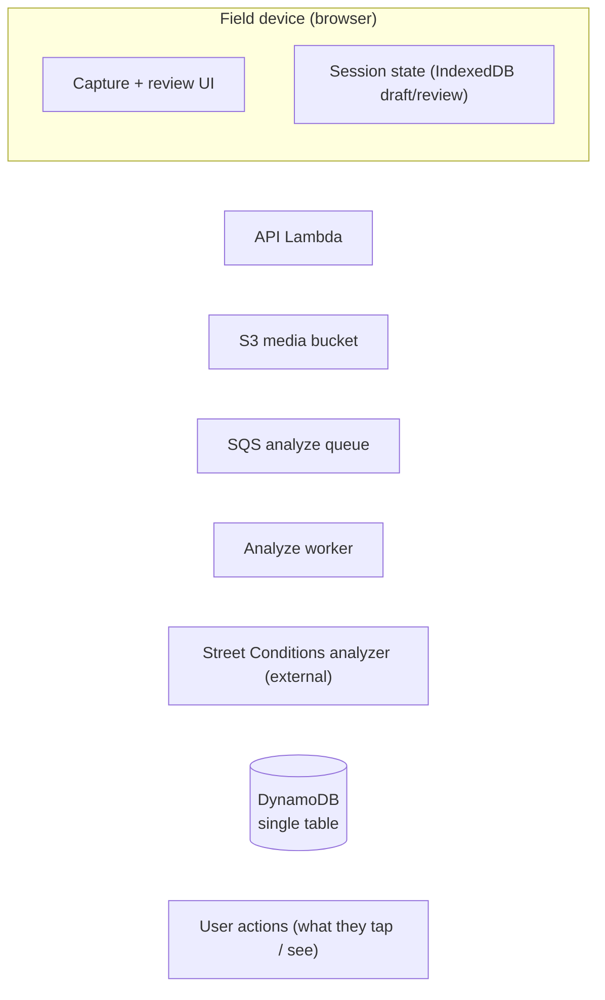
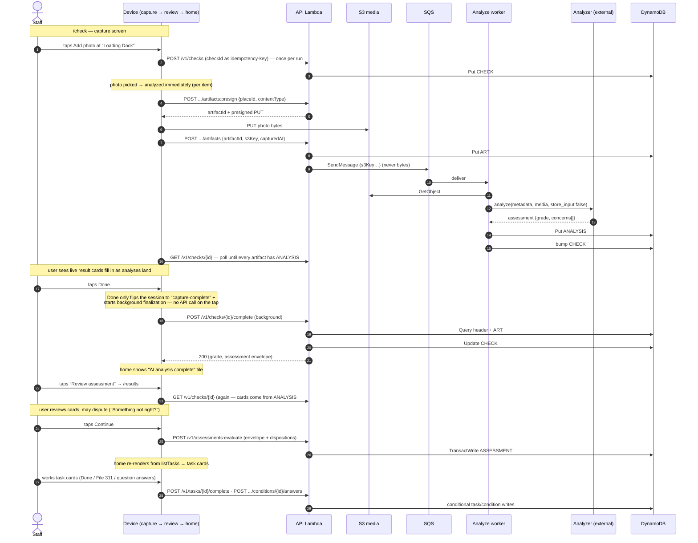
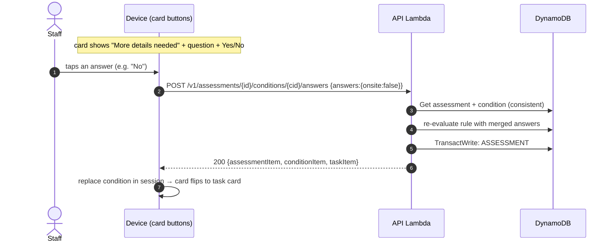
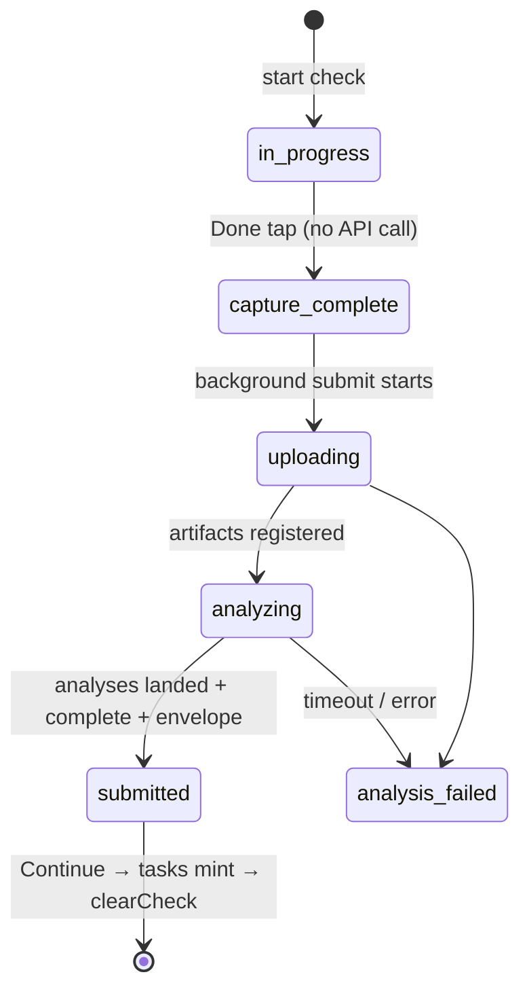
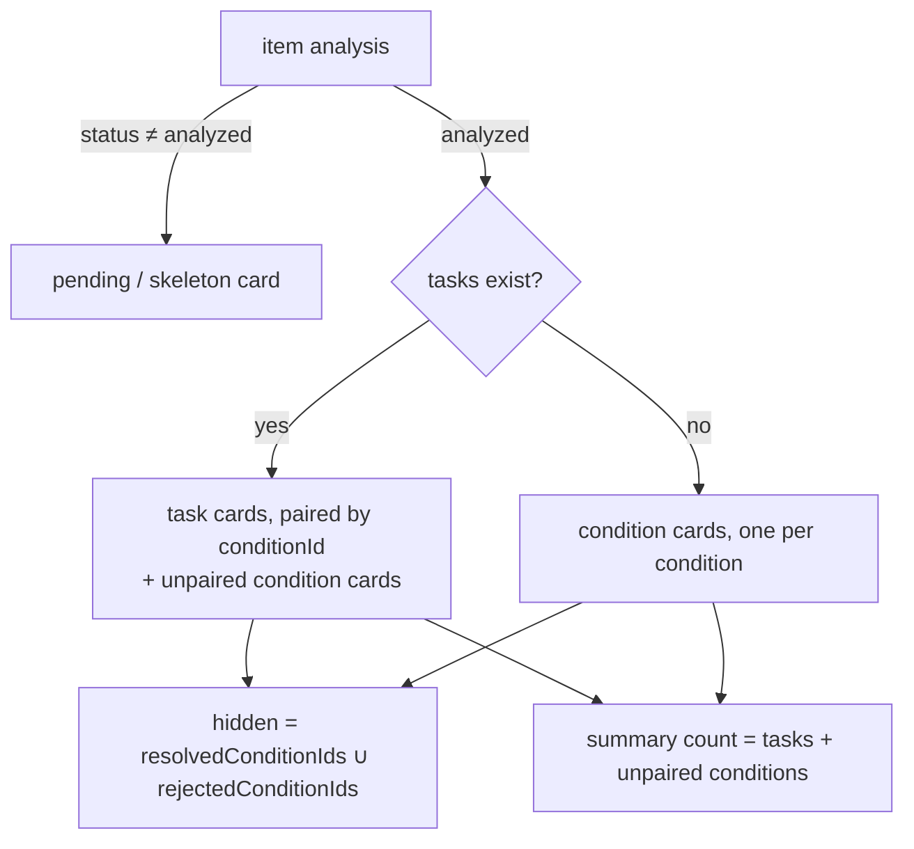
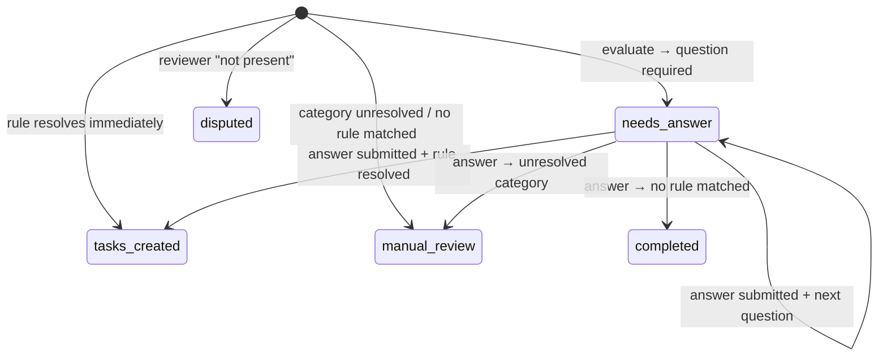

# Perimeter Check Data Flow — from tap to task

*Core reference · [index](./README.md) · item shapes: [dynamodb-data-model.md](./dynamodb-data-model.md)*

**Status:** Live flow — this is what happens today
**Date:** 2026-09-10 · traced file-by-file against the code (anchors throughout)

This doc walks one typical perimeter check end-to-end: what the user does, what the app
sends to the Street Conditions analyzer and what comes back, what lands in DynamoDB at
each moment, and how the analysis data becomes the cards the user sees and dismisses.
The analyzer itself is a black box here — see the [architecture doc](./architecture.md)
for its container context and [security-review.md](./security-review.md) for the media
boundaries. All sample data is realistic; every record below was traced to the code that
writes it.

**Audience:** new engineers and technical product folks. Start high-level, then zoom.

---

## 1. Orientation — the shape of the whole thing

Two phases, and almost everything interesting follows from that split:

1. **Capture & analyze** — the staff member walks the perimeter taking photos and typing
   descriptions, one "place" at a time. Each piece of evidence is uploaded and analyzed
   **individually and asynchronously**, while the walk is still happening. When the user
   taps Done, the app folds every per-artifact analysis into one **scorecard on the check
   header** and produces a **guidance assessment envelope**.
2. **Guidance phase** — the user reviews the identified conditions on the results screen
   (and may dispute them), then taps Continue. Only then does the client send the
   assessment to the rule engine, which persists **assessment + condition + task** items.
   From here the user works the tasks on the home screen until they're done.

Who's who:

- **Staff (device)** — performs the check; not logged in as a person (device+site attribution).
- **API Lambda** — one Lambda behind all `/v1/*` routes (backend/src/lambda/api.js).
- **Analyze worker** — SQS-triggered Lambda that fetches media from S3 and calls the analyzer
  (backend/src/workers/analyze-artifact.js).
- **Street Conditions analyzer** — external service. In: metadata + downscaled image bytes
  (`store_input:false`). Out: one assessment per photo — a `grade`, a one-line
  `general_conditions` description, and `identified_conditions_of_concern[]`
  (category/severity/explanation/evidence indices).
- **DynamoDB** — single table, partition `SITE#<siteId>` (backend/src/handlers/keys.js).

### Mermaid key for the diagrams



---

## 2. Sequence — the happy path, with the user in it



Reading notes:

- Steps 2–11 repeat **per evidence item**, not per check. The check header is created once
  (step 3) on the first item's analysis kick-off; each artifact then runs its own
  upload→analyze loop concurrently.
- The worker→analyzer call is the only place media leaves our stack, and it's
  one-arrow-in/one-out on purpose — that's the whole external boundary.
- Everything after step 12 is **client-driven**: the backend never calls the client, and the
  guidance phase doesn't start until the user reaches Continue on the results screen.

### The branch: a condition needs a user answer

Some rule rows can't resolve from category+severity alone — they ask a question first
("Is this on site property?"). The condition is parked as `needs_answer`, the card renders
with Yes/No buttons, and the answer round-trip re-enters the flow:



The condition guards are the idempotency story here: a double-tap or retry that loses the
race gets a 409 — and if the stored answers already match what was submitted, the backend
**recovers** by returning the stored result (a 200) instead of erroring
(backend/src/handlers/guidance.js `recoverAnsweredCondition`).

---

## 3. Worked example — "Graffiti at the Loading Dock"

Follow one realistic run through every write. Site **Civic Center Annex** (`siteId:
site-civic-01`), places **Lobby** (typed description, no issues) and **Loading Dock**
(one photo). ULID checkId minted client-side: `01JABCDEF…`. Analyzer returns, for the
Loading Dock photo: `{grade:"Poor", concerns:[{category:"Graffiti", severity:2,
description:"Spray paint on the roll-up door", …}]}`.

### Phase 1 — capture & analyze (per item, async)

**User taps Add photo.** The photo is added to the local session and analysis starts
*immediately* for that one item (frontend/src/components/perimeter-check.js `_addPhoto` →
frontend/src/services/photo-analysis.js `analyzeEvidenceItem` → `run`). No DB write yet —
the first `createCheck` happens lazily inside the item's own analysis run
(photo-analysis.js `ensureRemoteCheck`).

| API call | DB write | Record (abbreviated) |
|---|---|---|
| `POST /v1/checks` (once; idempotency-key = ULID) | Put CHECK# | `pk SITE#site-civic-01` · `sk CHECK#01JABC…` · `{status:"in_progress", startedAt, places:[…], issueCount:0, maxSeverity:0}` |
| `POST .../artifacts:presign` | — (no write; mints artifactId + S3 key `checks/site-civic-01/01JABC…/loading-dock/<uuid>`) | — |
| (device PUTs bytes straight to S3) | — | — |
| `POST .../artifacts` (register) | Put ART# (conditional) | `sk CHECK#01JABC…#ART#loading-dock#<uuid>` · `{placeId, placeName:"Loading Dock", s3Key, capturedAt, contentType}` → then SQS send `{siteId, checkId, artifactId, s3Key…}` (never bytes) |
| *(SQS → worker → analyzer)* | Put ANALYSIS# (conditional) | `sk CHECK#01JABC…#ANALYSIS#<uuid>` · `{status:"analyzed", grade:"Poor", gradeDescription:"…", concerns:[{category:"Graffiti", rating:2, explanation:"Spray paint…", evidenceIndices:[0]}], issueCount:1, maxSeverity:2, analysisId, rubricVersion, model}` + best-effort header counter bump |
| *(typed Lobby description)* `POST .../artifacts` (text: no s3Key, carries `text`) | Put ART# + ANALYSIS# | text artifacts take the same path minus S3; the analyzer's grade for it was "Good" with no concerns |

While that runs the user sees a live "Analyzing photo…" skeleton on the card
(analysis-results.templates.js `pendingCard`), flipping into result cards when
`GET /v1/checks/{id}` returns the ANALYSIS# item (photo-analysis.js `waitForArtifactAnalysis`).

**User taps Done.** No API call on the tap itself: the session flips to
`capture-complete` (check-session.js `markCaptureComplete`) and
`finalizeCaptureScorecardInBackground` (submit-check.js) starts polling then calls:

| API call | DB write | Record (abbreviated) |
|---|---|---|
| `POST /v1/checks/{id}/complete` | Update CHECK# (guarded: `#status <> "completed"`) | `{status:"completed", grade:"Poor", summary:"<analyzer's own line for the worst place>", categories:[{category:"Graffiti", maxRating:2, sourceArtifactIds:[<uuid>]}], rubricVersion, issueCount:1, maxSeverity:2, synthesizedAt, completedAt}` — the Lobby's "Good" lost to the Dock's "Poor" (worst-of synthesis, backend/src/analysis/synthesize-check.js) |

The 200 response also carries the **guidance assessment envelope**
(checks.js `buildGuidanceAssessment`): synthesized conditions in analyzer-category terms,
`{assessmentId: checkId, conditions:[{conditionId:"001-graffiti", category:"Graffiti",
severity:2, description:"Spray paint…", sourceArtifactIds:[…]}], rawAssessment:{…}}`.
The client stashes this on the session (`markSubmitted`) — **nothing guidance-shaped is in
the database yet**.

### Phase 2 — review & Continue

**User taps "Review assessment"** (home tile → `/results`, check-results.js). Cards render
from `ANALYSIS#` concerns via the read adapter (check-adapter.js `analysesToFindings`) —
one card per concern with rating ≥ 1, titled by the analyzer's own category. The user may
open "Something not right?" per card (dispute path below). **Tapping Continue** is the
moment guidance goes to the database — task minting is deliberately deferred here so a
dispute can suppress a finding before its task ever exists:

| API call | DB write | Record (abbreviated) |
|---|---|---|
| `POST /v1/assessments:evaluate` (envelope + `dispositions`) | TransactWrite | see below |
| ↳ assessment | Put ASSESSMENT# (conditional) | `sk ASSESSMENT#01JABC…` · `{status:"tasks_created", policyVersion:"actions-escalations-v2", grade:"Poor", summary:{totalConditions:1, conditionsResolvedToTasks:1, openTaskCount:1, escalationCount:1, …}}` |
| ↳ condition | Put COND# (conditional) | `sk ASSESSMENT#01JABC…#COND#001-graffiti` · `{status:"tasks_created", analyzerCategory:"Graffiti", canonicalCategory:"Graffiti", severity:2, answers:{}, taskIds:[<taskId>], resolvedToTasks:true, selectedRuleId:"GRAFFITI-2", needsAnswer:null}` (+ GSI4/GSI5 stamps) |
| ↳ task | Put TASK# (conditional) | `sk TASK#<uuid>` · `{status:"open", kind:"escalation", type:"city_escalation", ruleId:"GRAFFITI-2", policyVersion, category:"Graffiti", severity:2, label:"Ask the City to clean the graffiti.", guidance:"If the graffiti is not on your property…", appActions:[create_311_ticket…], conditionId, assessmentId, checkId}` (+ GSI2 worklist stamp) |

Why rule GRAFFITI-2: the rule catalog (actions-escalations-v2) resolves "Graffiti" exactly,
matches severity 1–3 at evaluation order 1, and its predicate `location !=
provider_controlled_property` matched the default (nothing on-site flagged) — so it
escalates to the City rather than becoming a staff task. A sister rule GRAFFITI-1 with the
inverse predicate would have minted an `onsite` "Clean off the graffiti" action instead.

The home hub then re-renders from `GET /v1/tasks?status=open&limit=50` (GSI2, tasks.js)
— the new task appears as a card in the "Needs action" bucket.

### Phase 2b — a condition that asks a question (needs_answer)

Same trace, but suppose the Dock photo found **"Aggressive animals"** severity 2 instead
(analyzer alias: "Dangerous animals" → canonical "Aggressive animals"). Rules ANIMAL-1/2
both require the question *"Is this animal owned by a site client or resident?"* before
they can resolve, so:

| API call | DB write | Record (abbreviated) |
|---|---|---|
| `assessments:evaluate` | Put COND# | `sk ASSESSMENT#…#COND#001-aggressive-animals` · `{status:"needs_answer", needsAnswer:{key:"affiliated", prompt:"Is this animal owned by a site client or resident?", options:[{label:"Yes", value:true},{label:"No", value:false}]}, answers:{}, taskIds:[]}` (+ GSI5 unresolved stamp) |

The tray renders this as a **"More details needed"** card with the prompt and Yes/No
buttons (analysis-results.templates.js `clarifyingQuestion`). **User taps "No"**:

| API call | DB write | Record (abbreviated) |
|---|---|---|
| `POST /v1/assessments/{id}/conditions/{cid}/answers {answers:{affiliated:false}}` | TransactWrite | same COND# now `{status:"tasks_created", answers:{affiliated:false}, taskIds:[<newTaskId>], resolvedToTasks:true, needsAnswer:null, selectedRuleId:"ANIMAL-2", outcome:{kind:"non_actionable_escalation", …}}` — GSI5 stamp removed; new TASK# `{kind:"non_actionable_escalation", ruleId:"ANIMAL-2", …}` minted; assessment summary deltas applied (conditionsNeedAnswer −1, openTaskCount +1) in the same transaction, guarded by `assessmentRevision` |

Card dismissal is data-driven: the answer response replaces the condition item in the
client session, `needsAnswer` is now null, so the card re-renders as the task/condition
card for the same conditionId. Nothing was "dismissed" — it *resolved*.

### The dispute branch ("Something not right?") — detailed box

On the results screen each card offers four takes: **not_present / better / worse /
other** (check-results.js `DECISIONS`). All four are recorded; only **"I don't see this
problem"** (`not_present`) changes what gets minted. The dispositions ride along on the
Continue call:

```
POST /v1/assessments:evaluate
  body: { assessmentId, conditions:[…], dispositions: { "001-graffiti": "not_present" } }
```

Backend effect (guidance-store.js `storeEvaluatedAssessment`): the disputed condition
evaluates **no rules** and is persisted as a terminal record instead of a task-parked one:

| Record | Diff vs the happy path |
|---|---|
| `COND#001-graffiti` | `{status:"disputed", disputed:true, disputeDisposition:"not_present", taskIds:[], resolvedToTasks:false, needsAnswer:null}` — no GSI5 unresolved stamp, no selectedRuleId |
| `ASSESSMENT#…` | `summary.disputedCount:1`, status `no_tasks` (not `tasks_created`) |
| `TASK#…` | **never created** |

`better`/`worse`/`other` behave like the happy path (tasks still mint) — they exist as
recorded feedback for false-positive analysis. Disputing is keyed by the condition's stable
`conditionId`, so disputing one condition never suppresses a sibling that shares a category.

(There is also a **separate, live-path** edit/reject pair —
`POST .../conditions/{cid}` and `.../conditions/{cid}/reject` — that re-runs the analyzer
on an amended description and supersedes any open tasks for that condition
(backend/src/handlers/analysis-amendments.js). That's the tray's Edit/Delete buttons, not
the results-screen dispute; same supersession rule applies.)

### Dismissal & completion — task cards on home

Home task cards come straight from `TASK#` items (today-view.js `_homeTasks`):
status `open` → needs-action card; `completing` → in-progress; `completed`/`cannot_do` →
resolved bucket (then archived after an age window). **User taps "Done"** on the graffiti
card (311 path here):

| API call | DB write | Record (abbreviated) |
|---|---|---|
| `POST /v1/tasks/{taskId}/complete` (escalation → `311_filed`) | TransactWrite on TASK# | `{status:"completed", completionMethod:"311_filed", appActionStatus:"submitted", appActionResults:[{code:"create_311_ticket", status:"submitted", payload:{tickets:[{srNum, responsibleAgency:"76"}]}}], completionLeaseExpiresAt:null}` |
| *(onsite action instead)* `completionMethod:"manual"` | same shape | `{status:"completed", completionMethod:"manual"}` |

A failed 311 filing leaves the task `open` (with the failure in `appActionResults`) so the
user can retry — completion is conditioned on the completion lease, and informational
tickets filed under agency 76 are closed later via `close_311_ticket` on the done path
(see [dynamodb-data-model.md](./dynamodb-data-model.md) for the full 311 attribute story).

### Final database state (the whole run)

| pk | sk | Key attributes (end state) |
|---|---|---|
| `SITE#site-civic-01` | `CHECK#01JABC…` | status `completed`, grade `Poor`, categories rollup, issueCount 1, maxSeverity 2 |
| `SITE#site-civic-01` | `CHECK#01JABC…#ART#loading-dock#<uuid>` | placeName, s3Key, capturedAt (photo metadata; bytes in S3) |
| `SITE#site-civic-01` | `CHECK#01JABC…#ART#lobby#<uuid>` | text description (no s3Key) |
| `SITE#site-civic-01` | `CHECK#01JABC…#ANALYSIS#<uuid>` ×2 | raw adapted analyzer output: grade + concerns[] per artifact |
| `SITE#site-civic-01` | `ASSESSMENT#01JABC…` | status `tasks_created`, summary counts, rawAssessment |
| `SITE#site-civic-01` | `ASSESSMENT#01JABC…#COND#001-graffiti` | status `tasks_created`, taskIds, selectedRuleId `GRAFFITI-2`, answers {} |
| `SITE#site-civic-01` | `TASK#<uuid>` | status `completed`, kind `escalation`, ruleId `GRAFFITI-2`, appActionResults |

Every item shares one `pk`, so the check-detail read (AP7) is a single
`begins_with(sk, "CHECK#01JABC…")` query — the reason the single-table design exists.

---

## 4. The gates — how data decides what the user sees

Nothing in the UI is toggled by side-flags; cards render from stored/derived state. The
gates, in order:

**a. Session stage machine (during submit).** The local session carries a status that the
home tile keys off (check-session.js `markUploading/Analyzing/Submitted/…`):



- `in-progress` → capture UI. `capture-complete` → home shows "AI analysis paused" copy.
  `analyzing` → "AI analysis paused" (analysis copy). `submitted` → "AI analysis complete"
  tile with the **Review assessment** button (the gate to phase 2). `analysis_failed` →
  error tile with a retryable message.

**b. Results-tray card selection** (analysis-results.templates.js `visibleProblemSelection`).
For each evidence item's analysis state:



- A condition is **hidden** when its conditionId is in `resolvedConditionIds` or
  `rejectedConditionIds` (local session bookkeeping written by resolve/reject actions).
- A task card's title is `category → analyzerCategory → canonicalCategory` fallback.
- The "N problems found" label counts **tasks + unpaired conditions** — the same units the
  tray renders, so the count never disagrees with the cards.

**c. Question cards.** A condition with `needsAnswer` renders as "More details needed" +
prompt + Yes/No buttons. Answering replaces the condition item in the session (and in
DynamoDB, § 3b), so the question card disappears because the *data changed*, not because a
dismissal flag was set. Double-tap protection: per-condition in-flight set + button
disabling client-side; `status = needs_answer` condition guard server-side.

**d. Home worklist buckets** (today-view.js `homeTaskStatus`): straight from `TASK#`
status — `open` → needs-action, `completing` → in-progress, `completed`/`cannot_do` →
resolved (then archived after an age window); the newest tasks (created within a window)
also surface as "new" cards. Task overrides are client-side only (read-model smoothing),
never a second source of truth.

**e. Condition status state machine** (what gates a condition between card types):



Task status (`open → completing → completed | cannot_do | superseded`) is guarded by
conditional writes end-to-end — a replay can never double-complete or double-mint.

---

## 5. Where things live in code

| Step | Write site | Read/render site |
|---|---|---|
| Create check | backend/src/handlers/checks.js `createCheck` | — |
| Presign / register artifact | backend/src/handlers/artifacts.js `presignUpload`, `registerArtifact` | frontend/src/services/api.js `uploadArtifact`, `registerTextArtifact` |
| Per-item analysis orchestration | backend/src/workers/analyze-artifact.js | frontend/src/services/photo-analysis.js `analyzeEvidenceItem` |
| Complete / synthesize | backend/src/handlers/checks.js `completeCheck` + backend/src/analysis/synthesize-check.js | frontend/src/services/submit-check.js `finalizeCaptureScorecard` |
| Background submit stages | frontend/src/services/submit-check.js | frontend/src/state/check-session.js (`mark*` stage fns) |
| Review + dispute + Continue | backend/src/handlers/guidance.js `evaluateAssessment` | frontend/src/components/check-results.js (dispute UI), domain/check-adapter.js |
| Guidance evaluate → tasks | backend/src/analysis/guidance/guidance-store.js `storeEvaluatedAssessment` | — |
| Question round-trip | backend/src/handlers/guidance.js `submitConditionAnswers` + guidance-store.js `answerCondition` | frontend/src/services/photo-analysis.js `answerAnalysisQuestion`, components/analysis-answer-controls.js |
| Task completion / 311 | guidance-store.js `completeTaskWithAppActions` | frontend/src/components/perimeter-check.js `_resolveProblem`, today-view.js `_onAction` |
| Edit / reject condition | backend/src/handlers/analysis-amendments.js | perimeter-check.js `_saveProblemEdit` / `_confirmDeleteProblem` |
| Home worklist | backend/src/handlers/tasks.js `listTasks` | frontend/src/components/today-view.js `_homeResults` |

---

## 6. Notes & pointers

- **Single-problem flow** (`/problem`) deviates only in cadence: each item analyzes
  immediately at capture rather than in a background batch at Done
  (photo-analysis.js `analyzeEvidenceItem` runs per item as it's captured). Everything
  downstream — complete, evaluate, cards — is the same shape.
- **Offline/resume, 311 internals, analytics/CQRS, auth** are deliberately out of scope
  here: see [dynamodb-data-model.md](./dynamodb-data-model.md) (311 attributes, GSIs,
  identity model), [architecture.md](./architecture.md) (security boundaries),
  [guidance-policy-changelog.md](./guidance-policy-changelog.md) (rule versioning).
- The analyzer contract is documented by its consumer adapters:
  backend/src/analysis/contract.js (wire shape) and adapt-scorecard.js (what we keep).