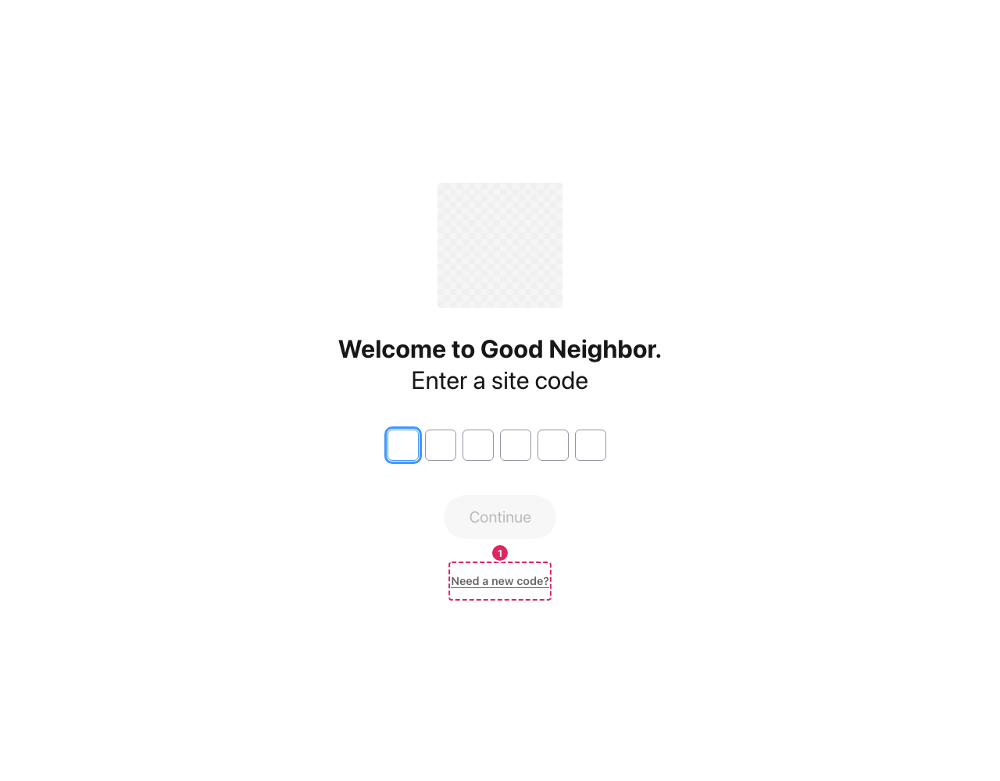
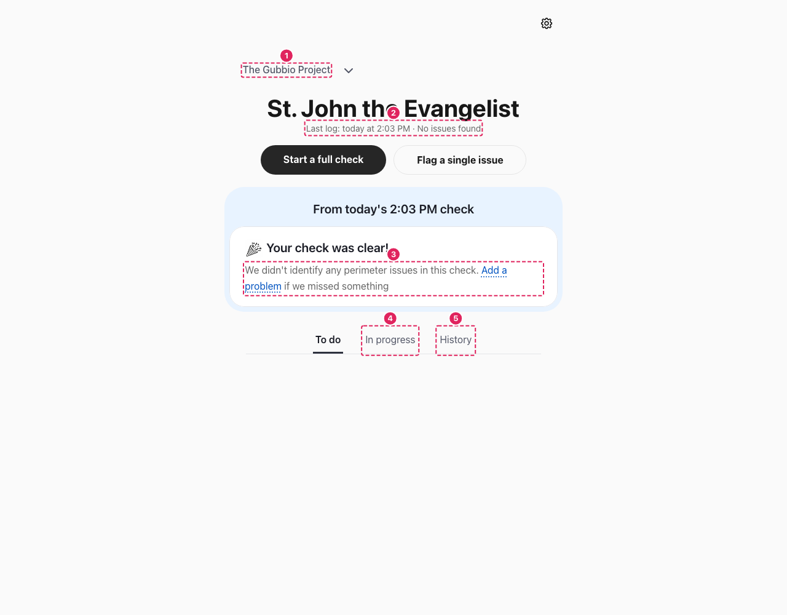
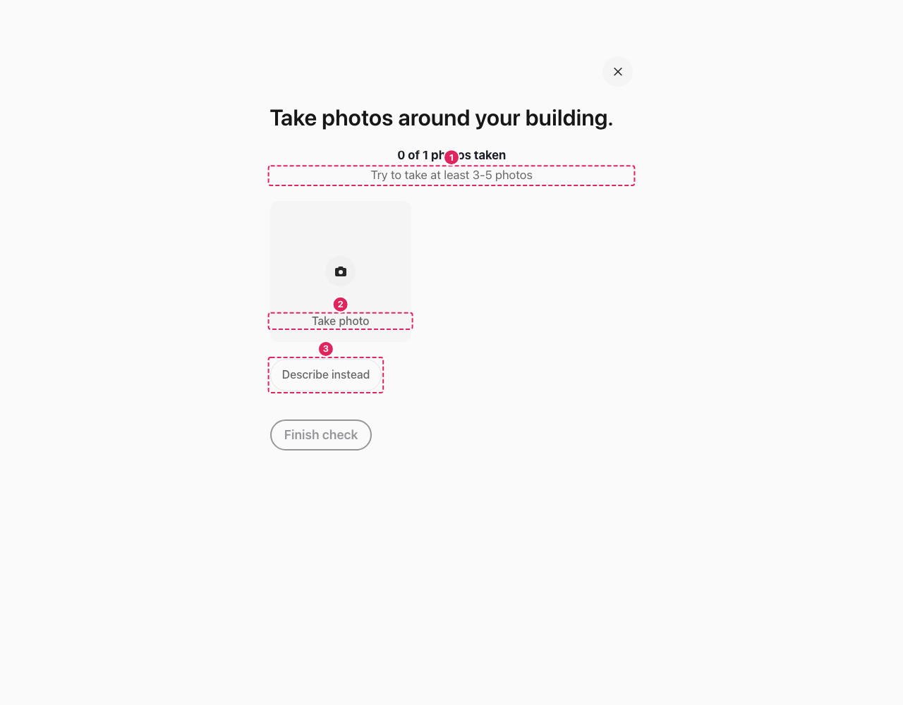
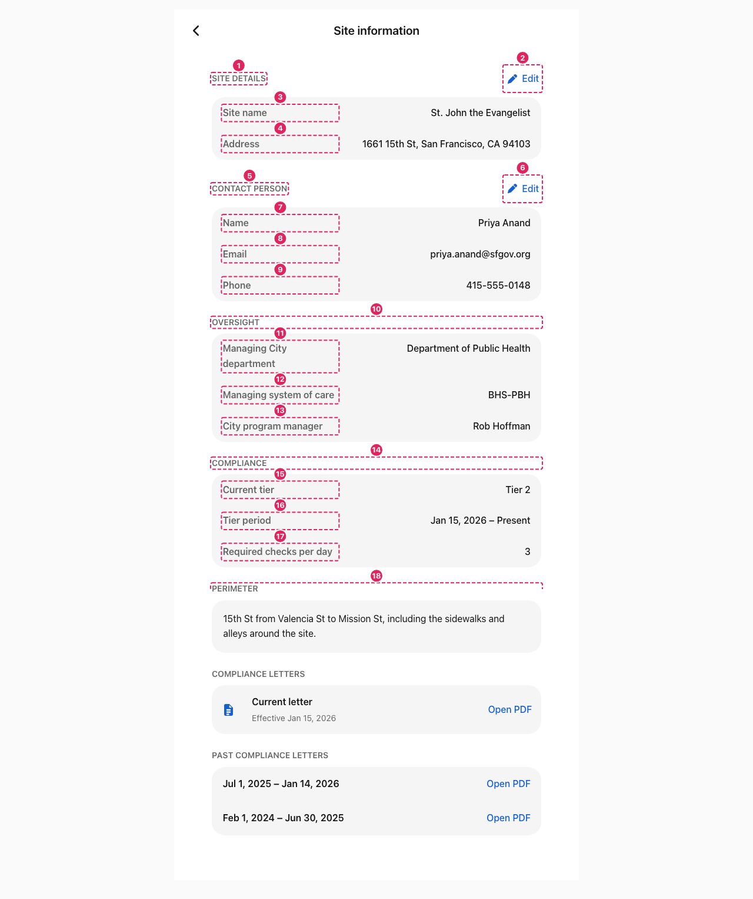
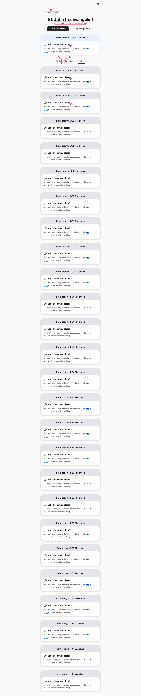
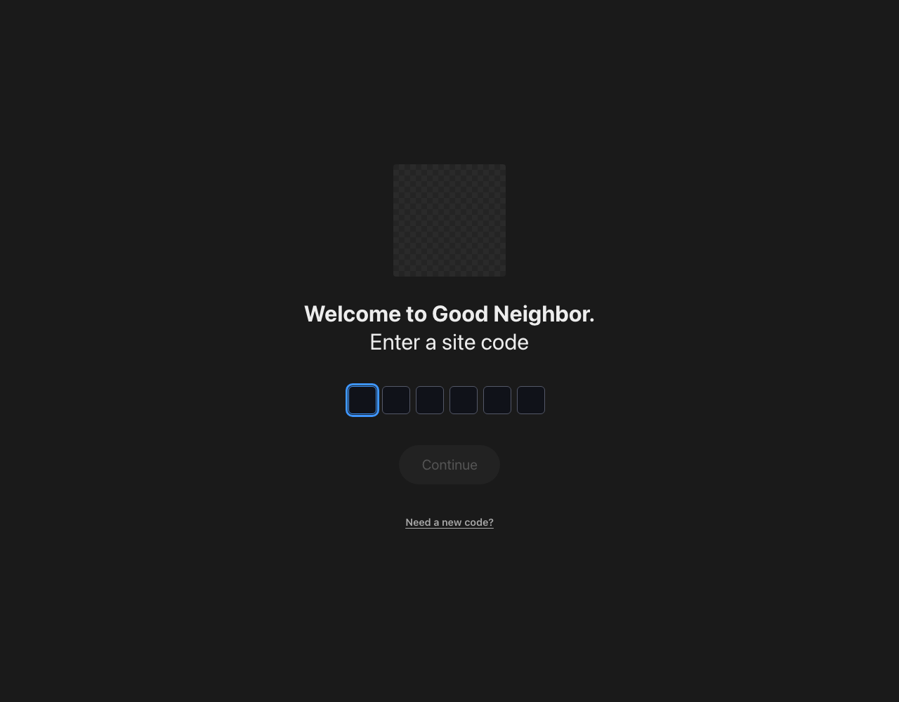
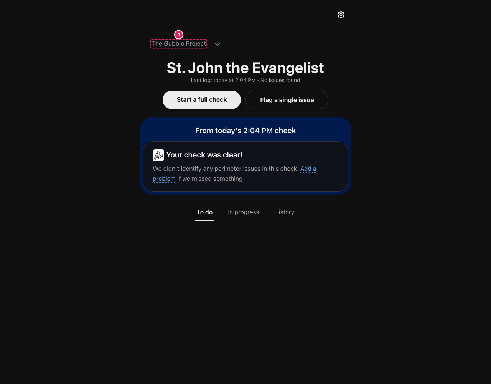
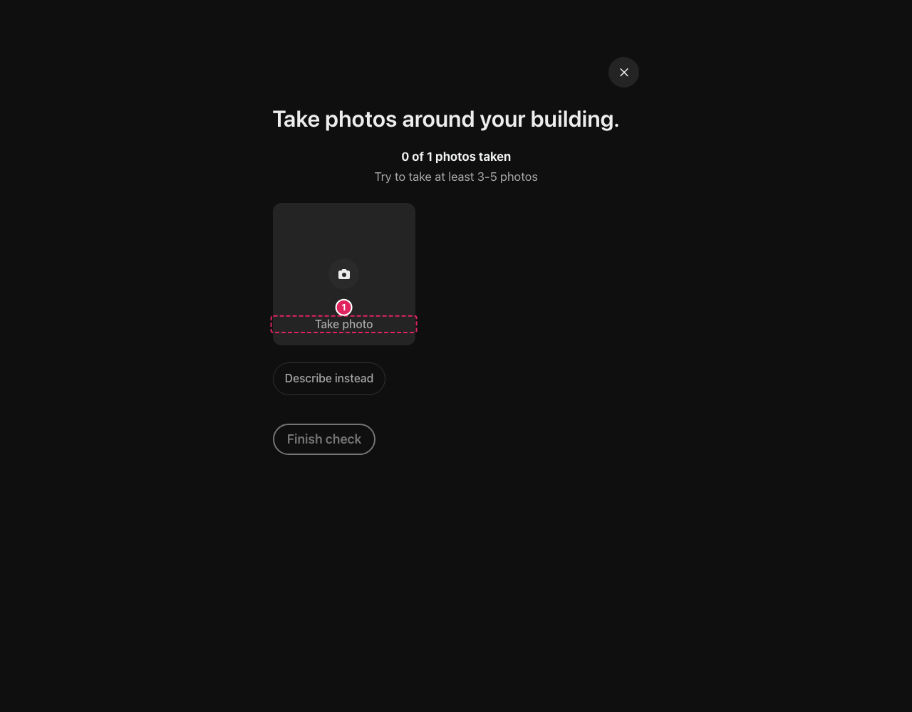
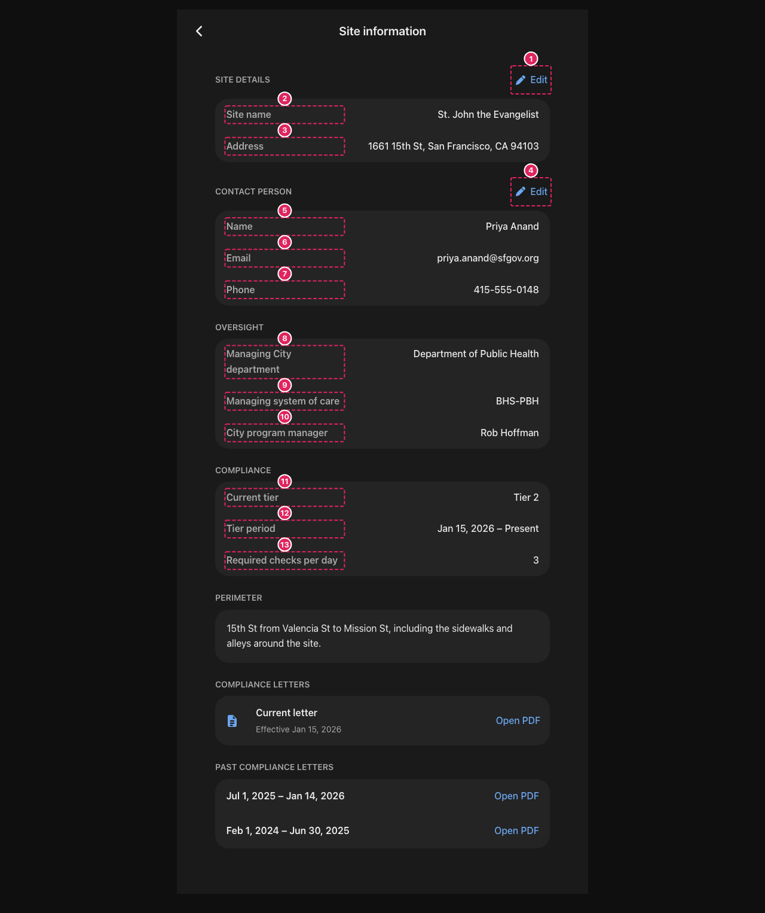
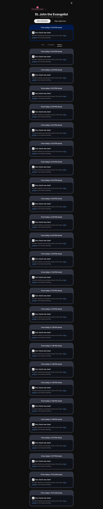

# AAA contrast findings — designer review

Generated 2026-10-01T21:03:47.371Z · policy: WCAG 2.2 AAA · rule `color-contrast-enhanced` (1.4.6, 7:1)
· screenshots in this folder — numbered pins match the row numbers.

## Proposed token changes (clears every finding when applied)

### Light
| Token | Current | → Suggested | Ratio now → then (worst-case bg) |
|---|---|---|---|
| `--text-secondary` | #666666 | **#4b4b4b** | 5.04:1 on #f0f0f0 → 7.66:1 |
| `--brand-blue` (links) | #155fce | **#0e4aa8** | 5.15:1 on #e8f0fe → 7.15:1 |
| switcher grey (`--wa-color-neutral-on-quiet`) | #545868 | **#464a5c** | 7.06:1 on #fff → 8.77:1; `#fafafa` 6.76 → 8.40 |
| clear-copy body | #424554 | **#33364a** | 9.50:1 (passes); link #0053c0 6.11 on pill → #0049b0 7.02 |
| clear-copy link | #0053c0 | **#0049b0** | 6.11:1 on #e8f0fe → 7.02:1 |

### Dark
| Token | Current | → Suggested | Ratio now → then (worst-case bg) |
|---|---|---|---|
| `--text-secondary` | #a8a8a8 | **#c0c0c0** | 6.53:1 on #2a2a2a → 7.89:1 |
| `--brand-blue` (links) | #6ba7f0 | **#8abcf5** | 6.03:1 on #17273d → 7.60:1 |
| switcher grey | #9194a2 | **#b8bcc9** | 5.77:1 on #1a1a1a → 9.18:1; worst #2a2a2a 6.88 → 7.57 |

## Per-screenshot detail

### code-entry (light) — 1 finding(s)

| # | Component | Text | fg → bg | Ratio | Suggested token |
|---|---|---|---|---|---|
| 1 | `#show-request-code` | Need a new code? | `#666666` on `#ffffff` | 5.74:1 | **#4b4b4b** (--text-secondary) |

### bound-home (light) — 5 finding(s)

| # | Component | Text | fg → bg | Ratio | Suggested token |
|---|---|---|---|---|---|
| 1 | `span` | The Gubbio Project | `#545868` on `#fafafa` | 6.76:1 | **#464a5c** (--wa-color-neutral-on-quiet (switcher)) |
| 2 | `.lastlog__eyebrow` | Last log: today at 2:03 PM · N | `#666666` on `#fafafa` | 5.5:1 | **#4b4b4b** (--text-secondary) |
| 3 | `.analysis-card__clear-copy` | We didn't identify any perimet | `#666666` on `#ffffff` | 5.74:1 | **#4b4b4b** (--text-secondary) |
| 4 | `button[data-home-filter="in_progress"]` | In progress | `#545868` on `#fafafa` | 6.76:1 | **#464a5c** (--wa-color-neutral-on-quiet (switcher)) |
| 5 | `button[data-home-filter="history"]` | History | `#545868` on `#fafafa` | 6.76:1 | **#464a5c** (--wa-color-neutral-on-quiet (switcher)) |

### capture-view (light) — 3 finding(s)

| # | Component | Text | fg → bg | Ratio | Suggested token |
|---|---|---|---|---|---|
| 1 | `span` | Try to take at least 3-5 photo | `#666666` on `#fafafa` | 5.5:1 | **#4b4b4b** (--text-secondary) |
| 2 | `.addshot__label` | Take photo | `#666666` on `#f5f5f5` | 5.26:1 | **#4b4b4b** (--text-secondary) |
| 3 | `#describe-instead` | Describe instead | `#666666` on `#fafafa` | 5.5:1 | **#4b4b4b** (--text-secondary) |

### site-admin (light) — 24 finding(s)

| # | Component | Text | fg → bg | Ratio | Suggested token |
|---|---|---|---|---|---|
| 1 | `h2` | Site details | `#666666` on `#ffffff` | 5.74:1 | **#4b4b4b** (--text-secondary) |
| 2 | `button[data-edit-section="site"]` | Edit | `#155fce` on `#ffffff` | 5.89:1 | **#0e4aa8** (--brand-blue / links) |
| 3 | `dt` | Site name | `#666666` on `#f5f5f5` | 5.26:1 | **#4b4b4b** (--text-secondary) |
| 4 | `dt` | Address | `#666666` on `#f5f5f5` | 5.26:1 | **#4b4b4b** (--text-secondary) |
| 5 | `h2` | Contact person | `#666666` on `#ffffff` | 5.74:1 | **#4b4b4b** (--text-secondary) |
| 6 | `button[data-edit-section="contact"]` | Edit | `#155fce` on `#ffffff` | 5.89:1 | **#0e4aa8** (--brand-blue / links) |
| 7 | `dt` | Name | `#666666` on `#f5f5f5` | 5.26:1 | **#4b4b4b** (--text-secondary) |
| 8 | `dt` | Email | `#666666` on `#f5f5f5` | 5.26:1 | **#4b4b4b** (--text-secondary) |
| 9 | `dt` | Phone | `#666666` on `#f5f5f5` | 5.26:1 | **#4b4b4b** (--text-secondary) |
| 10 | `h2` | Oversight | `#666666` on `#ffffff` | 5.74:1 | **#4b4b4b** (--text-secondary) |
| 11 | `dt` | Managing City department | `#666666` on `#f5f5f5` | 5.26:1 | **#4b4b4b** (--text-secondary) |
| 12 | `dt` | Managing system of care | `#666666` on `#f5f5f5` | 5.26:1 | **#4b4b4b** (--text-secondary) |
| 13 | `dt` | City program manager | `#666666` on `#f5f5f5` | 5.26:1 | **#4b4b4b** (--text-secondary) |
| 14 | `h2` | Compliance | `#666666` on `#ffffff` | 5.74:1 | **#4b4b4b** (--text-secondary) |
| 15 | `dt` | Current tier | `#666666` on `#f5f5f5` | 5.26:1 | **#4b4b4b** (--text-secondary) |
| 16 | `dt` | Tier period | `#666666` on `#f5f5f5` | 5.26:1 | **#4b4b4b** (--text-secondary) |
| 17 | `dt` | Required checks per day | `#666666` on `#f5f5f5` | 5.26:1 | **#4b4b4b** (--text-secondary) |
| 18 | `h2` | Perimeter | `#666666` on `#ffffff` | 5.74:1 | **#4b4b4b** (--text-secondary) |
| 19 | `h2` | Compliance letters | `#666666` on `#ffffff` | 5.74:1 | **#4b4b4b** (--text-secondary) |
| 20 | `span` | Effective Jan 15, 2026 | `#666666` on `#f5f5f5` | 5.26:1 | **#4b4b4b** (--text-secondary) |
| 21 | `a[href="/sample-compliance-letter.pdf"][ta` | Open PDF | `#155fce` on `#f5f5f5` | 5.41:1 | **#0e4aa8** (--brand-blue / links) |
| 22 | `h2` | Past compliance letters | `#666666` on `#ffffff` | 5.74:1 | **#4b4b4b** (--text-secondary) |
| 23 | `a[href="/sample-compliance-letter.pdf"][ta` | Open PDF | `#155fce` on `#f5f5f5` | 5.41:1 | **#0e4aa8** (--brand-blue / links) |
| 24 | `a[href="/sample-compliance-letter.pdf"][ta` | Open PDF | `#155fce` on `#f5f5f5` | 5.41:1 | **#0e4aa8** (--brand-blue / links) |

### home-history (light) — 30 finding(s)

| # | Component | Text | fg → bg | Ratio | Suggested token |
|---|---|---|---|---|---|
| 1 | `span` | The Gubbio Project | `#545868` on `#fafafa` | 6.76:1 | **#464a5c** (--wa-color-neutral-on-quiet (switcher)) |
| 2 | `.lastlog__eyebrow` | Last log: today at 2:04 PM · N | `#666666` on `#fafafa` | 5.5:1 | **#4b4b4b** (--text-secondary) |
| 3 | `.analysis-card__clear-copy` | We didn't identify any perimet | `#666666` on `#ffffff` | 5.74:1 | **#4b4b4b** (--text-secondary) |
| 4 | `button[data-home-filter="todo"]` | To do | `#545868` on `#fafafa` | 6.76:1 | **#464a5c** (--wa-color-neutral-on-quiet (switcher)) |
| 5 | `button[data-home-filter="in_progress"]` | In progress | `#545868` on `#fafafa` | 6.76:1 | **#464a5c** (--wa-color-neutral-on-quiet (switcher)) |
| 6 | `.analysis-card__clear-copy` | We didn't identify any perimet | `#666666` on `#ffffff` | 5.74:1 | **#4b4b4b** (--text-secondary) |
| 7 | `.analysis-card__clear-copy` | We didn't identify any perimet | `#666666` on `#ffffff` | 5.74:1 | **#4b4b4b** (--text-secondary) |
| 8 | `.analysis-card__clear-copy` | We didn't identify any perimet | `#666666` on `#ffffff` | 5.74:1 | **#4b4b4b** (--text-secondary) |
| 9 | `.analysis-card__clear-copy` | We didn't identify any perimet | `#666666` on `#ffffff` | 5.74:1 | **#4b4b4b** (--text-secondary) |
| 10 | `.analysis-card__clear-copy` | We didn't identify any perimet | `#666666` on `#ffffff` | 5.74:1 | **#4b4b4b** (--text-secondary) |
| 11 | `.analysis-card__clear-copy` | We didn't identify any perimet | `#666666` on `#ffffff` | 5.74:1 | **#4b4b4b** (--text-secondary) |
| 12 | `.analysis-card__clear-copy` | We didn't identify any perimet | `#666666` on `#ffffff` | 5.74:1 | **#4b4b4b** (--text-secondary) |
| 13 | `.analysis-card__clear-copy` | We didn't identify any perimet | `#666666` on `#ffffff` | 5.74:1 | **#4b4b4b** (--text-secondary) |
| 14 | `.analysis-card__clear-copy` | We didn't identify any perimet | `#666666` on `#ffffff` | 5.74:1 | **#4b4b4b** (--text-secondary) |
| 15 | `.analysis-card__clear-copy` | We didn't identify any perimet | `#666666` on `#ffffff` | 5.74:1 | **#4b4b4b** (--text-secondary) |
| 16 | `.analysis-card__clear-copy` | We didn't identify any perimet | `#666666` on `#ffffff` | 5.74:1 | **#4b4b4b** (--text-secondary) |
| 17 | `.analysis-card__clear-copy` | We didn't identify any perimet | `#666666` on `#ffffff` | 5.74:1 | **#4b4b4b** (--text-secondary) |
| 18 | `.analysis-card__clear-copy` | We didn't identify any perimet | `#666666` on `#ffffff` | 5.74:1 | **#4b4b4b** (--text-secondary) |
| 19 | `.analysis-card__clear-copy` | We didn't identify any perimet | `#666666` on `#ffffff` | 5.74:1 | **#4b4b4b** (--text-secondary) |
| 20 | `.analysis-card__clear-copy` | We didn't identify any perimet | `#666666` on `#ffffff` | 5.74:1 | **#4b4b4b** (--text-secondary) |
| 21 | `.analysis-card__clear-copy` | We didn't identify any perimet | `#666666` on `#ffffff` | 5.74:1 | **#4b4b4b** (--text-secondary) |
| 22 | `.analysis-card__clear-copy` | We didn't identify any perimet | `#666666` on `#ffffff` | 5.74:1 | **#4b4b4b** (--text-secondary) |
| 23 | `.analysis-card__clear-copy` | We didn't identify any perimet | `#666666` on `#ffffff` | 5.74:1 | **#4b4b4b** (--text-secondary) |
| 24 | `.analysis-card__clear-copy` | We didn't identify any perimet | `#666666` on `#ffffff` | 5.74:1 | **#4b4b4b** (--text-secondary) |
| 25 | `.analysis-card__clear-copy` | We didn't identify any perimet | `#666666` on `#ffffff` | 5.74:1 | **#4b4b4b** (--text-secondary) |
| 26 | `.analysis-card__clear-copy` | We didn't identify any perimet | `#666666` on `#ffffff` | 5.74:1 | **#4b4b4b** (--text-secondary) |
| 27 | `.analysis-card__clear-copy` | We didn't identify any perimet | `#666666` on `#ffffff` | 5.74:1 | **#4b4b4b** (--text-secondary) |
| 28 | `.analysis-card__clear-copy` | We didn't identify any perimet | `#666666` on `#ffffff` | 5.74:1 | **#4b4b4b** (--text-secondary) |
| 29 | `.analysis-card__clear-copy` | We didn't identify any perimet | `#666666` on `#ffffff` | 5.74:1 | **#4b4b4b** (--text-secondary) |
| 30 | `.analysis-card__clear-copy` | We didn't identify any perimet | `#666666` on `#ffffff` | 5.74:1 | **#4b4b4b** (--text-secondary) |

### code-entry (dark) — 0 finding(s)

### bound-home (dark) — 1 finding(s)

| # | Component | Text | fg → bg | Ratio | Suggested token |
|---|---|---|---|---|---|
| 1 | `span` | The Gubbio Project | `#9194a2` on `#0f0f0f` | 6.35:1 | **#b8bcc9** (--wa-color-neutral-on-quiet (switcher)) |

### capture-view (dark) — 1 finding(s)

| # | Component | Text | fg → bg | Ratio | Suggested token |
|---|---|---|---|---|---|
| 1 | `.addshot__label` | Take photo | `#a8a8a8` on `#242424` | 6.52:1 | **#c0c0c0** (--text-secondary) |

### site-admin (dark) — 17 finding(s)

| # | Component | Text | fg → bg | Ratio | Suggested token |
|---|---|---|---|---|---|
| 1 | `button[data-edit-section="site"]` | Edit | `#6ba7f0` on `#1a1a1a` | 6.97:1 | **#8abcf5** (--brand-blue / links) |
| 2 | `dt` | Site name | `#a8a8a8` on `#242424` | 6.52:1 | **#c0c0c0** (--text-secondary) |
| 3 | `dt` | Address | `#a8a8a8` on `#242424` | 6.52:1 | **#c0c0c0** (--text-secondary) |
| 4 | `button[data-edit-section="contact"]` | Edit | `#6ba7f0` on `#1a1a1a` | 6.97:1 | **#8abcf5** (--brand-blue / links) |
| 5 | `dt` | Name | `#a8a8a8` on `#242424` | 6.52:1 | **#c0c0c0** (--text-secondary) |
| 6 | `dt` | Email | `#a8a8a8` on `#242424` | 6.52:1 | **#c0c0c0** (--text-secondary) |
| 7 | `dt` | Phone | `#a8a8a8` on `#242424` | 6.52:1 | **#c0c0c0** (--text-secondary) |
| 8 | `dt` | Managing City department | `#a8a8a8` on `#242424` | 6.52:1 | **#c0c0c0** (--text-secondary) |
| 9 | `dt` | Managing system of care | `#a8a8a8` on `#242424` | 6.52:1 | **#c0c0c0** (--text-secondary) |
| 10 | `dt` | City program manager | `#a8a8a8` on `#242424` | 6.52:1 | **#c0c0c0** (--text-secondary) |
| 11 | `dt` | Current tier | `#a8a8a8` on `#242424` | 6.52:1 | **#c0c0c0** (--text-secondary) |
| 12 | `dt` | Tier period | `#a8a8a8` on `#242424` | 6.52:1 | **#c0c0c0** (--text-secondary) |
| 13 | `dt` | Required checks per day | `#a8a8a8` on `#242424` | 6.52:1 | **#c0c0c0** (--text-secondary) |
| 14 | `span` | Effective Jan 15, 2026 | `#a8a8a8` on `#242424` | 6.52:1 | **#c0c0c0** (--text-secondary) |
| 15 | `a[href="/sample-compliance-letter.pdf"][ta` | Open PDF | `#6ba7f0` on `#242424` | 6.21:1 | **#8abcf5** (--brand-blue / links) |
| 16 | `a[href="/sample-compliance-letter.pdf"][ta` | Open PDF | `#6ba7f0` on `#242424` | 6.21:1 | **#8abcf5** (--brand-blue / links) |
| 17 | `a[href="/sample-compliance-letter.pdf"][ta` | Open PDF | `#6ba7f0` on `#242424` | 6.21:1 | **#8abcf5** (--brand-blue / links) |

### home-history (dark) — 1 finding(s)

| # | Component | Text | fg → bg | Ratio | Suggested token |
|---|---|---|---|---|---|
| 1 | `span` | The Gubbio Project | `#9194a2` on `#0f0f0f` | 6.35:1 | **#b8bcc9** (--wa-color-neutral-on-quiet (switcher)) |
